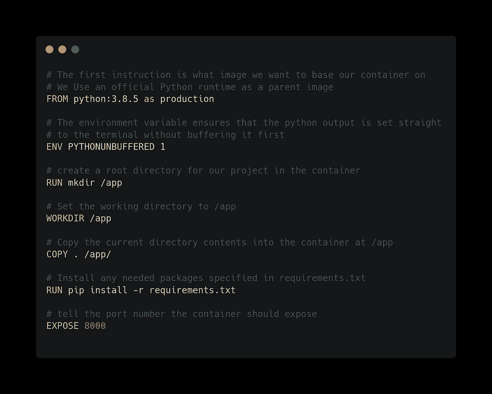
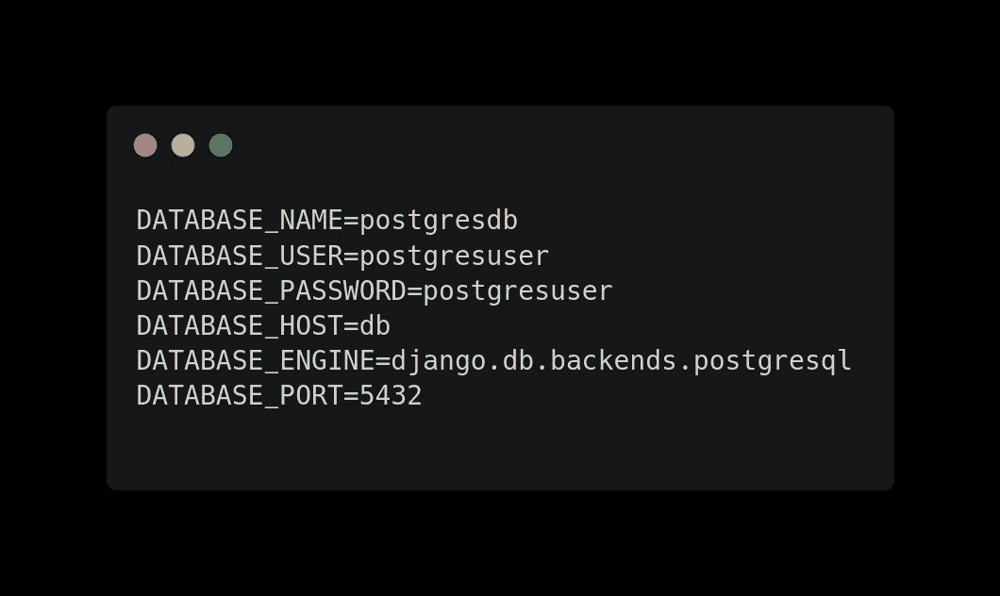
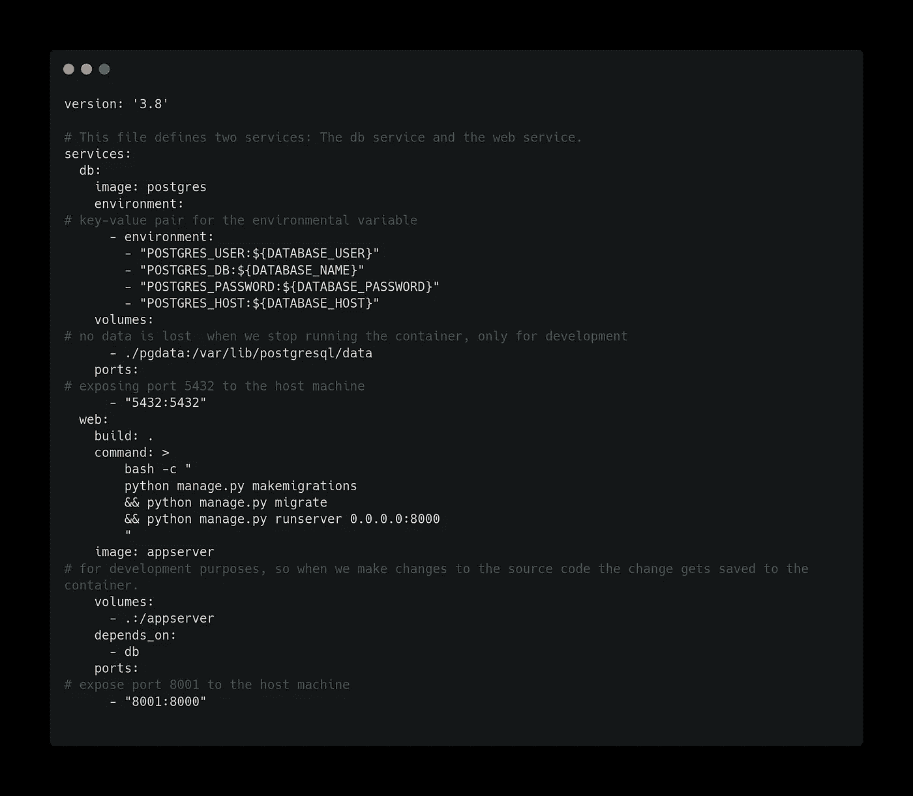
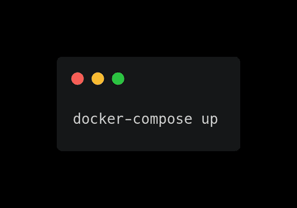

# 如何对一个简单的 Django 应用程序进行 Dockerize

> 原文：<https://medium.com/geekculture/how-to-dockerize-a-simple-django-app-3cb0d5a71eea?source=collection_archive---------0----------------------->

# 介绍

根据 Docker docs， *Docker 是一个提供操作系统级虚拟化的工具，以称为容器的包的形式交付软件。*

Docker 通过提供一个简化的、自以为是的包装器，将现有的 Linux 发行版作为容器、进程控制、安全和资源管理技术调用，从而使应用程序容器易于使用。

Docker 擅长这两个关键领域:

*   包装应用
*   流程隔离和管理

> Docker 帮助你在独立的小盒子里打包和运行应用程序，并提供所有的平台和应用程序依赖，从而保持主机整洁。

Docker 解决以下相关问题:

*   缺少或不正确的应用程序依赖项，如库、解释器、代码/二进制文件、用户、操作系统包等
*   在同一主机上运行的程序之间的冲突，如库依赖或端口；示例:本地 Django 试图使用端口 80
*   运行应用程序所需的系统资源不足，如 CPU 和内存。

让我们看看 Docker 是如何实现其轻松“构建、发布和运行”应用程序的承诺的😃。

**假设**:我们将使用 [Django 应用程序](https://www.django-rest-framework.org/)，可能需要一些使用 Django 应用程序的经验，并且您已经安装了[Docker](https://docs.docker.com/get-docker/)&[Docker Compose](https://docs.docker.com/compose/)。

# 将应用程序打包到映像中

由 [Docker](https://docs.docker.com/get-docker/) 提供的操作系统级虚拟化帮助我们将应用和平台镜像到一个`docker file`。`docker file`应该放在 Django 项目的根位置。

Docker images 还允许您定义元数据和定义更多选项，以帮助操作员根据您的应用程序需求运行应用程序。

# 设置 Docker-compose.yml 文件

为了清楚起见，Docker Compose 解决了同时运行多容器应用程序的问题。因此，您可以设置所需的容器数量、它们的构建、服务和容量，然后使用一组命令，您就可以构建、运行和配置所有的容器。

> *根据*[*Docker-compose Docs*](https://docs.docker.com/compose/)*使用 Compose 基本上是一个三步走的过程:*

*   用 docker 文件定义你的应用环境，这样它可以在任何地方被复制。
*   在 docker-compose.yml 中定义组成您的应用程序的服务，以便它们可以在一个隔离的环境中一起运行。
*   运行 docker-compose up 和 compose 启动并运行您的整个应用程序。

它也位于 Django 应用程序的根目录中。当您为部署创建复杂的容器或数据库服务时，Docker 环境变量文件`.env`是必需的。

假设您的`.env file`(顺便说一下，这是文件的全名)位于存放`docker-compose.yml file`的同一个目录中。在`.env file`中，你有这几行:

一个简单的`docker-compose.yml`看起来是这样的:

我们现在都设置好了，让我们使用这个简单的命令构建并运行我们的容器:

这是对应用程序容器如何帮助您的团队解决许多常见的打包、分发和操作问题的简单介绍；同时帮助您发布更好的软件🤓。

感谢观众，希望这篇文章对你有所帮助🤗。请随时在 [Github](https://github.com/nextwebb) 、 [Twitter](https://twitter.com/i_am_nextwebb) 和 [LinkedIn](https://www.linkedin.com/in/peterson-oaikhenah-102645144/) 上联系我。一定要点赞、评论和分享😌。

# 进一步阅读

*   [Docker-撰写文档](https://docs.docker.com/compose/)
*   [Docker 文档](https://docs.docker.com/engine/reference/builder/)
*   [在 ubuntu 20.04 上安装 docker](https://www.digitalocean.com/community/tutorials/how-to-install-and-use-docker-compose-on-ubuntu-20-04)

*原载于*[*https://blog . next Webb . tech*](https://blog.nextwebb.tech/how-to-dockerize-a-simple-django-app/)*。*