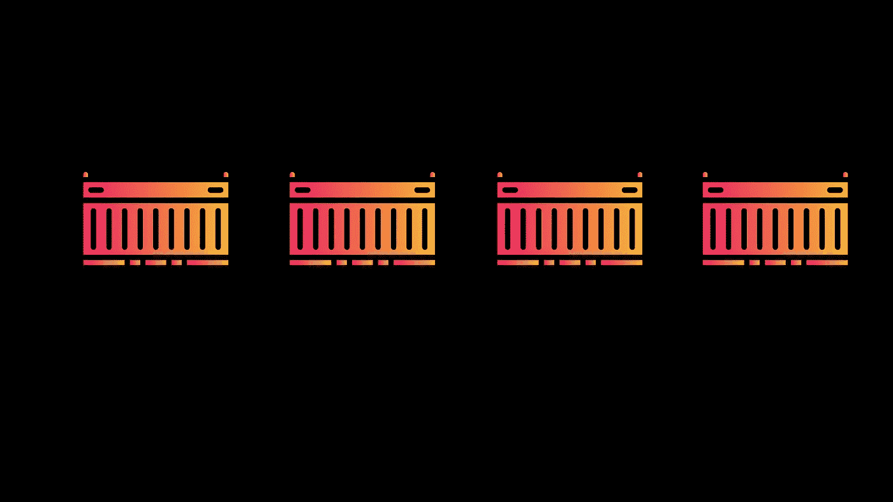
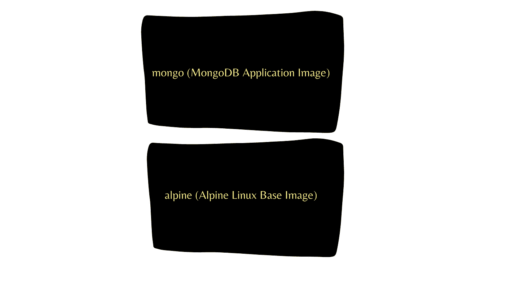
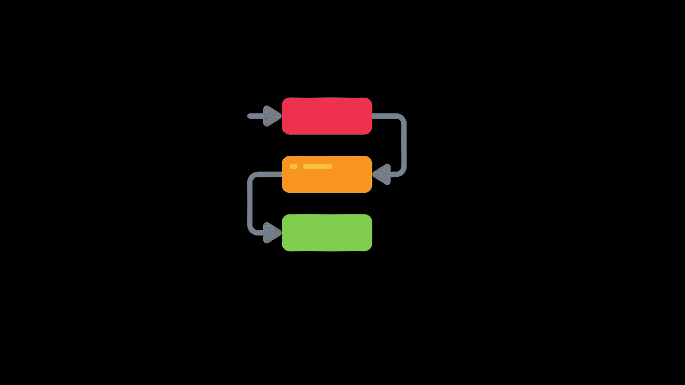

# 如何对接 Java Spring Boot Api & Mongo DB

> 原文：<https://medium.com/geekculture/how-to-dockerize-java-spring-boot-api-mongo-db-2ad5561a2592?source=collection_archive---------0----------------------->



**Docker 是什么？**

Docker 是一个工具，它提供了一种在松散隔离的环境中打包应用程序的方法，该环境被称为**容器**。

**什么是集装箱？**

Container 是一个虚拟化环境，其中的应用程序在运行时与底层系统相隔离。容器是基础和应用程序的分层映像的集合。



**为什么要用 docker？**

在早期，web 应用程序是使用虚拟机和一些使用附加工具的部署脚本来部署的。其中虚拟机将创建与您的主操作系统完全隔离的环境，并且依赖于客户操作系统。这里的想法是启动一个虚拟机，设置您的 web 应用程序，安装数据库服务器、Web 服务器等。，每次当你想部署你的 web 应用程序时，你都必须遵循上面提到的所有步骤，因为这将是一个非常耗时和乏味的过程。使用 docker，您不必安装任何客户操作系统，因为 docker 容器共享主机操作系统。

**docker 的优势？**

docker 的最大优势之一是，与虚拟机相比，它的重量非常轻，并且因为它有效地使用系统资源并帮助隔离应用程序，所以节省了大量的金钱和时间。

**有什么缺点吗？**

docker 的核心概念是虚拟化，因此在容器和主机系统之间进行交互时，基础设施仍然会受到限制。其他限制包括持久数据存储、GUI 应用程序等的复杂性。,

**所需安装**


*   [JAVA](https://www.java.com/en/)
*   [美文](https://maven.apache.org/)
*   [IntelliJ](https://www.jetbrains.com/idea/)
*   [GIT](https://git-scm.com/) (如果你想克隆示例项目的话)

**创建 Spring Boot Api**

从 Spring 初始化器开始，因为它会很容易地生成 boiler plate 代码。我们在这里使用的示例项目是一个电影信息管理 API。

[](https://start.spring.io/) [## 弹簧初始化器

### 初始化器生成的 spring boot 项目正好是你快速启动所需要的！

start.spring.io](https://start.spring.io/) 

**依赖关系**



*   Spring Boot 入门网站
*   Spring Boot 入门数据 MongoDB
*   龙目岛

```
Project: [https://github.com/karthiksai231/docker-example](https://github.com/karthiksai231/docker-example)Clone: git clone [https://github.com/karthiksai231/docker-example.git](https://github.com/karthiksai231/docker-example.git)
```

**运行**

要运行该应用程序，您的系统应该安装了 MAVEN。运行以下命令...

```
// Go to Project Root Directory
cd <PathToRootDirectory>// Install
mvn clean install// Run
java -jar target/<name_of_your_project_jar> // If you have cloned the Project
java -jar target/docker-0.0.1-SNAPSHOT.jar
```

一旦项目开始成功运行，您就可以使用…

```
http://localhost:8080/api/v1/movie
```

使用 API Url 创建一个电影条目，在请求正文中包含电影名称和类别。

```
// Request Body{
 "movieName" : "IronMan",
 "category" : "Action"
}// ResponseCode: 200 (OK){
 "movieName": "IronMan",
 "category": "Action"
}
```

**包装**

目标目录应该包含构建 docker 映像所需的项目 JAR 文件。如果您在运行`mvn clean install`命令后进行了任何额外的更改，请确保重新运行该命令以检测新的更改。

```
mvn clean install
```

**Dockerfile**

**构建 Docker 图像**

转到 **Dockerfile** 所在的目录，在命令提示符/终端中运行以下命令，为您的应用程序创建 docker 映像。

```
docker image build -t <name_of_the__app_image> .
```

**运行码头集装箱**

在运行应用程序容器之前，您需要运行相关的数据库容器。

要开始，请遵循以下步骤…

Mongo 数据库

```
docker run -d -p 27017:27017 --name <mongo_container_name> --net backend mongo:latest
```

电影应用程序

```
docker run --rm -p 8080:8080 --name <name_of_app_container> --net backend --link <mongo_container_name>:mongo <name_of_the__app_image>
```


**奖金**

**将应用发布到 Docker Hub**

运行以下命令发布您的应用程序映像。您需要有一个 docker 帐户来发布图像。

[码头工人中心](https://hub.docker.com/)

在您的命令提示符/终端中运行以下命令…

```
// Login to your Docker account
docker login
```

docker 图像应该在发布图像之前进行标记。为了标记图像，运行以下命令。

```
docker image tag <original_image_name> <your_user_name>/<repo_name>:latest
```

现在，您可以发布您的图像了…


```
docker image push <your_user_name>/<repo_name>:latest
```

**Docker 撰写文件**

运行下面的命令`docker-compose up`来运行电影应用程序和 Mongo DB 容器，而不需要手动运行任何其他 docker 命令。

`Note: You need to have the application image already created before running the Docker Compose file.`