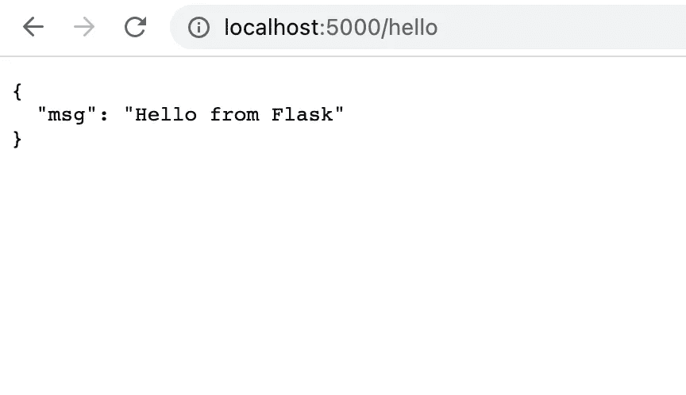
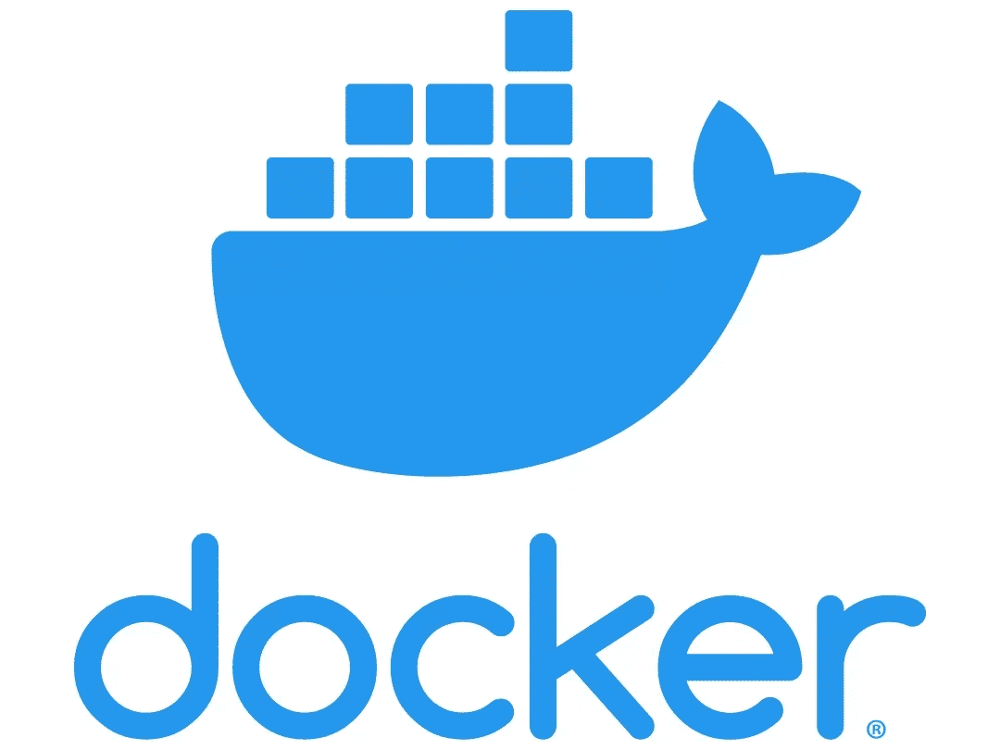

# 如何整理你的烧瓶申请

> 原文：<https://medium.com/geekculture/how-to-dockerize-your-flask-application-2d0487ecefb8?source=collection_archive---------1----------------------->

## 一个简约的烧瓶应用程序


# 简介:

这篇文章的目的是记录一个极简的烧瓶应用程序。让我们以一个简单的 flask 程序为例，对它进行 dockerise。

# 一个简单的烧瓶应用:

下面的代码是一个只有一个端点`/hello`的最小烧瓶应用程序。假设模块名为`my_flask.py`。

## my_flask.py

```
from flask import Flask, jsonify

app = Flask(__name__)

@app.route("/hello", methods=["GET"])
def say_hello():
    return jsonify({"msg": "Hello from Flask"})

if __name__ == "__main__":
    # Please do not set debug=True in production
    app.run(host="0.0.0.0", port=5000, debug=True)
```

# 运行烧瓶应用程序:

```
(docker-env) dinesh@dinesh % python my_flask.py 
 * Serving Flask app 'my_sync'
 * Debug mode: on
WARNING: This is a development server. Do not use it in a production deployment. Use a production WSGI server instead.
 * Running on all addresses (0.0.0.0)
 * Running on http://127.0.0.1:5000
 * Running on http://10.104.1.164:5000
Press CTRL+C to quit
 * Restarting with stat
 * Debugger is active!
```

## 输出:

```
{
  "msg": "Hello from Flask"
}
```



Flask endpoint browser output

现在，我们的 flask 应用程序正在运行，并给出了预期的输出，让我们来对接它。

# 码头工人——什么？



从文件上看，

> *容器是软件的标准单元，它将代码及其所有依赖项打包，以便应用程序能够从一个计算环境快速可靠地运行到另一个计算环境。Docker 容器映像是一个轻量级的、独立的、可执行的软件包，包括运行应用程序所需的一切*
> 
> [*https://www.docker.com/resources/what-container/*](https://www.docker.com/resources/what-container/)

从技术上讲，docker 容器是应用程序之上的一个抽象层。在我们的例子中，烧瓶应用程序。那么，要在不同的环境下运行 flask 应用程序而不出错，我们需要做些什么呢？让我们把它们列出来。

1.  首先，我们需要`python`。
2.  `flask`应安装库。

这就是我们所需要的。假设你想让你的 flask 应用程序在你的对等机器上的其他地方运行，我们只需要一个安装了`flask`的`python`环境。这正是 Docker 解决的问题。

你不必向你的同伴提供你的依赖库或自述文件来开始使用你的 flask 应用。他/她只需要一个 docker 环境来运行你的应用程序，并访问你的应用程序所在的存储库。我们将使用`dockerhub`来托管 flask 应用程序。然而，大多数组织也使用`JFrog artifactory`来托管他们的内部 docker 映像。

# Dockerhub:

> *Docker Hub 是由 Docker 提供的托管存储库服务，用于与您的团队查找和共享容器映像*

# Requirements.txt:

requirements.txt 文件列出了运行项目所需的所有依赖库。我们的小工作室只需要`flask`模块。

```
flask==2.2.2
```

让我们编写 Docker 文件。

# Docker 文件:

```
FROM python:3.9-slim-buster
WORKDIR /app
COPY ./requirements.txt /app
RUN pip install -r requirements.txt
COPY . .
EXPOSE 5000
ENV FLASK_APP=my_flask.py
CMD ["flask", "run", "--host", "0.0.0.0"]
```

1.  从 dockerhub 导入 python。
2.  创建工作目录应用程序。
3.  将`requirements.txt`文件复制到 app 目录下。
4.  安装 requirements.txt 文件中的所有依赖项。
5.  将整个应用项目复制到应用目录中。
6.  我们公开端口 5000，因为应用程序将在端口 5000 上运行。
7.  定义`FLASK_APP`环境变量。否则解释器可能会抱怨找不到变量
8.  最后，输入运行命令`flask run --host 0.0.0.0`。这是为了确保服务器接受来自所有主机的请求。

# 构建 docker 图像:

既然我们已经准备好了`Dockerfile`，我们将建立 docker 映像。请确保您的`docker desktop`正在运行。否则你可能会得到这个错误。

```
Cannot connect to the Docker daemon at unix:///var/run/docker.sock. Is the docker daemon running?
```

**命令:**

```
(docker-env) dinesh@dinesh % docker build -t myflaskapp .
```

请注意命令末尾的句点。

```
[+] Building 27.8s (10/10) FINISHED                                                                                                                                                                                     
 => [internal] load build definition from Dockerfile                                                                                                                                                               0.0s
 => => transferring dockerfile: 37B                                                                                                                                                                                0.0s
 => [internal] load .dockerignore                                                                                                                                                                                  0.0s
 => => transferring context: 2B                                                                                                                                                                                    0.0s
 => [internal] load metadata for docker.io/library/python:3.9-slim-buster                                                                                                                                          3.8s
 => [1/5] FROM docker.io/library/python:3.9-slim-buster@sha256:e0bf67a281748c0f00c320dbe522631e92c649bef22a14f00a599c1981dac2a6                                                                                   18.3s
 => => resolve docker.io/library/python:3.9-slim-buster@sha256:e0bf67a281748c0f00c320dbe522631e92c649bef22a14f00a599c1981dac2a6                                                                                    0.0s
 => => sha256:e0bf67a281748c0f00c320dbe522631e92c649bef22a14f00a599c1981dac2a6 988B / 988B                                                                                                                         0.0ssha256:2238450926aa858e592e60bb5d68dd26eeab8a984eee45505ca89d2022e3b450 27.14MB / 27.14MB                                                                                                                  16.1s
 => => sha256:15d04b3d1b9d2c709f48e1224daac0ab09f65130a892380cf1f725f980dbb0fa 2.78MB / 2.78MB                                                                                                                     1.2s
 => => sha256:83de38ae3b75c524cce554598a0f0842ba782b433f637623bdcff1d4158c8764 11.57MB / 11.57MB                                                                                                                   7.4s
 => => sha256:f2ae8a19c88b4a4fee41cd329b6cc78f34ea84933f26d82c5157971e4cc2f4dc 233B / 233B                                                                                                                         4.5s
 => =>                                                                                                                    0.2s
 => [internal] load build context                                                                                                                                                                                  0.0s
 => => transferring context: 87.10kB                                                                                                                                                                               0.0s
 => [2/5] WORKDIR /app                                                                                                                                                                                             0.5s
 => [3/5] COPY ./requirements.txt /app                                                                                                                                                                             0.0s
 => [4/5] RUN pip install -r requirements.txt                                                                                                                                                                      5.0s
 => [5/5] COPY . .                                                                                                                                                                                                 0.0s
 => exporting to image                                                                                                                                                                                             0.2s
 => => exporting layers                                                                                                                                                                                            0.2s
 => => writing image sha256:6b1ab29f10db5c51a894504df7ac11594f5da5b1e9da68561c1e6543ff0fc7a8                                                                                                                       0.0s
 => => naming to docker.io/library/myflaskapp
```

一旦成功构建了映像，这些映像应该作为 docker 映像的一部分列出。

```
(docker-env) dinesh@dinesh % docker imagesREPOSITORY    TAG       IMAGE ID       CREATED          SIZE
myflaskapp    latest    6b1ab29f10db   10 minutes ago   133MB
```

# 运行 Docker 映像:

```
(docker-env) dinesh@dinesh % docker run -p 5000:5000 myflaskapp

 * Serving Flask app 'my_flask.py'
 * Debug mode: off
WARNING: This is a development server. Do not use it in a production deployment. Use a production WSGI server instead.
 * Running on all addresses (0.0.0.0)
 * Running on http://127.0.0.1:5000
 * Running on http://172.17.0.2:5000
Press CTRL+C to quit
```

# 将 Docker 映像推送到 Docker hub:

Docker 图片通过`[docker push](https://docs.docker.com/engine/reference/commandline/push/)`命令被推送到 Docker Hub。单个 Docker Hub 存储库可以保存许多 Docker 图像(存储为标签)。要将图像推送到 Docker Hub，您的帐户中应该有一个存储库。假设我的存储库名称是`myflaskapp`，docker push 命令看起来像这样，

```
docker push <username>/<reponame>:tagname

docker push dinesh/myflaskapp:mytag
```

# 总结:

*   容器是一个标准的软件单元，它将代码及其所有依赖项打包在一起
*   Docker 容器映像是一个轻量级的、独立的、可执行的软件包，包括运行应用程序所需的一切