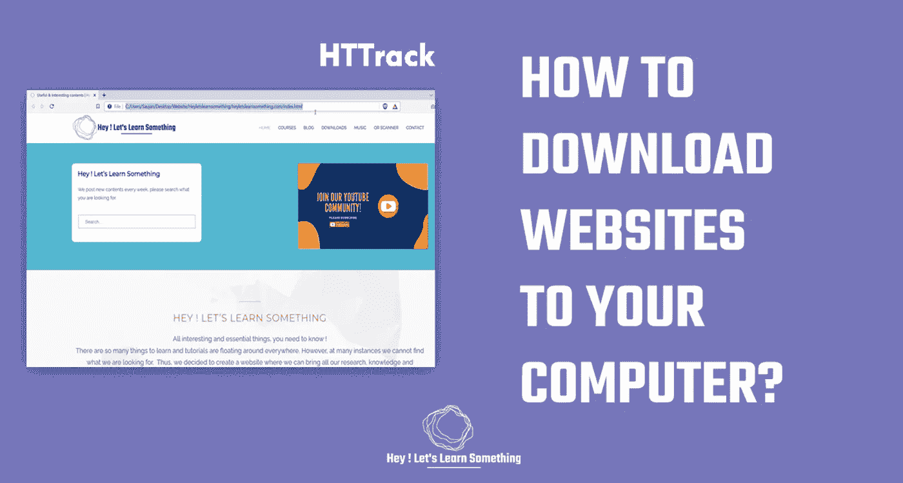

# 如何把一个网站下载到电脑上？

> 原文：<https://medium.com/geekculture/how-to-download-a-website-to-your-computer-b48493557247?source=collection_archive---------9----------------------->

有时候，把整个网站保存到你的电脑里会非常有用。它可以用来展示给你的同事或演示文稿等等。好的一点是，下载网站非常简单，根本不需要任何特殊技能。但是，请注意，通过下载网站，你将没有工作文件——就像如果你下载了一个 WordPress 网站，你将不会…