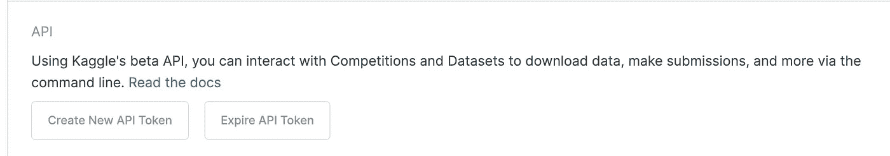
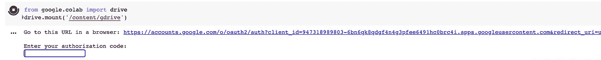
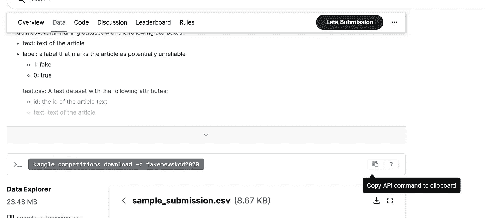

# 如何从 Kaggle 下载数据集到 Google Colab

> 原文：<https://medium.com/geekculture/how-to-download-datasets-from-kaggle-to-google-colab-7bb3c5a44c51?source=collection_archive---------9----------------------->

## 使用 Google Colab 进行数据分析


Photo by [Myriam Jessier](https://unsplash.com/photos/eveI7MOcSmw) from [Unsplash](https://unsplash.com/)

# 介绍

在本教程中，您将从 Kaggle API 下载数据集到 Google Colab。

[Kaggle](https://www.kaggle.com/) 是一个由数据科学家和机器学习实践者组成的在线社区，用户可以在这里找到和发布数据集，在基于网络的数据科学环境中探索和构建模型。

[Google Colab](https://colab.research.google.com/notebooks/welcome.ipynb#scrollTo=ZIAj4oZF1KhQ) 允许任何人通过浏览器编写和执行 python 代码。它还提供免费的 GPU 和 TPU 服务。

在本教程结束时，您将有一个假新闻检测数据集下载到您的 Google Colab，您可以使用相同的方法在 Kaggle API 中下载任何您希望的数据集。

# 先决条件

要完成本教程，您需要:

*   为 Python3 安装并设置一个本地编程环境。

[](https://www.digitalocean.com/community/tutorial_series/how-to-install-and-set-up-a-local-programming-environment-for-python-3) [## 如何安装和设置 Python 3 | DigitalOcean 的本地编程环境

### 本系列教程将指导您在本地机器上安装 Python 3 并设置编程…

www.digitalocean.com](https://www.digitalocean.com/community/tutorial_series/how-to-install-and-set-up-a-local-programming-environment-for-python-3) 

*   拥有一个 Kaggle 账户和一个 Google Colab 账户。

# 步骤 1 —获取 Kaggle API 令牌。

登录您的 Kaggle 帐户，点击您的个人资料，转到您的帐户，滚动到 API 部分，然后点击**过期 API 令牌**以删除以前的令牌。不要忘记这一步，否则，您可能会在下载数据集时遇到 401-未授权错误。



Kaggle API token

# 第二步——将 Kaggle.json 下载到 Google Colab。

1.  首先，在 Google Colab 中创建一个名为 Kaggle 的文件夹。请随意使用任何文件夹名称。我使用 Kaggle 是为了更好地跟进。
2.  其次，在你的 Kaggle 账户中点击**创建新的 API 令牌**，将 kaggle.json 文件下载到你在 Google Colab 中创建的 kaggle 文件夹中。

# 步骤 3 —将驱动器安装到 Colab 笔记本电脑上。

1.  首先，创建一个新的 Colab 笔记本，并使用以下代码安装 Kaggle。

```
! pip install kaggle
```

2.其次，使用下面的代码安装您的 google drive:

```
from google.colab import drive
drive.mount('/content/gdrive')
```

3.然后使用提示的 URL 获取您的授权码，并在空白框中提供它，如图所示:



Colab authorization

4.运行以下代码，提供 kaggle.json 的配置路径。

```
import osos.environ['KAGGLE_CONFIG_DIR'] = "/content/gdrive/My Drive/Kaggle"
```

# 步骤 4 —更改目录并下载数据集。

1.  使用`%cd /content/gdrive/My Drive/Kaggle`切换到 Kaggle 目录
2.  在 Kaggle 中找到想要下载的数据集。例如，假设您将在 Kaggle 上执行一个[假新闻检测挑战](https://www.kaggle.com/c/fakenewskdd2020/data)，并希望在 Colab 中下载数据集。在这种情况下，您可以导航到数据集网站并单击数据，然后复制 API 命令，如下所示。



Dataset API

在这种情况下，API 命令是`kaggle competitions download -c fakenewskdd2020`。

3.运行以下命令在 Colab 中下载数据集:`!kaggle competitions download -c fakenewskdd2020`数据集现在下载到您的 Kaggle 目录中。

4.使用`!unzip \*.zip && rm *.zip`解压文件并删除 zip 文件。

太棒了。数据集已经准备好供您使用了！

# 结论

在本文中，您从 Kaggle API 下载了一个假新闻检测数据集到 Google Colab。现在，您可以从 Kaggle API 下载任何想要的数据集，并使用您的数据进行操作！