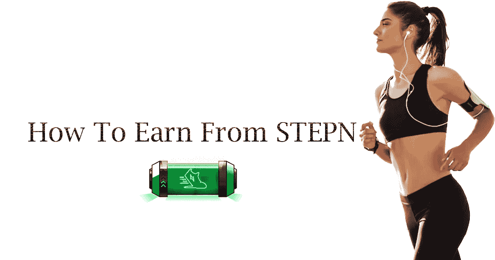
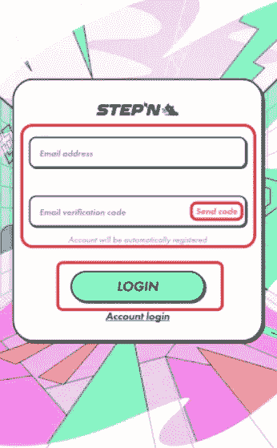
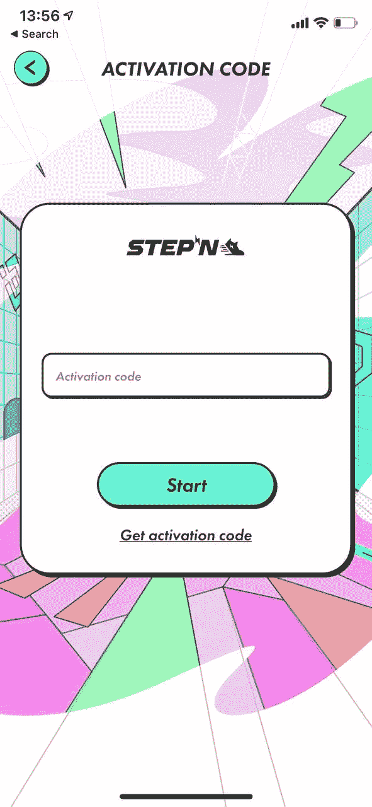
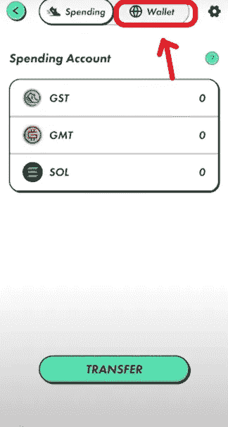
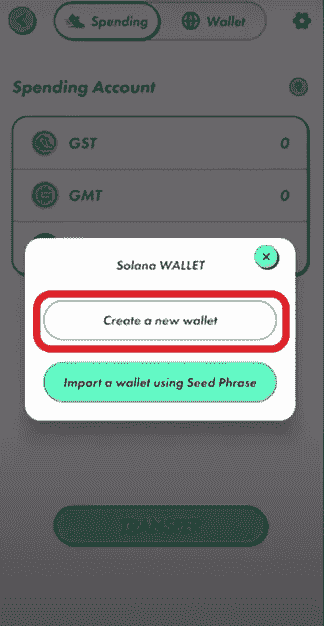
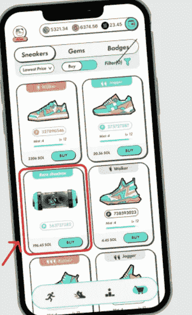
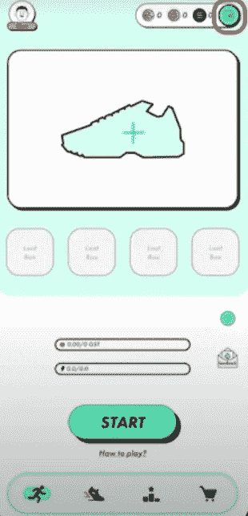
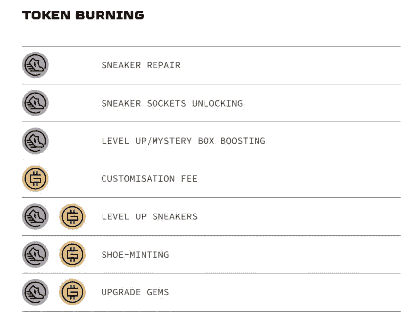

# 如何从 STEPN 赚？

> 原文：<https://medium.com/geekculture/how-to-earn-from-stepn-6b2e715bc3a8?source=collection_archive---------4----------------------->

## 如何玩 STEPN 移动赚取平台。玩 STEPN 的完全指南

**How To Earn From STEPN**

嘿伙计们！再次很高兴在这里见到大家。现在我想在这个博客上分享一些重要的消息。是的，我很确定你们都知道“玩到赚”的平台/游戏，但是你们听说过“移动到赚”的概念吗？还挺有意思的 naa！耶！这个概念是由 STEPN 发起的，它是元宇宙 web 3 生活方式应用程序，实现了社交和游戏体验。让我解释这个项目和一步一步的程序来玩这个游戏。

**什么是 STEPN？**

STEPN 顾名思义，你需要走出去使用这个应用程序。这是新的元宇宙移动赚取游戏应用程序，它允许您通过虚拟资产赚取。STEPN 的主要座右铭是鼓励人们保持健康。这个项目吸引了每一个 NFT 爱好者，在年轻人中非常受欢迎。谁不喜欢光靠走路/跑步挣钱啊！因此它闻名全球。

其中 STEPN 应用程序开发了内置市场和具有独特交换功能的特定钱包。它允许用户购买和存储他们的运动鞋/靴子 NFT

用户也可以通过他们的二级市场重新交易他们的运动鞋/靴子。

STEPN 的两个令牌:

**1。商品及服务税**

**2。GMT**

GST 被称为公用令牌，而 GMT 被称为公用令牌和治理令牌。

你只需要走出去或移动赚取那些商品及服务税和 GMT 代币。只有达到球鞋 30 级才能获得 GMT 代币。

现在别浪费时间了，让我们开始吧，

**使用 STEPN 的分步说明:**

第一步:从 google play 商店下载 **STEPN 应用**。

**STEPN Login**

第二步:注册并创建一个帐户。您需要使用您的电子邮件 id 来接收您的**验证码**。验证后，您将可以登录您的帐户。

第三步:现在你要面对被称为**激活码**的将死。

耶！注册后有一个将军会！玩游戏需要激活码。

**Activation Code**

有许多可能的方法来获得激活码。

1.  您可以从任何现有用户处获取激活码，但会有一些限制。
2.  另一种方式是你将从 STEPN 官方**不和谐服务器**获得激活码，那里将有一个用于代码共享的特定通道。
3.  最后一种方法是，你可以通过使用标签**# stepna activation code**从 Twitter 获取激活码
4.  您也可以在 STEPN Discord、 **STEPN Reddit 和其他加密社区**的赠品中找到 STEPN 激活码。

但是你需要像早起的鸟儿一样去捕捉你的虫子。

申请激活码后，创建一个钱包，并为你的钱包提供资金来购买你的运动鞋 NFT。

第四步:现在你需要创建一个 **STEPN 钱包**。激活您的帐户后，您将进入 STEPN 主页，在主页的右上角，您会看到一个钱包图标。

点击钱包图标，你可以看到两个标签，**钱包和消费**

单击钱包创建一个钱包。您还可以通过使用**种子短语**洞察力导入您的钱包。

如果你想创建一个新的钱包，点击**创建一个新的钱包** t，在这里你需要输入密码。

现在，将你的密码储存在你的头脑或任何有形资产中，比如纸张，而不是数字资产。

第四步:转账 **SOL** 买鞋。

要购买运动鞋/步行机/慢跑机，你只需要在 SOL 上花费。创建您的帐户后，您需要点击接收复制您的地址。

然后打开币安或任何其他交易所，并选择溶胶。

现在粘贴您从 STEPN 复制的地址，并输入购买资产所需的 SOL 数量。

1 索尔的当前价值是 62.26 美元，而且还在上涨，所以要尽可能快地买入你想要的资产。

第五步:买你想要的运动鞋

为了玩和赚 STEPN 的钱，你必须需要一双球鞋。你需要买一双数字运动鞋来成为 STEPN 的一部分。

**运动鞋的特点**

1.步行者(1-6 公里/小时)

2.慢跑者(4-10 公里/小时)

3.跑步者(8-20 公里/小时)

4.教练(1-20 公里/小时)

你可以从他们的市场买到你想要的运动鞋。

目前，一双运动鞋的价格在 13 索尔到 20 索尔之间。

你也可以把你的运动鞋转手或出租给其他玩家来赚钱。你可以在运动鞋详情页面找到更多信息。

其中运动鞋详细信息页面包含以下详细信息:

1.  品质:普通，稀有，史诗，传奇
2.  效率:商品及服务税象征性收入
3.  运气:关于神秘盒子
4.  舒适:GMT 代币收入(这将只在 30 级启用)
5.  弹性:降低维修成本

第六步:抓住运动鞋 NFT 和运行赚取！

现在离开你的床，跑去挣钱吧！

你需要打开你的全球定位系统。确保您的 GPS 信号很强。如果你的 GPS 很低，意味着你将面临赚钱的困难。

最重要的是你需要保持最佳速度。维持绿区挣钱就行了。

按开始并运行！

第七步:燃烧商品及服务税和 GMT

燃烧 GST/GMT 意味着花费您赢得的代币

你可以通过烧你的商品及服务税来修复你的运动鞋

你可以花你的商品及服务税来铸造一双新运动鞋

您也可以将您的 GST/GMT 代币兑换成 USDC 代币。

**最终想法**

STEPN 是每个人的神圣应用程序之一，在这里我们可以赚钱，同时提高我们的健康水平。

> “醒醒。系好鞋带。快跑。不管怎么样。”—乌塞恩·博尔特

只要走出你的舒适区，通过 STEPN 赚钱。你为什么还在等着出去！开始跑步赚你的钱吧！

**快跑宝贝快跑！**