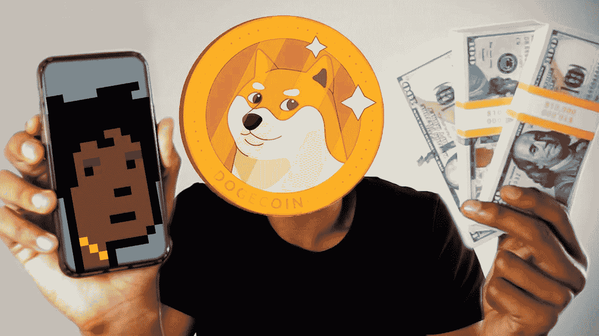
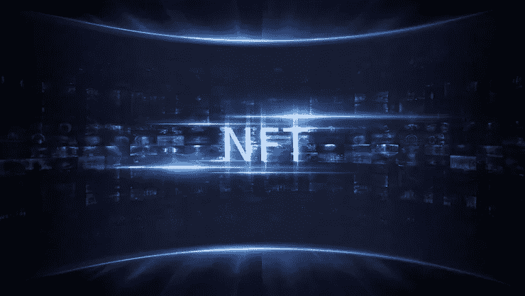
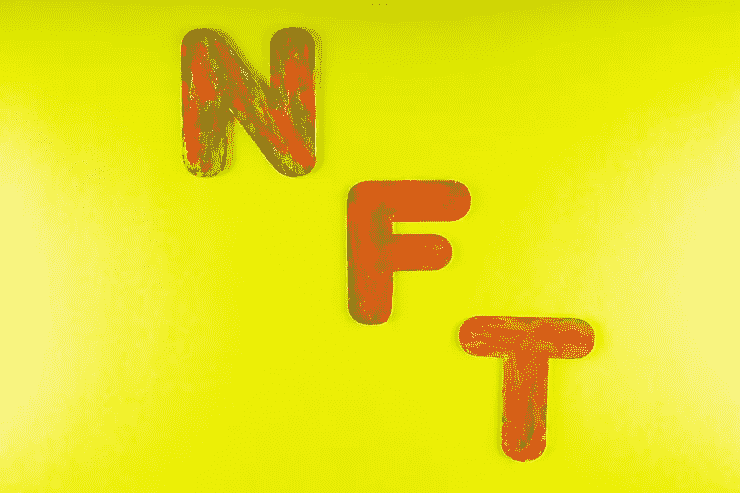
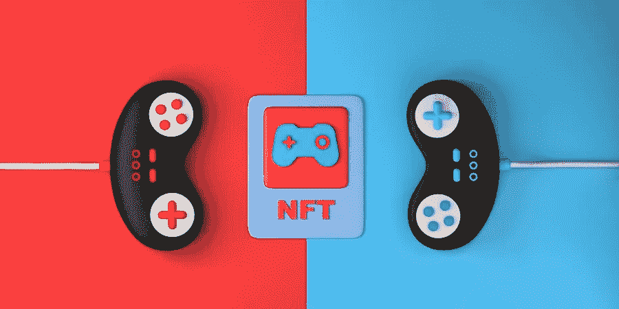
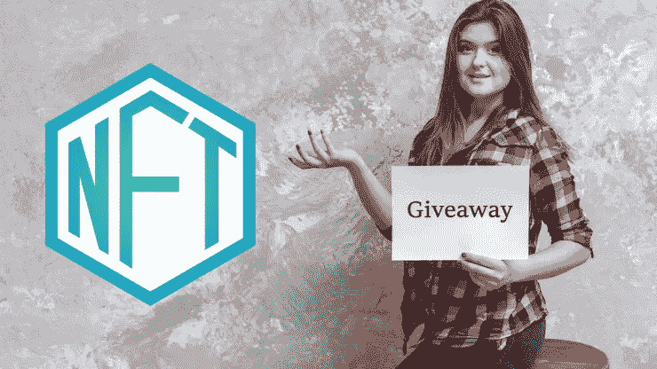

# 如何从 NFT 赚钱？

> 原文：<https://medium.com/geekculture/how-to-earn-money-from-nft-c42159e1a3db?source=collection_archive---------11----------------------->

## **一些从 NFT 赚钱的简单方法**

**Earn Money From NFT**

NFT 又名不可替代令牌是统治当前商业市场的独特数字资产。这被认为是数字领域中蓬勃发展的盈利业务之一。最近，社交媒体公司将注意力转向了 NFTs。Twitter 首席执行官杰克·多西用他的第一条推文换取了 290 万美元的数字资产。最近，Meta 首席执行官马克·扎克伯格(Mark Zuckerberg)计划在他们的社交媒体平台(如脸书/Instagram)上整合(铸造)不可替代的令牌。

因此，不浪费时间，让我们深入研究通过这些有利可图的非功能性网络营销赚钱的方法。

**是什么让 NFT 身价倍增？**

这个问题可能会出现在每个人的脑海里。就连我也对这个有点困惑。然后，我做了一些区块链研究，以找到一个有效的理由。NFT 价值背后的主要原因是它们的独特性。每个 NFT 都有它的价值。

**What makes NFT Worth**

最重要的是，NFTs 没有任何限制，你可以把任何东西变成 NFT，可以是你的手机，你的 Snapchat 照片，甚至是你的内衣，等等。另一件事是没有人可以复制或伪造你的数字资产，因为 NFT 有其独特的区块链地址。所以真正的所有权由你来承担。这些是 NFTs 的最佳特征，这些特征使得 NFTs 成为 21 世纪的宝贵财富。

# **从 NFT 赚钱的 5 个简单方法！**

**1。买卖你的 NFT**

这是通过 NFTs 赚钱的最简单的方法之一。根据你的愿望，选择一些最好的 NFT 市场，如开放海洋，基金会，币安等。购买你想要的 NFT，然后重新交易获利。就是这样。可以赚取更多的利润。但是在选择在市场上投资你的法定货币(政府批准的纸币)之前，有一件事要记住，那就是你必须对特定的市场做市场调查，此外，你必须检查你明智购买的非法定货币的稀有标准和独特性。它表示你的 NFTs 的转售价值，以赚取更多的利润。

**Buy and Sell your NFTs**

**2。发布你的数字艺术**

当谈到没有任何投资的绝对利润时，那么发布你的数字艺术是赚取利润的最佳方式。你唯一需要投资的是你的艺术技巧和时间来创作这种独特的艺术。如前所述，将艺术转化为 NFT 是没有限制的。你可以上传你的艺术，照片，或任何其他独特的资产到市场中的 NFTs。如果任何个人喜欢你的艺术意味着他可以出价或以你想要的底价或最高价购买你的艺术。除了从市场上扣除的最低服务费，所有的利润都属于你。

埃米利奥·巴雷拉是一名 7 岁的数码艺术家，他的数码涂鸦集名为《埃米利奥的艺术》。他的作品在 NFT 的平台上吸引了数百万艺术爱好者。

同样，如果有人被你的艺术所吸引，就意味着他们会接近你来得到你的艺术。你会在一夜之间成为摇滚明星。

**Publishing your Digital Art**

**3。NFT 玩挣钱游戏**

这将是每一个游戏玩家通过玩游戏赚钱的最佳策略。有一些 NFT P2E 游戏，你可以简单地玩，从你的对手那里赚取 NFT。这个数字世界让许多人变成了游戏玩家。因此，我更希望这将是每个游戏玩家/视频游戏流从 NFT 视频游戏中赚取利润的好机会。Axie Infinity，Sandbox，Gods Unchained，Sorare 是一些最好的 NFT 游戏。许多即将推出的 NFT 视频游戏正在排队等待将玩家和 NFT 迷拖入他们的世界。很可能是 NFT 科技的未来。因此，游戏玩家为 NFT 游戏大战做好准备，以赚取更多利润。在未来，NFT 的游戏产业将会蓬勃发展，每个玩家都有无数的机会来证明他们的才华。我亲爱的读者利用这些巨大的 P2E 游戏来产生利润。

**NFT Play to Earn Games**

**4。特许门票/收藏品**

您可以将任何认证/许可的门票或收藏品令牌化，这似乎是 NFT 技术最有机、最清晰的应用。任何有效的课程认证、婚礼请柬、入场券、折扣券等许可资产都可以在市场上被标记和重新标记为 NFT。每一个具有独特特征的物理对象都可以转换成数字资产，从而保持其独特的价值。例如，我们在童年时都可能打出王牌，每张牌都有其等级和其他价值，就像我们可以将有效的入场券或邀请函作为 NFT 令牌化一样，无论谁购买了这些门票，都可以虚拟地或实际地参观/享受该会议。这将是通过 NFTs 赚钱的另一种最佳方式。

**Licensed Tickets / Collectibles**

**5。参与免费空投**

这将是从数字资产中获利的最简单方式。每家 NFT 公司都会进行空投或免费赠品来鼓励他们的社区成员。对于 earing 来说，这种免费的 NFTs 你所要做的就是不断更新有关赠品的消息，并努力与该公司建立更好的关系。如果你是空投赢家，你甚至可以在市场上持有或再出售这些数字资产。你方不投资也能盈利。但是这个策略纯粹是靠你的运气。我宁愿试一试，谁知道运气可能会帮助你在这个 NFT 王国把你的生活提升到下一个阶段。

**Participate in free Airdrops**

**给我的朋友们最后的想法**

关于数字资产的日常新闻证明，未来取决于不可替代的代币。所以这将在未来的元宇宙王国扮演重要角色。因此，这将是每个人利用 NFTs 赚钱的最佳时机。只要按照上面提到的方法从 NFTs 中获利就可以了。我的建议是不要盲目相信任何事情，做好你的市场调查，自己做决定。

祝你未来一切顺利！