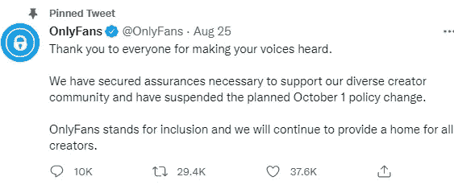

# 如何从 OnlyFans 克隆 app 挣钱？

> 原文：<https://medium.com/geekculture/how-to-earn-money-from-onlyfans-clone-app-940055fdcc4d?source=collection_archive---------12----------------------->

自 2016 年 OnlyFans 成立以来，它已经获得了超过 1.3 亿注册用户的巨大人气。此外，疫情期间用户数量激增。随着时间的推移，它在行业中的地位日益提高。

近日， **OnlyFans 计划禁止露骨内容**，预计从 2021 年 10 月 1 日开始实施。但是，来自支付提供商和银行合作伙伴的压力是暂停这项禁令的唯一原因。由于这个平台是许多内容创作者创收的来源，**暂停了对露骨内容的禁令**。

尽管该公司在推特上发布了政策暂停的消息，但它无法用热情平息愤怒。OnlyFans 突然流行背后的一个主要原因是关于明确内容禁令及其暂停的嗡嗡声。

在这篇博客中，让我们来看看内容创作者从 OnlyFans 这样的内容订阅应用程序中获取收入的各种方式。此外，对企业家获取收入的货币化策略有更深刻的见解。

**什么是 OnlyFans，为什么企业家渴望发展一个类似的粉丝？**

OnlyFans 是一个内容订阅应用程序，允许内容创作者发布内容并从中赚钱。用户必须订阅他们最喜欢的名人档案才能查看内容。因此，这个平台得到了名人、音乐家、艺术家和许多其他人的关注。

由于这个平台允许内容露骨，用户需要一个政府颁发的 ID 来注册这个应用程序。这是为了验证的目的，确保只有 18 岁以上的人可以访问这个平台。

**有趣的数据和事实:**

毫无疑问，在新冠肺炎疫情期间，OnlyFans 应用程序的用户数量大幅增加。很明显，2020 年 3 月有 35 万用户，2020 年 8 月增加到 70 万。

据预测，注册用户的数量将逐年增加。根据最近的一份报告，OnlyFans 拥有 200 万内容创作者和 1.3 亿用户。去年，它的收入超过了 4 亿美元。

自成立以来，用户和内容创作者激增，其净值也随之增长。目睹这一成功，许多企业家对开发类似 OnlyFans: OnlyFans Clone 的内容订阅服务应用程序表现出兴趣和好奇心。

**only fans Clone——一个盈利的现成应用解决方案**

**OnlyFans Clone Script 是一个现成的内容订阅应用解决方案**，它使创业者能够在短期内推出他们的应用。它在特性&功能方面模仿了原始版本。

如果你想推出一个像 OnlyFans 这样的粉丝俱乐部网站，选择定制&现成的解决方案，而不是从头开始开发，将是一个明智的举动。在投资 OnlyFans 克隆应用程序开发之前，你必须确定在你的平台上实现哪些收入流。浏览下一部分！

**OnlyFans Clone 为内容创作者提供各种收入流赚取**

单一收入流是无效的，因此您可以考虑实施多种收入流。通常，你可以考虑的一些标准的货币化策略如下所述。以下收入流将允许内容创作者从中获得巨额收入。

*   **按次付费收入流**

这种收入流将让内容创作者自己设定订阅费。他们可以向订阅他们内容的用户收取任意比例的费用。

由于 OnlyFans Clone 应用程序中没有发现功能或推荐系统，您可以让他们利用促销活动。

*   **付费消息/帖子**

该应用程序允许内容创建者使用付费消息功能向他们的订户发送消息。通过这种方式，他们将从订户那里赚取相当大比例的金额。

如果他们不想把内容放在付费墙后面，他们甚至可以实现付费帖子收入流。其中，他们可以为特定的帖子设定价格。

*   **流媒体直播**

直播是一个值得考虑的功能，它使内容创建者能够主持直播会议。**想实时展示你的才华吗？给他们直播的小费由你决定。他们可以允许用户免费观看直播内容，或者支付一定比例的费用。**

*   **筹款**

除了这些收入来源，在该应用程序注册的内容创作者还可以筹集资金。他们可以设定一个筹款目标。

**作为一个创业者，如何从 OnlyFans 克隆中创收？**

**基于佣金的收入模式**是内容订阅应用创收策略的常见来源。你可以向注册了该应用的内容创作者收取固定的佣金，通过前面提到的收入流赚取收入。例如，OnlyFans 收取 20%的佣金。

**该你了！开始使用你的 OnlyFans 克隆应用**

内容创作者从 OnlyFans **这样的 [**粉丝俱乐部网站赚取一分钱，有一个令人印象深刻的方法。**因此，他们热衷于利用这个平台展示自己的才华，获得更多关注者(订阅者)的关注。](https://www.uberlikeapp.com/onlyfans-clone)**

这个平台的受欢迎程度开始上升，尤其是在新冠肺炎疫情期间，这点燃了年轻企业家们思考投资 OnlyFans 克隆应用程序开发的火花。

你为什么不能利用这个好机会呢？轮到你了；永远不要拖延创业。现在是时候推出类似 OnlyFans 的内容订阅 app 了！

都准备好了吗？你所做的一切都是接近一个合适的技术合作伙伴，他精通根据你的业务需求制作应用程序。