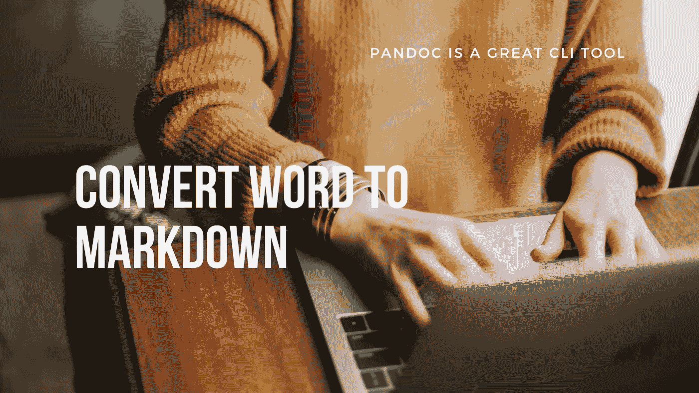

# 如何用 Pandoc 轻松地将 Word 转换成 Markdown

> 原文：<https://medium.com/geekculture/how-to-easily-convert-word-to-markdown-with-pandoc-4d60878ccc64?source=collection_archive---------3----------------------->

Markdown 怎么可能比微软 Word 好？

image from Canva

Word 有许多很棒的特性，非常适合编写长文档。但不幸的是，导出它们的唯一方式是 as。docx 文件。

如果你想把你的作品上传到像 Medium 这样的博客或者其他接受 Markdown 而不是 Word 文件的网站，这是没有用的。