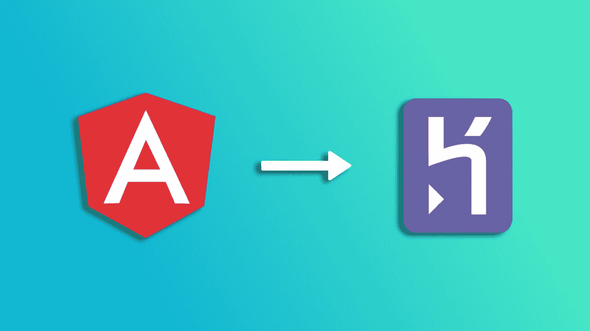
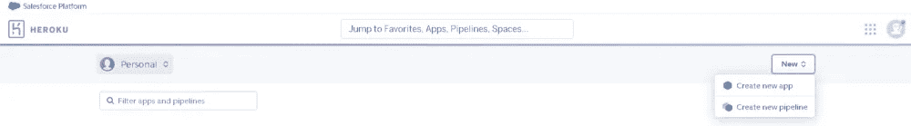
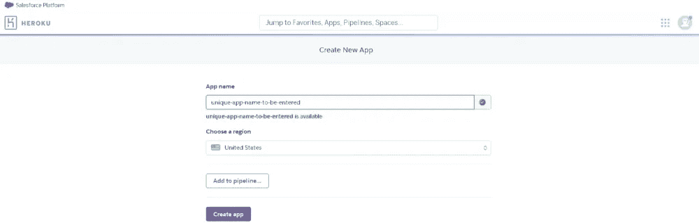
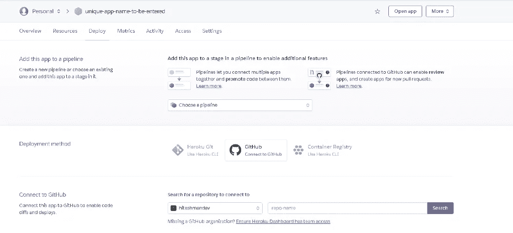
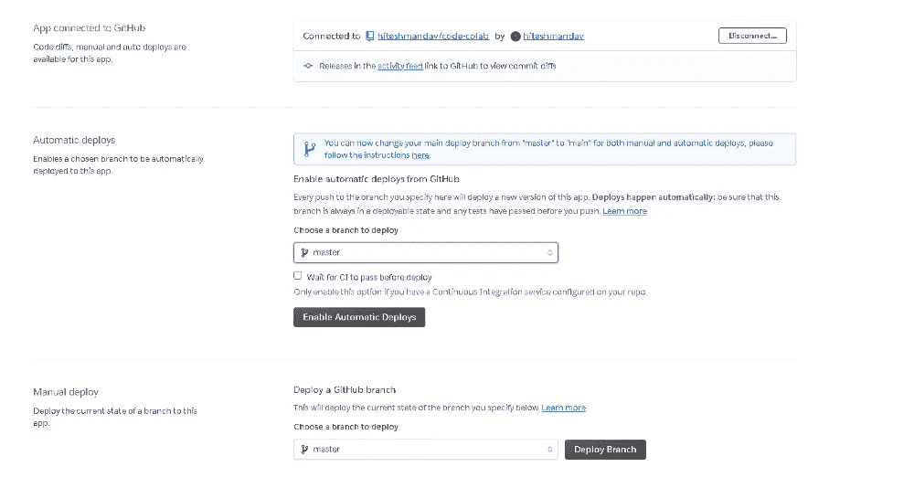
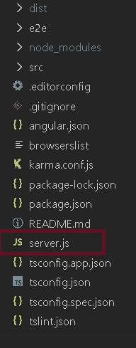

# 如何在 Heroku 上轻松部署你的第一个 Angular 应用

> 原文：<https://medium.com/geekculture/how-to-easily-deploy-your-first-angular-app-on-heroku-65dd546c8181?source=collection_archive---------0----------------------->



你是一个刚刚完成 Angular app 的开发者吗？我假设你不想只为自己保留这个应用程序，主要是你希望任何人都可以访问这个应用程序，如果它只是你的个人项目，你知道你不会从中赚到任何钱，你可能也不想在它上面花任何钱。

Heroku 来救援了！！！

在本文中，我们将介绍将 Angular 应用程序部署到 Heroku 服务器的步骤。

在本文中，假设您的代码在 GitHub 库中可用，我们将讨论以下内容。

*   创建 Heroku 应用程序
*   将 GitHub repo 链接到 Heroku 应用程序进行自动部署。
*   为 Heroku 服务器配置 Angular 应用程序

## 创建 Heroku 应用程序

在这里免费创建一个 Heroku 账号。如果您已经有帐户，请登录并转到仪表板。

这里你需要创建一个新的应用程序。



并输入唯一的应用程序名称



## 将 GitHub repo 链接到 Heroku 应用程序进行自动部署。

要做到这一点，你可以去你的 Heroku 应用程序。在 deploy 部分，您需要选择第二个选项 GitHub。(如果你的 Heroku 账户没有连接到 git hub，你必须登录 GitHub 并连接你的 Github 账户。)并且您将能够看到一个输入框，用于搜索与您的 git hub 帐户相关联的存储库。你可以找你的回购，点击连接。



一旦连接了存储库，您可以选择**enable automatic deployments**，现在一切都完成了，只要有一个推送到您的 Github repo，Heroku 就会自动部署更改。



但是，你的棱角将会消失。因为我们还没有为 Heroku 部署配置 angular 应用程序。所以让我们现在就开始吧。

## 为 Heroku 服务器配置 Angular 应用程序

首先，您需要确保您的项目中有 angular cli 和 angular 编译器开发依赖项。

因此，您可以转到 package.json 文件，验证在开发依赖项中是否有@angular/cli 和@angular/compiler-cli。如果没有，你需要在你的项目的根文件夹中运行下面的 cmd。

`npm install @angular/cli@latest @angular/compiler-cli — save-dev`

现在在你的 package.json 中，从 dev-dependencies 中复制下面的代码，并粘贴到 dependencies 对象中。

`“@angular/cli”: “x.x.x”,
“@angular/compiler-cli”: “x.x.x”,`

和

`“typescript”: “x.x.x”`

现在我们需要添加一个脚本，告诉 Heroku 使用提前(AOT)编译器来构建项目，这样我们就有了浏览器可以理解的 HTML、javascript 文件。因此，我们在 package.json 的脚本中添加了以下内容。

`“heroku-postbuild”: “ng build — prod”`

这将创建所有编译过的文件，并将它们放在将要部署的 dist 文件夹中。

现在，重要的是要知道我们不能像现在这样部署 angular 应用程序，所以我们将创建一个节点服务器来服务我们的应用程序。做到这一点非常简单。

首先，我们将在项目中安装 express 模块和路径，为此，请在项目目录中运行下面的 cmd。

`npm install express path --save`

现在在你的项目的根目录下创建一个文件 server.js，并添加下面的代码记住用你的实际应用名替换<app-name>,这个应用名可以在 package.json name 键中找到。</app-name>



```
const express = require('express');const path = require('path');const app = express();app.use(express.static(__dirname + '/dist/<app-name>'));app.get('/*', function(req,res) {res.sendFile(path.join(__dirname+'/dist/<app-name>/index.html'));});app.listen(process.env.PORT || 8080);
```

现在我们需要添加一个节点和 npm 引擎，Heroku 将使用它们来运行我们的应用程序。因此，在 package.json 文件中添加以下代码。作为新的键值对。

`“engines”: { “node”: “x.x.x”, “npm”: “x.x.x” }`

我们最好将节点和 npm 配置为与本地机器上的版本相同。所以运行命令`npm -v`和`node-v`来获得版本。

现在我们差不多完成了，最后一步是将 package.json 中的启动脚本改为

```
"start" : "node server.js"
```

我们都准备好了。让我们使用下面的代码添加、提交并推送到 Github

```
git add .
git commit -m "updates to deploy to heroku"
git push
```

或者其他你喜欢的方式。

完成后，您将能够在 Heroku app 仪表盘中看到构建已自动启动，因为我们已经在上述步骤中完成了配置。


部署成功后，您可以单击顶部的打开应用程序按钮，访问您的 angular 应用程序，并与任何人共享该链接，以便他们可以访问您的应用程序。

感谢您的阅读，如果您有任何问题或建议，请在评论中联系我。