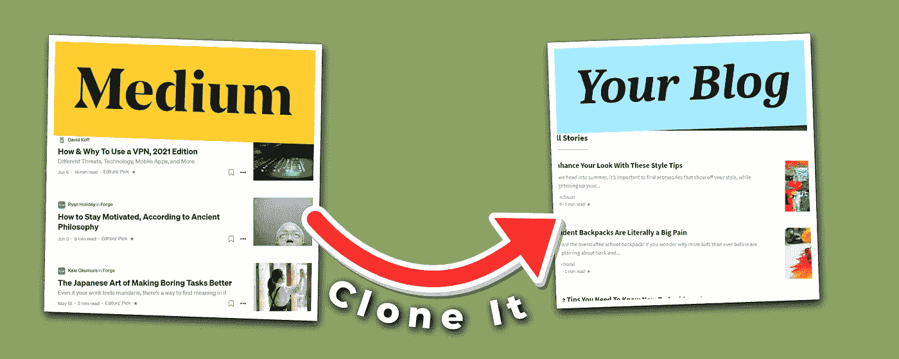
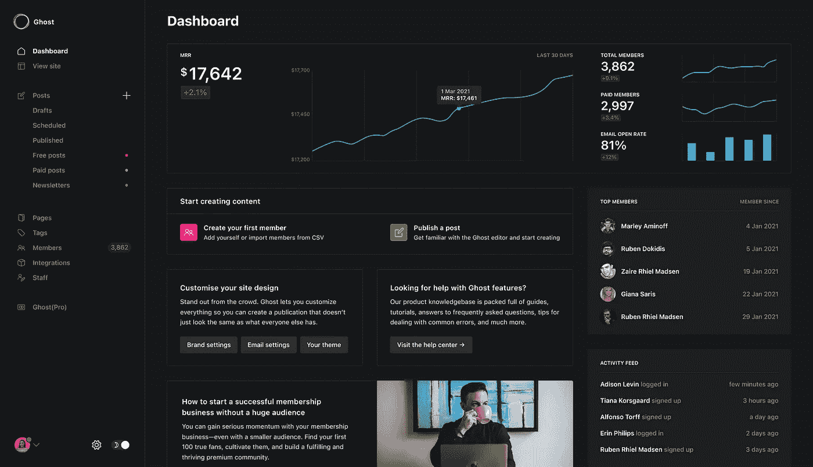

# 如何轻松制作一个看起来和工作起来都像中号的网站

> 原文：<https://medium.com/geekculture/how-to-easily-make-an-amazing-website-that-looks-works-like-medium-30d02daaa202?source=collection_archive---------37----------------------->

## 克隆培养基！

像任何想创建自己博客的技术迷一样，我从一个 WordPress 网站开始，在这里和那里写了一些文章。

我很快就发现了 Medium.com，因为我知道我可以在这里转载我的文章，并扩大我的影响范围(关于金钱)。

那时我开始为 Medium 重新创作文章，我发现 Medium 的编辑器比 WordPress 上的 Gutenberg 编辑器好得多。

不仅写文章更加直接和直观，而且我也非常喜欢阅读媒体上的文章。

这是独一无二的。我从来不认为自己是一个在线读者。我正式决定购买中等会员。

> 如果我非常享受使用 Medium 的体验，为什么我不去想办法在我自己的网站上创造同样的体验。

简单的布局，易读的字体，甚至还有一个像 on Medium 一样的直观编辑器。去他的。为了好玩，我们甚至尝试直接复制网站的外观。

这就是我所做的，作为一个没有代码的技术爱好者，这就是你可以做的！

# 使用正确的 CMS

我知道 WordPress CMS(内容管理系统)不会用它的 Gutenberg 编辑器来删除它，所以我去搜索。我发现了一个新的 CMS 叫做幽灵。

This is how Ghost CMS backend looks like.

Ghost 是一个只专注于发布的平台。没有别的无意义，只是写你的博客。这可以减少分心，帮助你专注于写好的内容。

更重要的是，Ghost 的 Koenig 编辑器与 Medium 的编辑器完全一样，我认为它的效果甚至更好。当我找到这个的时候，它是天造地设的一对。

Ghost CMS 内置的其他一些功能有…

*   原生搜索引擎优化(不需要插件)
*   集成会员网站功能(付费订阅和会员管理)
*   集成的电子邮件简讯
*   比 WordPress 快多了

值得注意的一点是，你不必使用付费订阅功能或集成的电子邮件简讯。

# 为 Ghost.org 寻找最佳主机

你可以在 Ghost.org 网站上试用 14 天免费试用版，并使用编辑器和后端。然而，在此之后，你将不得不决定在哪里主办你的网站。

马上，你会看到 Ghost 提供他们的 Ghost(PRO)主机，如果你支付一整年的费用，每月 29 美元。

这个计划对我来说似乎很昂贵。Ghost(Pro)也有看似随意的限制，比如只允许两个访客用户或者只允许 100，000 次浏览。

所有主机选项都需要至少 [1GB 的空间](https://ghost.org/docs/hosting/#self-hosting)。此外，下面的所有选项都是云托管或 VPS(虚拟专用服务器)，所以你选择下面的任何选项都会很快。

最便宜的选择是以每月 5 美元的价格使用[数字海洋](https://m.do.co/c/124eb5a3732b)建立自己的服务器。这种方法需要一些技术知识，并且必须能够轻松地在命令提示符中输入几行 SSH。Ghost 的网站上有大量的文档，YouTube 上也有一个关于如何做的视频。

然而，如果你是一个技术爱好者或想节省时间(金钱)，托管是一条路要走。您将不必处理 SSH(安全外壳协议)。您也不会浪费时间浏览文档，并避免未来的更新问题。请记住，托管主机还会处理安全问题，并按时完成更新。

这里有一些托管选项。

1.  Themeix.com
2.  DigitalPress .博客
3.  Firepress.org
4.  GloatHost.com
5.  GetMidnight.com

# 为你的网站选择合适的主题

Ghost 的一个缺点是你不能用拖放页面生成器来定制你的站点。你必须知道如何调整一些前端代码。

同时，这肯定是一个缺点；我们可以对此持积极态度。与其浪费大量时间来定制你想要的网站，不如更专注于创造好的内容。

> 老实说，大多数人并不关心你的网站看起来怎么样，只要它速度快，响应快，易于阅读。

所以你从卡斯帕主题开始。我建议改变它，因为它没有最好的谷歌页面速度评分。

这里有一个很棒的幽灵博客，里面有一篇文章，里面有每个幽灵主题的所有链接。https://ghost-o-matic.com/where-to-get-ghost-themes/

这将是至关重要的挑选出最好的主题与所有你想要的功能。这样，你可以专注于写博客，而不是“主题化”

借助主题附带的文档，您应该能够轻松地对主题进行基本的定制。

## 幽灵主题看起来像中号

你想要一个完全一样的媒体主页和媒体帖子吗？

这里有两个广受好评的轻量级 Medium 主题。

 [## Mediumish WordPress 主题喜欢中型|哇主题

### Item: Mediumish 版本:1.0.47 类型:WordPress WP 版本:高达 5.7+许可证:GPL 价格:Mediumish 是一个 WordPress…

www.wowthemes.net](https://www.wowthemes.net/themes/mediumish-wordpress/)  [## Mundana WordPress 中型主题|哇主题

### 项目:Mundana 版本:1.1.7 类型:WordPress WP 版本:高达 5.7+许可证:GPL 价格:“Mundana”是 WordPress 的一个主题…

www.wowthemes.net](https://www.wowthemes.net/themes/mundana-wordpress/) 

# 将博客内容转贴到媒体上

现在你有了一个专门写博客快速网站，让我们添加一些策略。由于 Ghost 的 Koenig 编辑器与 Medium 的编辑器工作方式相同，因此您可以轻松地将文章从一篇复制并粘贴到另一篇，它们看起来会一样。

利用这个功能，将你的内容从媒体转贴到你的博客，反之亦然。但是你必须正确地做，这样搜索引擎就不会惩罚你。查看这篇关于规范标签的[文章，了解更多信息。](/@PatrickLimitless/how-to-correctly-repost-content-from-your-blog-to-medium-using-canonical-tags-9b6d6b5c3985)