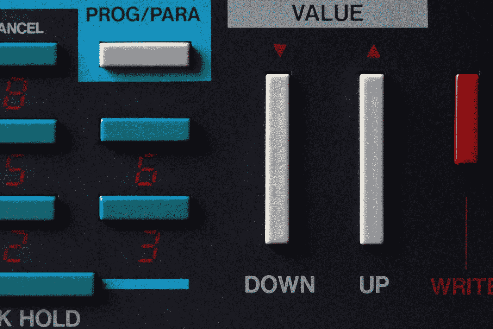

# 如何轻松将自然语言翻译成代码

> 原文：<https://medium.com/geekculture/how-to-easily-translate-natural-language-into-code-6908eaeb4774?source=collection_archive---------3----------------------->

## Github copilot 项目的 OpenAI Codex 游乐场

Photo by [Anne Nygård](https://unsplash.com/@polarmermaid?utm_source=medium&utm_medium=referral) on [Unsplash](https://unsplash.com?utm_source=medium&utm_medium=referral)

OpenAI 已经创建了一个名为 *Codex* 的翻译程序，能够将自然语言翻译成代码。我获得了 API 的访问权限，并希望在这篇博文中探索这个人工智能的主要功能。