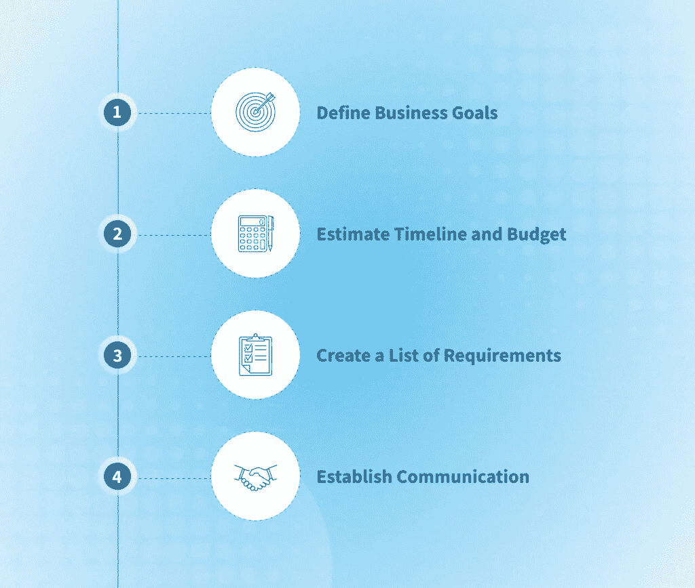

# 如何在 2023 年有效外包 Web 开发:最佳实践— NIX United

> 原文：<https://medium.com/geekculture/how-to-effectively-outsource-web-development-in-2023-best-practices-nix-united-377cf58d6bb4?source=collection_archive---------22----------------------->

现代技术的复杂性早已超出了一个人的能力，这使得外包 web 开发项目更加普遍。拥有一个可以实现任何项目的内部团队，无论其规模、大小和雄心如何，都可能适得其反。一些项目需要专业的行业知识，而只有少数专家具备这些知识。结果，越来越多的公司将 web 开发任务外包给另一家公司，该公司拥有专注于 web 解决方案的专家团队。这一过程为公司节省了资金、时间和其他宝贵的资源，并使他们能够专注于业务挑战。在本文中，我们将调查 web 开发外包市场，了解它的好处和成本，以及如何外包网站开发的综合指南。

# 外包与外包

外包是指将整个项目或部分项目委托给外部 it 合作伙伴，而外派是一种临时远程雇佣。杰出的机构借出他们的专家来填补一定的人才缺口。例如，如果你可以处理你的 web 开发项目，但是缺少一个重要的专家，一个杰出的代理机构会为你找到最合适的人，在项目期间与你的团队一起工作。这种模式的缺点是入职、激励和沟通，这是新的临时员工经常遇到的问题。

当谈到外包 web 开发时，客户将任务委托给已经一起工作的另一个团队，并且不需要任何额外的入职。沟通渠道没有改变，激励机制也没有改变。另一个替代方案是[团队即服务(TaaS)](https://nix-united.com/services/dedicated-software-development/) 方法，它是传统人员扩充模型的改进，没有我们上面讨论的缺点。

# 外包网站开发的好处

在这一部分，我们将探究[为什么公司决定外包 web 开发任务](https://nix-united.com/blog/outsourcing-who-does-it-and-why/)的原因。

# 资源管理

与雇佣一个由经验丰富的开发人员、项目经理、设计师、业务分析师和其他专家组成的内部团队相比，外包项目是一个更实惠的选择。雇佣一个团队需要时间和资源，更不用说入职流程和适应期了。员工也有资格获得办公空间、设备、社会福利、休假时间、保险、税收等等。所有这些加在一起，每个员工每月都会积累一笔可观的账单。与可靠的 IT 合作伙伴合作将帮助您降低成本，并在更短的时间内完成项目。

# 人才库

不断增长的技术市场需要新的人才，而这些人才在你所在的领域可能不容易找到。与外包网络开发公司合作将会让你接触到全球范围内更广泛的人才库。你可以将你的项目委托给一位有多年经验的资深专业人士，而不是满足于某个技能刚刚够用的人。例如，如果你需要一个专门研究特定技术的后端开发人员，他们可能很难找到。有了外包供应商，你不必投资资金来培训你的员工，只需选择你需要的特定劳动力来完成项目。

# 扩展的机会

一些 IT 项目在启动前可能需要几个月甚至几年的时间，这增加了可伸缩性和灵活性的紧迫性——这是项目外包的主要原因之一。敏捷方法允许开发团队在整个项目中保持灵活性。但是扩充你的员工是一个完全不同的故事。外包公司有多名专家可以随时投入到项目中。如果在某个时候你的项目需要更多的人手、特别的敏锐度或行业经验，公司会简单地在他们的团队中加入另一个玩家。

# 关注业务目标

当你外包 web 开发任务时，你可以将所有的注意力和资源集中在业务方面。当外包公司收集相关信息、设计、功能、期限、预算等时，客户只需要在项目的最开始就参与进来。一旦收集并记录了这些需求，就有可能最大限度地减少客户需要投入到项目中的时间和资源。专业的 IT 合作伙伴将定期传达他们的初步结果，以帮助客户保持最新并做出可能的修正。

# 更短的上市时间

缩短上市时间对任何组织都有诸多好处。如今，如果你想到一个想法，很可能其他人也有同样的想法，并正在努力实现它。你越早发布你的产品，你就能越快地将它推向正确的受众。一个由经验丰富的专业人员组成的团队，他们的全部工作就是执行你的项目，他们会投入资源来完成你的产品。

# 专业咨询

除了执行你的项目，外包网站开发团队也可以利用他们的敏锐度来评估和潜在地改进它。他们可以利用他们的集体经验和技能来评估产品想法，改进设计，测试假设，并确保最终产品将满足用户的需求。

# 风险分担

任何一家声誉良好的 IT 公司都会尽最大努力交付一款让客户满意的功能良好的产品。在声誉受到威胁的情况下，外包公司更有可能与客户合作，以创造出好的产品。因此，您将受益于与您的 it 合作伙伴分担一些风险，他们会像您一样为您的成功投资。

# 如何找到最好的外包机构

可以说，将你的项目、数据和软件委托给一家外部公司是非常危险的。你想学习如何外包网站开发并享受成功的合作吗？你可以通过审查公司并确保他们有相关的经验和良好的声誉来最小化风险。在这一部分，我们将讨论有助于您找到值得信赖的 IT 合作伙伴的最佳实践。

# 阅读评论

在你将 web 开发活动外包给一家公司之前，使用 GoodFirms、Clutch 和 Glassdoor 等平台来了解他们以前客户的经验。显然，即使是最好的公司也可能会有一些糟糕的评论，但这将让你了解公司是如何运作和沟通的，以及它提供了什么。

# 检查领域专业知识

除非你是在和一家大公司打交道，否则 IT 公司大多专注于某个或某些领域。例如，如果你正在建立一个医疗保健网站，搜索外包网站开发公司，这些公司已经证明了为这个利基市场开发产品的商业经验。开发一个产品不仅需要敏锐的技术，还需要深入的行业专业知识。

# 建立沟通

双向的、可靠的和开放的沟通是你成功的关键。首先，寻找一个积极响应的合作伙伴，回复你的邮件和电话，让你了解最新的进展，清晰透明地传达他们的信息、关注和反馈。

同时，你也需要遵守同样的原则。在你将 web 开发外包给供应商之前，确保你的需求是清晰的，你的目标是有据可查的，并且沟通渠道是建立的。安排与项目经理的周会，让自己了解情况。就有助于您和您的 IT 合作伙伴监控进度和交换反馈的工具达成一致。建立一个真实的单一来源，团队可以在其中存储所有与项目相关的文档。仔细检查你的推荐人，特别是如果外包机构在另一个国家，有不同的文化背景。

几乎一半的外包努力由于沟通不畅而失败，包括供应商响应和客户服务。只有您和您的 IT 合作伙伴都愿意保持沟通顺畅，项目才会成功。

为了保护你的公司和客户的数据以及增加富有成效的合作的机会，签署保密协议(NDA)。该文档必须包括与您的知识产权、敏感数据、项目终止条件、双方责任等相关的信息。强烈建议与有经验的律师一起准备一份全面而扎实的 NDA。

# 网络开发外包的成本

毫不奇怪，web 开发速度会随着供应商的位置、经验和项目本身而波动。一个复杂的网站或应用程序，拥有先进的功能和尖端的技术，如增强现实或语音识别，会比一个基本的应用程序花费更多。降低成本的一个常见方法是从东欧、拉丁美洲或亚洲寻找海外合作伙伴。平均而言，北美或西欧的开发公司会有更高的利率。在外包网站开发之前，比较各国的平均费用:

# 东欧

该地区包括多个国家，这些国家以高质量的技术专家和较低的费率而闻名，主要是因为生活成本较低。乌克兰、格鲁吉亚、波兰、立陶宛等国家提供顶尖的 IT 专业知识，不会让您的财务部门不堪重负。每年，合格的技术专业人员的数量都在增长，其中一半选择从事外包项目。平均工资从每小时 30 美元到 70 美元不等，而东欧和西方世界其他国家之间的文化差异几乎不存在。唯一值得注意的缺点通常是开发人员的基本英语水平，但这通常被讲英语的项目经理所回避。

# 拉丁美洲

拉丁美洲之所以对北美人来说是一个有吸引力的地区，是因为它们有相似的时区。尽管在网络发展方面不如东欧先进，拉丁美洲国家也开始扩展他们的技术专长。你可以在墨西哥、巴西和阿根廷找到有经验的公司，每小时收费 40 到 100 美元。特别是如果你关心的是远距离，并且喜欢偶尔安排面对面的会议，那么从拉丁美洲雇佣一个代理可能是一个不错的选择。

印度、巴基斯坦、马来西亚和其他亚洲国家提供原始的网络开发服务。与这些国家合作的最大劣势是相当大的时差以及文化误解。传达你的需求可能会有点困难，因为在欧洲被认为是极简主义的设计在亚洲可能意味着非常不同的东西。与此同时，价格适中——每小时 30 至 70 美元——技术敏锐度也很高。最重要的是，大多数印度人英语说得非常好，这消除了任何语言障碍。

# 北美洲

美国和加拿大提供高度专业和经验丰富的网站开发团队，但价格不菲。平均费用高达每小时 150 到 250 美元，即使是一个小项目也是极其昂贵的。

很难明确回答哪个国家是最终的外包点。不管在哪里，总会有相关的外包网站开发的好处和风险。如果最小的时差对你来说非常重要，那么相应地选择一个地区。然而，如果你正在寻找文化相近、技术敏锐和合理价格的最佳组合，那么东欧是你的选择。

# 外包循序渐进指南

决定外包项目时的犹豫是可以理解的。你将信任一家拥有敏感信息的外部公司，并依赖陌生人来实现一个重要的项目。希望我们关于如何外包 web 开发的指南能够帮助您避免常见的陷阱，并开始与可靠的合作伙伴进行成功而富有成效的合作。

# 定义业务目标

甚至在雇佣 IT 合作伙伴之前，定义项目的目标和需求。如果你缺乏技术上的理解，使用商业术语来清楚地确定你的产品想要达到的目标。也许你想提高品牌知名度，产生更多的线索，或达到国际观众。无论哪种方式，描述你想要达到的目标和原因。最重要的是，确定目标受众，明确你的产品要解决的问题。如果你在与潜在的外包公司会面之前就准备好了这份文件，你最初的沟通将会容易得多。

# 估计时间表和预算

要缩小 IT 合作伙伴的选择范围，请估算整个项目的预算。根据这个数字，你可以找到合适的外包网站开发公司。请记住，外包公司主要使用两种定价模式:固定和灵活。在一个固定的模型中，整个项目被计划到一个球座上，以计算出整个账单的最接近的估计值。缺点是缺乏灵活性，这对 web 开发项目非常不利。一个灵活的模型允许您在进行更改时扩展范围。虽然这种模式通常会产生更好的结果，但它确实会增加预算。

寻找公司时，衡量时间表也很有帮助。如果你知道产品应该在什么时候发布，把这个信息传达给公司，让他们评估他们的可能性，并提供一个合适的交易。但是，如果您的项目没有确定的发布日期，您可以将这一计算留给您未来的 IT 合作伙伴。

# 创建需求列表

在外包网站开发任务之前，起草一份基本要求清单，包括位置、行业经验、价格、价值观、文化背景等。这份记录将帮助你在预算范围内列出最合适的代理机构。要根据你的要求检查一家公司，你可以阅读在线评论，细读他们的网站和案例研究，了解他们的使命和价值观，并询问他们的费率。最后一步，联系公司安排一次会面，评估他们的沟通技巧和技术专长。

# 建立通信

正如我们之前提到的，沟通在您与 IT 供应商的关系中非常重要。就沟通渠道和信息工具达成一致，制定一致的会议日程，交换反馈，并确保透明度。SLA(服务水平协议)是一个有用的缓解沟通问题的工具。在协议中包括所有相关信息以及担保、定义、责任、软件和工具。在寻找合作伙伴的时候，确保外包的网络开发公司是积极响应的，重视它的客户，并努力提供开放的交流。

# Web 开发外包有什么缺点吗？

在将 web 开发外包给外部公司之前，您需要了解潜在的风险。在委派一个项目或项目的一部分时，你可能会面临一些挑战，我们将在下面讨论。你如何在不面临重大问题的情况下外包 web 开发？

将您的项目和公司数据委托给第三方公司可能会非常令人不安，而且风险很大。你选择的公司总有可能无法交付所需的产品。然而，如果你尽职调查这家公司，你不太可能最终对结果感到失望。在供应商未能交付的情况下，SLA 也会保护您。

# 缺乏远程工作经验

如果您的组织在现场运营，并且没有太多与远程员工打交道的经验，雇用外包合作伙伴可能会很有挑战性。拥有成熟远程工作系统的经验丰富的供应商可以帮助您弥合这一差距，并建立一条清晰的沟通路径。

# 数据安全

将你的敏感数据交给另一家公司听起来很可怕，而且风险极大。如果客户或员工的数据被泄露或损坏，数据泄露会导致有害的后果并毁掉您的声誉。这就是拥有一个深思熟虑的 NDA 如此重要的原因。包括涉及数据传输和保护的条款，以及在出现违规的情况下对供应商可能产生的影响。

即使你创建了一个详细的预算细目表，由于隐藏的和意想不到的成本，你仍然可能以更高的账单结束。减轻这个问题的最好方法是在外包网站开发之前，在合同中包含可能的额外费用。此外，留在循环和监测进展也将有助于您保持在预算内，并保持对支出的控制。

# 失控

许多公司非常担心在将项目委托给 it 供应商后会失去对项目的控制。特别是如果项目与业务的核心过程相关联，公司担心损害他们的组织是可以理解的。一个好的补救办法是需求跟踪软件，它允许你监督进度并随时做出改变。还建议建立定期报告，包括全面的状态更新。然而，我们的客户可以与技术专家取得联系，以获得有关他们的项目和公司需求的任何支持。

# 时区差异

一两个小时的差异很容易管理，但如果超过六七个小时，就会出现严重的挑战。虽然时区差异是一个真正的障碍，但它可以通过高质量的通信和任务管理系统来克服。创建一个统一的空间，您可以在其中共享和交换与项目相关的信息，以确保持续的沟通。如果时差相当大，您可以采用所谓的“跟随太阳”模型，供应商在客户的晚上工作，第二天早上交付结果。

# 关于 Web 开发外包的常见误区

有几个与外包 web 开发项目相关的误区，阻碍了组织选择这种工作模式。在现实中，如果处理和设置正确，IT 外包可以非常有利可图和方便，并提供一流的结果。例如，一些公司已经有过糟糕的外包经历，这阻止了他们再次承担这种风险。然而，分析哪里出了问题，并进行更精确的审查，将有助于他们避免未来的失败。

一些公司也很难接受委托，并认为外部组织不会尽力而为，因为他们不太在乎。这种想法完全是一种谬论，因为好公司不会损害自己的声誉。交付让客户满意的高性能产品符合他们的利益。最终，尽职调查将会带来很大的帮助，并确保你们合作的成功。在做出最终决定之前，评估外包网站开发对你公司的好处和风险。

另一个常见的误解是文化和语言障碍。虽然对一些供应商来说这是真的，但是大多数有声望的公司都有熟悉西方文化的讲英语的员工。你可以通过与东欧的合作伙伴一起工作来减少文化障碍，在那里这种差异是最小的。NIX United 是一个值得信赖的合作伙伴，重视客户并提供最佳结果。我们是一个网站开发专家团队，他们将以有效和透明的方式建立合作。与我们联系以获得报价并讨论您的项目。

*原载于 2022 年 11 月 11 日*[*【https://nix-united.com】*](https://nix-united.com/blog/outsourcing-web-development-in-2023-benefits-risks-and-tips/)*。*