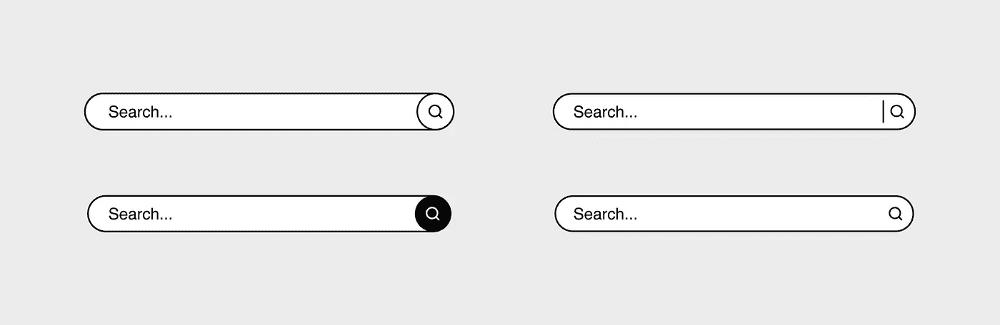
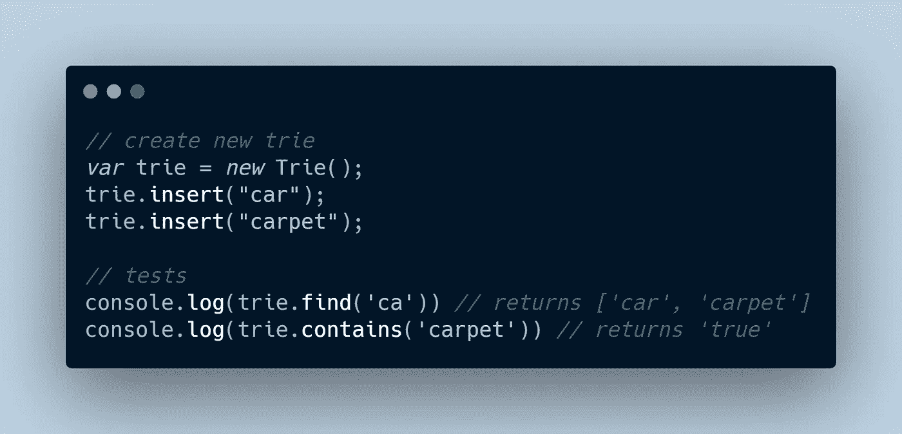

# 如何毫不费力地在 JavaScript 中实现自动完成数据结构(使用 Trie)。

> 原文：<https://medium.com/geekculture/how-to-effortlessly-implement-an-autocomplete-data-structure-in-javascript-using-a-trie-ea87a7d5a804?source=collection_archive---------9----------------------->



你有没有想过谷歌是如何知道你会在搜索栏中键入的下一个单词或句子的？哦是的！他们有很好的算法，并收集了足够的数据，每个人都知道这一点。但是在大多数搜索栏中，这种用户友好特性的核心是一种非常强大的数据结构，叫做 **Trie** 。Trie ( *Keyword Tree* )是一种存储字符串的树形数据结构，可用于机器学习、web 爬行，以及最常见的我们将立即实现的自动完成功能。

# 如何实现自动完成的 Trie

在我们进入实现之前，我假设您熟悉；-

*   JavaScript 对象以及如何操作它们
*   JavaScript 数据结构和基本方法
*   树形数据结构的基本知识和术语

一旦你确定了这三点，我们就可以毫不费力地深入研究这个问题了(*我还试图用注释使代码块变得“肮脏”，以便于解释*)。

在整个实施过程中，我们要考虑两件重要的事情:

*   节点
*   特里结构

1.  **节点**

由于 Trie 是一个树形数据结构，它显然必须有一个*节点*。每个节点代表存储在 Trie 中的任意单词的一个字母。在我们的实现中，节点将跟踪 ***当前字母*** ， ***前一个字母*** ， ***下一个字母*** ， ***位置*** (无论是否是最后一个节点)，以及一个连接该节点之前所有前一个字母 的函数(如果可能，形成一个单词)。

implementation of Node properties and methods

从上图中可以看出，创建新节点时没有前面的字母，因为它是根节点(树中的第一个节点)，在我们添加单词之前也没有前面的字母。然后我们在`TrieNode`对象的中创建`getword()`方法

**getWord method**

**最后，我们的完整节点将如下图所示**

**Complete TrieNode object**

****Trie 实现****

**在我们创建了树的节点结构之后，我们现在可以实现 Trie 了。为了完成基本的自动完成任务，我们应该有一个属性和三个方法；-**

*   **`root`该属性将创建树的第一个节点**
*   **`insert`；这个方法将在我们的“字典”中创建或插入一个新单词。**
*   **`contains`；这个方法将检查一个单词是否存在于我们的“字典”中。**
*   **`find`；这种方法将使用前缀来预测可以用给定前缀构成的单词。(单词当然必须在字典里有。)**

**Trie Tree implementation with property and methods**

**我们从`insert`方法开始，因为当它缺少“字典”时，我们不能使用 Trie**

**insert method**

**从上图可以看出，遍历每个字母使我们能够为每个字母创建一个节点。此外，因为我们的`nextLetters`属性是一个 ***对象*** ，所以我们有多种方法可以访问键值(在本例中是字母)，我选择了`nextLetters[current_letter]`。为了进一步解释我们如何访问下一个字母，这里有一个片段。**

**如果我要插入的单词是`cat`，我们将每个字母单独迭代为`'c'`、`'a'`和`'t'`。这些字母的对象看起来像这样；**

```
nextLetters = { 
  c: 'c',
  a: 'a',
  t: 't'
}
```

**要访问字母`'a'`并对其进行任何比较或影响，我们可以说；**

```
nextLetters.a  // return 'a'
OR
nextLetters[a] // returns 'a' if we use a loop
```

**基本上，这就是我们在上面的方法和下面的两个方法中试图访问和操作字母的方式。**

**接下来，我们实现了检查单词是否存在的`contains`方法**

**contains method**

**如果一个单词存在，它将返回 true，否则返回 false。我们可以用这种方法来确认我们的单词是否被插入到“字典”中。**

**最后是`find`，这个方法使得这个 Trie 数据结构变得非常重要。`find`方法有两部分。首先，我们检查前缀并将节点移动到前缀的最后一个字母。如果前缀是`exerc`，我们必须确保当前节点是`c`，因为它将被用作引用。这是我们的做法。**

**find method**

**`findAllWords()`函数将是一个递归函数，它将使用`prefix`的当前节点作为参考点来遍历该节点的所有`children`，然后返回一个包含所有可能单词的数组。**

**findAllWords function**

**基本上，该函数接受两个参数，即`node`和`array`。首先，它检查节点是否代表一个单词的最后一个字母。如果是，它将被`getword()`函数用来获取相应的单词，该单词将被推到可能单词的数组列表中。如果不是，我们使用一个`for...in`循环遍历节点的子节点，这样我们就可以访问下一个节点并递归地构建单词。**

**一旦访问了所有子节点，`find`方法将返回一个可能单词的数组。然后我们的尝试就完成了。为了进行一些测试，我们可以实现一个 trie 并进行一些采样。**

****

**trie tests**

**原来如此。你可以在这里找到完整的代码。如果这是有帮助的，不要忘记鼓掌。**