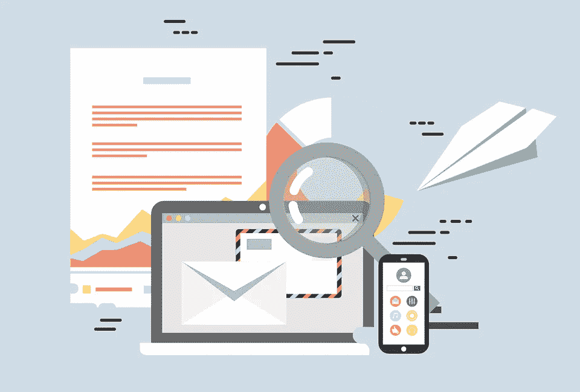
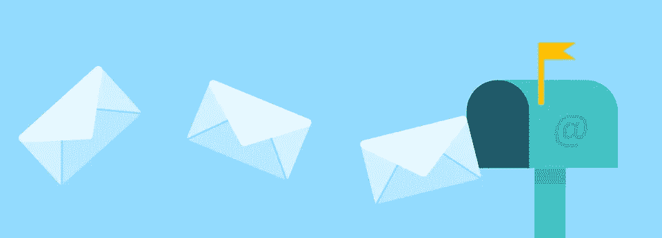
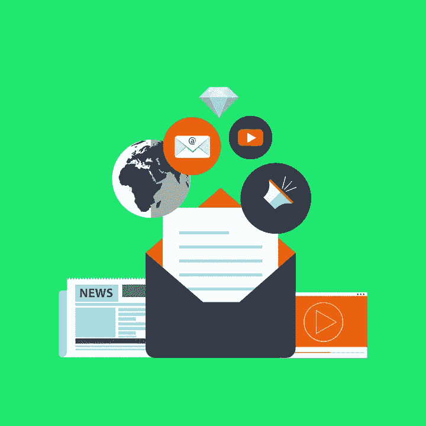

# 如何在 HTML 邮件中嵌入图像:终极指南

> 原文：<https://medium.com/geekculture/how-to-embed-images-in-html-emails-the-ultimate-guide-f9edc7c5154f?source=collection_archive---------7----------------------->

## 在电子邮件中嵌入图像对于电子邮件营销至关重要

Original illustration by A.Malyavina

你认为哪一个会更好:一个简单的文本消息还是一个带有彩色诱人图片的 HTML 模板？大多数情况下，第二种。我们感知到的大约 90%的信息是视觉的 T2，处理速度比普通文本快六万倍。此外，视觉内容增加了客户参与度。

Image: [https://pixabay.com/](https://pixabay.com/ru/)

这就是为什么今天超过 70%的大规模电子邮件活动都是以 HTML 格式的品牌化的、漂亮的模板为框架的。HTML 使得在电子邮件中插入图像成为可能。

邮件中嵌入图片的方式有哪些，会出现哪些困难，如何解决？请继续阅读本文。

# 嵌入图像是什么意思？

**嵌入**允许你**将来自各种网络服务的多媒体元素**发布到你的网站或博客上。这是一种在您的页面上借用和使用其他 web 资源功能的方式。嵌入后，你最终得到一个功能齐全的元素，你可以与之交互，就像在它被取出的网站上一样。

**由于嵌入，您可以在页面上放置**:

*   来自视频托管网站的视频:这种方法最明显的优点是不需要在你的服务器上存储大量的文件。此外，视频托管网站本身成为你的内容的额外分发渠道；
*   交互式地图和带注释的插图:很少有 CMS 和独立的“引擎”允许你在不求助于第三方服务的情况下创建它们；
*   分析和信息图表:与用户交互相关的一切，等等。

电子邮件通道(特别是电子邮件客户端，因为他们向用户显示我们的电子邮件)给你在 HTML 方面的使用增加了很多限制。问题是，如果你试图在电子邮件中嵌入视频或互动对象，这在所有或大部分电子邮件客户端都无法工作。因此，就将多媒体对象嵌入电子邮件而言，我们唯一能 100%确定正确显示的是图像。

# 电子邮件的最佳图像格式

如今，在电子邮件中嵌入图像最流行的格式是 JPEG、GIF 和 PNG。它们都没有确定的优势，所以你在选择时要以你为图片设定的任务为导向。

1.  **JPEG。**这种格式可以很好地呈现照片中的颜色。但是它不能使用动画；随着它的减少，它变得非常扭曲，这是不方便的标志。
2.  **GIF。**这种格式可以传输动画图像、无损质量地进行压缩、很好地传输文本，并允许您创建透明区域。但是调色板有限(256 色)，GIF 文件很大，而且它显示照片的效果很差。
3.  **巴新。**格式压缩而不失质量，非常适合 logos 和图标；它传达文本和透明度。但是，并不是所有的浏览器都支持 PNG 动画，在电子邮件中也不太好用…

Image: [https://pixabay.com/](https://pixabay.com/ru/)

# 电子邮件的最佳图像大小和尺寸

理想情况下，上传或嵌入电子邮件**的图片应该已经有了正确的大小。**然后，如果图像不显示，它将被相同格式的空白白色矩形所取代，这意味着文本和电子邮件的布局通常不会受到影响。

有时候，当你在 iPhone 或 Mac 上打开一封宣传邮件时，图像可能会有点模糊。这并不总是意味着它们是低质量的图片。也许，设计师只是没有想到你会在视网膜显示设备上看到。

你应该根据以下考虑来选择 HTML 布局的图片大小:

*   ****图像越小越好。但是如果这封邮件的主要内容是一个很棒的 gif 文件，它可能是 10 甚至 15 Mb。但是，尽量不要使用大于 5 MB 的图像，因为大小会影响图像加载速度。这很重要，因为许多人使用移动互联网，在某些地区可能不稳定。您可以使用 [TinyPNG](https://tinypng.com/) 服务来压缩 PNG 和 JPEG 图像。****
*   **横幅的大小(动画或非动画)应**适合模板**的宽度(对于 600px 宽的模板，应为 600x300 或 600x400px)。**
*   **为了使按钮易于点击，它们的大小应该在 35–50px 之间**。****
*   **桌面版和移动版都需要**在按钮或可点击图像**周围做一个缩进**。****
*   **至于 Retina 显示屏，为了布局不模糊，**我们将**的尺寸翻倍，使内容宽度不是 600px 而是 1200 px，文本不是 16px 而是 32。**

# **不同的电子邮件客户端如何处理图像？**

**图像屏蔽是营销人员在开展电子邮件活动时面临的最突出的问题之一。通常情况下，原因在于默认设置或接收者的个人偏好。因此，许多订阅者的图像被自动屏蔽，电子邮件不能马上获得主要信息，甚至看起来被破坏了。**

****

**Image: [https://pixabay.com/](https://pixabay.com/ru/)**

**Outlook.com 对图像阻塞有点不可思议。默认情况下，**不会禁用所有邮件中的图片，只会禁用“可疑”用户发送的邮件中的图片**。**

**同时，不清楚发件人是根据什么原则分为可疑和核实的。此外，Outlook 用户可以禁止显示来自联系人列表之外的发件人的所有电子邮件中的图片。邮件服务以不同方式处理这两种类型的过滤:**

*   **在来自可疑地址的电子邮件中，它不显示图片，但显示替代文本；**
*   **对于有更严格的内容阻止设置的用户，Outlook.com 使用灰色字段。他们屏蔽掉不想要的图片，用简单的灰色背景代替。**

**自 2013 年 12 月以来，Gmail 一直没有阻止在电子邮件中嵌入图片。营销人员和设计师似乎应该感到兴奋——电子邮件将会如期出现，公开跟踪将变得更加可靠。然而，这一转变也并非一帆风顺。由于缓存问题，图像损坏或失真的情况并不少见。**

**还需要考虑整个页面(即 HTML 代码)的大小，以免影响外观。请记住，Gmail 会修剪长度超过 102 KB 的邮件，在这种情况下，订户只会看到你设计精美的邮件的一部分。**

**尽管所有基于网络的邮件都支持**替代文本**，但其风格化版本的操作取决于用户使用的浏览器。在当前版本的 Chrome 和 Firefox 中会显示风格化的替代文本，但在 Internet Explorer 中不会。您可以在此浏览器中看到它的颜色，但看不到字体、大小、样式和饱和度等属性。**

**关于电子邮件客户端，还有一件重要的事情需要提及，那就是有些客户端会在服务器上缓存(复制)你的图片，并且**已经在显示这些图片了**。这是苹果公司将于 2021 年秋季实施的邮件隐私保护措施的一部分。对于电子邮件营销人员来说，这可能会导致两件事:**

1.  **当你注意到横幅上的一个打字错误或错误时，尽快修复并替换 FTP 上的图像，做好准备，无论如何，你的一些订户会看到旧版本。**
2.  **为电子邮件生成实时内容的服务，如 Movable Ink、LiveClicker 或 Zembula，可能无法识别用户的地理、时区和天气。此外，计时器可能会工作不正常。**

# **如何在邮件中嵌入 HTML？**

**在电子邮件中嵌入图片有几种方法——让我们来看看其中的三种。**

## **CID 图像嵌入**

**Content-ID (CID)是一种在没有任何 HTML 编码的情况下将照片附加到电子邮件的方法。流程如下:在邮件中附上一张图片和链接作为模板。当你打开一封电子邮件时，图像会自动嵌入其中。但是请记住，此选项会增加结果电子邮件的大小。**

## **内嵌嵌入**

**将图像插入电子邮件的另一种方法是在 HTML 中嵌入 base64。Base64 是一组类似的二进制编码方案。使用这种方法，你需要用 base64 编码你的图像——图像将作为一个文件存储在 HTML 中。然而，问题是每张图片都会增加这封邮件的大小，这导致 Gmail 下载和整理的速度变慢。**

## **图像链接**

**链接到电子邮件中的图片的方式与图片出现在任何网站上的方式相同。您必须在 HTML 代码中添加一行 URL 来标识要显示的图像的来源。**

**这种方法的优点是显而易见的——首先，有一个图片不会以任何方式影响电子邮件的大小，并且插入一个到该图片的链接是快速和容易的。此外，你可以在服务器上改变图片，它会在信中改变，而图像的大小(宽度，高度)，这些电子邮件服务不会改变。**

**然而，也有不利之处。例如，一些电子邮件客户端，如 Outlook，可能会阻止由链接引起的图像。此外，如果在没有互联网连接的情况下查看，图像将无法加载。**

# **如何测试 HTML 邮件中的图片**

**在邮件中嵌入图片时，许多人忽略了一个老生常谈的小技巧——**测试你的信件**。电子邮件中的图片可能无法在收件人的电子邮件客户端中显示，或者可能超过 HTML 表格单元格的大小，这将导致图像被裁剪，或者整个电子邮件在某些浏览器中“失效”。**

****

**Image: [https://freerangestock.com/](https://freerangestock.com/)**

**所以在给整个数据库发信之前，最好先发几封测试邮件，在不同的邮件系统打开。向不同电子邮件提供商的地址测试列表发送定制的电子邮件。在其他设备和邮件上测试网络和移动版本。使用 EmailOnAcid 或 Litmus 确实有助于加快检查过程，但有时我们，[email 士兵](https://emailsoldiers.com/)，也在真实设备上执行测试。**

# **如何处理电子邮件中被阻止的图像**

**有时候一封 HTML 电子邮件进来，但是里面的图像根本没有显示或者显示不正确。在这种情况下，如果你的收件人看不到他们应该看到的内容，使用 HTML，支付额外的带宽和设计工作就没有意义了。**

**为了防止邮件中的图片欺骗你，研究活跃用户对你的邮件列表的行为是很重要的。你需要知道**他们使用什么电子邮件客户端**和**他们更经常选择什么类型的图片。****

## **为什么电子邮件中的图片会被屏蔽**

**有时用户无法打开邮件中的图像。大多数桌面邮件客户端(Mozilla Thunderbird，Outlook 2007–2016)默认情况下会阻止图片下载。如果雅虎、Outlook.com 和 Gmail 的网页界面认为发件人不可靠或邮件内容有问题，它们也会这么做。两者都需要上传证明来展示图片。**

## **使用 ALT-Text 有什么帮助**

**替代文本(Alternative text)是一种很好的方法来处理图像阻塞，并成功地在电子邮件中嵌入图像。ALT-text 是给用户的关于图片中应该有什么的信息，用户看不到它是因为图片被挡住了。**

**您可以决定在替代文本中描述图片的详细程度。只看完成的邮件；用 Litmus 或 EOA 这样的电子邮件测试软件检查一下，因为它们都显示了关闭图像时电子邮件的样子，想想读者是否会理解它的内容。**

****电子邮件营销人员关于这个话题的建议**既简单又符合逻辑:**

*   **不要在图片中写重要的信息，否则你将无法理解邮件的主旨。**
*   **不要用一张图片或几张没有文字的图片来发送整封信。**
*   **不要使用大的背景图片:一些收件人不会看到这样的背景，其他人会重复信的宽度和高度。**
*   **如果电子邮件无法正确打开，您可以在电子邮件的页眉或页脚中添加一个指向 web 版本的链接。**

# **摘要**

**当然，如果使用得当，图像可以改善时事通讯的外观和性能。下面总结几个关于邮件中插入图片的事情。**

**首先，**你的布局应该是自适应的**，这样页面就可以显示在移动设备的屏幕上(没有任何额外的压缩)。所用图像的**格式应该适合任务的**(主要是 PNG 或 JPEG)。图片本身应该**和模板**一样大(最大 1200px 宽)。**

**当使用图片作为背景时，需要考虑图片上文本的**可见性，并且**提供一种替代的颜色填充。**另外，一定要在 ALT 标签中指定**替代文本**(小尺寸)。最后，你应该考虑 Gmail 和 Hotmail** 中**风格设计的细节。****

**如果你遵循这些建议，你的简讯将会更有效和有利可图。我希望我们的文章已经回答了你可能有的关于在电子邮件中嵌入图片的所有问题。**