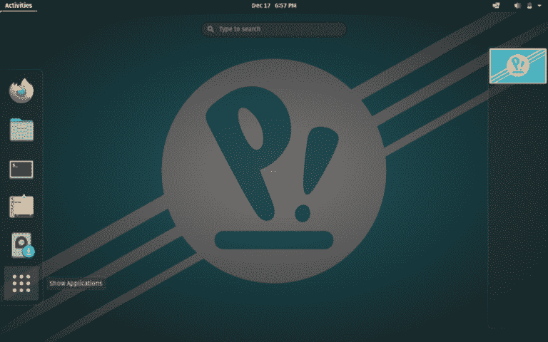
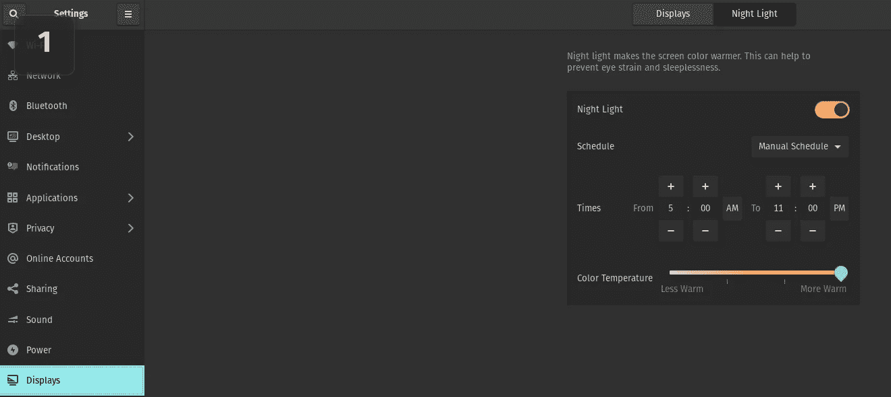
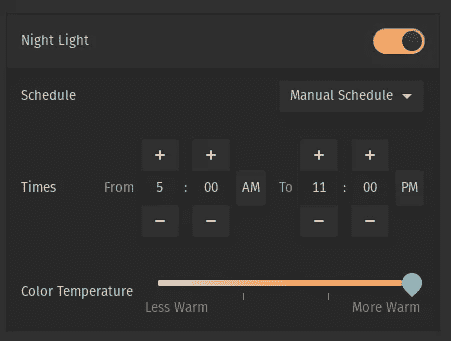
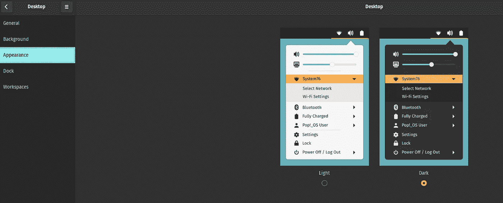

# 如何在 Pop 中启用夜灯！_OS

> 原文：<https://medium.com/geekculture/how-to-enable-night-light-on-pop-os-and-dark-mode-d3ce2b967c?source=collection_archive---------17----------------------->

Night Light on Pop!_OS

我在想爸爸是不是！_OS 有和 Windows 10 一样的夜灯，你可以用[红移](http://jonls.dk/redshift/)之类的程序模拟同样的夜灯，但是它有自己的夜灯吗？

# 检查你是否有夜灯模式

前往“设置”>“显示器”>“夜间照明”

Activate Night Light Pop!_OS

# 如何激活夜灯 Pop！_OS

如果你有夜灯，只需点击切换按钮启用夜灯，如果你想改变时间，你可以这样做，如果没有检查版本的流行！_OS 我有 21.04

Turn on Night Light Pop!_OS

# 深色模式

如果你想启用黑暗模式，你需要进入设置>桌面>外观>黑暗

How to enable dark mode Pop!_OS

# 享受吧，你的眼睛会深深感激

如果你担心你的眼睛，并且你想保持它的健康，你可以在流行上使用这种夜灯！_OS。