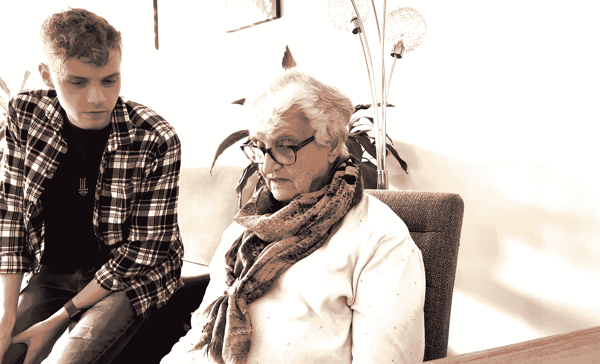

# 如何让老年人参与 iOS 应用？

> 原文：<https://medium.com/geekculture/how-to-engage-the-elderly-in-ios-applications-c5c42a27c82b?source=collection_archive---------16----------------------->

这篇文章是为我的毕业论文而写的，只关注 iOS 应用程序。我开发了一款名为“ [Adelee](https://apps.apple.com/app/adelee/id1551941583) ”的 iPad 版个人媒体应用。我想在这里和大家分享一下。

Helping my grandmother with her iPad.

智能手机无处不在。学生们正在开发应用程序来查看他们的成绩，点餐，甚至寻找伴侣。根据 Andrew Perrin (2021)的研究，61%的 65 岁以上的美国公民拥有智能手机。本文研究了老年人的手机使用情况，并就如何吸引这一特定目标受众提出了几点建议。

**设备使用**

老年人使用手机比以往任何时候都多。根据 Peter Rinderud (2021a)的说法，由于新冠肺炎全球健康危机，越来越多的老年人通过上网来对抗孤独。在过去的四年里，用于日常即时通讯的电话从 45%增加到 71%(Perrin，2021)。这也是因为老年人的年龄发生了变化。Rinderud (2021a)指出，老一代中有几个群体已经适应了技术，并将这些群体定义为“老年技术人员”。这个群体使用互联网是因为他们对互联网感兴趣。

说所有的老年人都对这项技术不感兴趣是骗人的。虽然一些老年人使用即时通讯应用程序与家人保持联系，但其他人仍对使用智能手机犹豫不决。对上瘾的恐惧和对侵犯隐私的担忧是造成这种情况的两个原因。

77 岁的玛格丽特·卡伦(Margaret Cullen，Renstrom，2020)表示，学习使用移动应用程序的一个动机是孙辈。如果一个孙子教他或她的祖父母一些东西，那么我们经常会看到祖父母的朋友圈子也对学习同样的活动感兴趣。事实证明，通过口口相传，爷爷奶奶更愿意学习新技术。

**应用优化**

根据 McGaughey 等人(2013 年)的研究，如果开发者针对老年人使用优化他们的平台，老年人将会更多地使用移动应用。解释用户输入并提供帮助的应用程序，例如 Siri，可以极大地提高目标受众的易用性。大多数开发人员都很年轻，他们会优化自己的产品，让年轻用户看起来赏心悦目，这往往会导致应用程序缺乏对辅助功能的支持。

在过去的九年里发生了很大的变化。对许多开发者来说，支持应用程序的辅助功能越来越重要。Derksen-Staats (2021)指出，移动开发者应该抱着可访问性的心态开始创建移动应用。通过遵循可访问性原则，许多应用程序可以面向更广泛、更多样化的受众。

支持诸如 DynamicType 和 VoiceOver 之类的辅助功能可能对您的应用程序有益。苹果的标准字体自动支持 DynamicType，如果用户决定在设置中打开 DynamicType，它会增加应用程序中文本的大小。VoiceOver 为有视觉障碍的人大声朗读文本。

另一个需要解决的可访问性特性是本地化。这意味着您的应用程序支持多种语言。为了理解一个新的应用程序而学习一门新的语言可能会令人望而生畏。如果您的应用程序包含大量文本，应该考虑支持本地化的文本。

**支持**

Renstrom (2020)指出，老一代人出于隐私原因对使用技术犹豫不决。根据 Trepte 和 Reinecke (2011 年)的说法，他们更害怕自己的身份在网上被窃取。老年人更喜欢完全控制他们在互联网上分享的内容。因此，教育用户他们的数据是如何被使用的，以及他们如何改变他们的隐私偏好是非常重要的。

互助小组对老年人很有帮助。通过每天积极训练，用户更有可能在以后能够自己管理。如前所述，孙子可以教他们的祖父母如何使用手机上的特定平台，这已被证明是成功的。这是因为孩子和他/她的祖父母之间的关系是一种特殊的关系。祖父母喜欢与家人保持联系，并为此设立社交媒体账户。2018 年来自英格兰的一项研究显示，76%的祖父母正在学习社交媒体，因为与孙辈联系让他们感觉更年轻。

老年人对技术感兴趣，他们使用(移动)设备的事实就证明了这一点。这种兴趣通常源于与他们所爱的人保持联系的愿望。然而，我们看到他们有许多与互联网使用相关的隐私问题。通过清楚地解释他们的数据是如何被使用的，以及为什么你能从他们那里得到理解。您的应用程序应该支持 DynamicType 和本地化，以支持关键的可访问性特性。在教育老年人如何使用你的应用程序方面，入职可能非常有帮助，但让他们的核心圈子里的人定期帮助他们更有用。通过积极地让老年人参与到技术中来，我们可以制作出更具包容性的软件。工具在这里，现在是我们动手的时候了。

**资源**

德克森-斯塔茨，D. D. (2021 年 8 月 26 日)。构建可访问的移动应用程序的最佳实践。增量。[https://increment . com/mobile/best-practices-for-building-accessible-mobile-](https://increment.com/mobile/best-practices-for-building-accessible-mobile-)apps/

McGaughey，R. E .、Zeltmann，S. M .、和 McMurtrey，M. E. (2013 年)。老年人使用智能手机的动机和障碍:发展一个研究框架。*国际电子金融杂志*， *7* (3/4)，177–193。[https://doi.org/10.1504/ijef.2013.058601](https://doi.org/10.1504/ijef.2013.058601)

佩兰，A. (2021 年 6 月 3 日)。*移动技术和家庭宽带 2021* 。皮尤研究中心:互联网，科学&技术。[https://www.pewresearch.org/internet/](https://www.pewresearch.org/internet/)2021/06/03/移动技术和家庭宽带-2021/

伦斯特伦，J. (2020 年 7 月 13 日)。*为什么老年人真正回避技术*。石板杂志。[https://slate . com/technology/2020/07/seniors-technology-文盲-](https://slate.com/technology/2020/07/seniors-technology-illiteracy-)misconception-pandemic.html

林德鲁德，P. (2021a，1 月 26 日)。【Covid 期间的学长和技术:新研究。爱立信 LM。[https://www.ericsson.com/en/blog/2021/1/](https://www.ericsson.com/en/blog/2021/1/)covid 期间的老年人和技术

林德鲁德，P. (2021b，3 月 4 日)。老年人的科技可以提高生活质量。爱立信 LM。[https://www.ericsson.com/en/blog/2021/3/technology-](https://www.ericsson.com/en/blog/2021/3/technology-)为——老年人

特雷佩特，s .，&赖内克，l .(红色。).(2011).社交网络中的隐私和自我表露透视。在线隐私，235–250 英镑。[https://doi.org/10.1007/978-3-642-21521-6](https://doi.org/10.1007/978-3-642-21521-6)