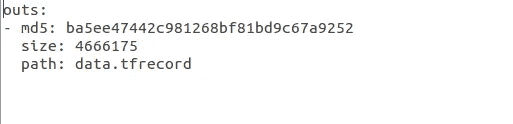
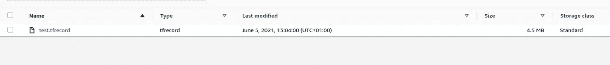
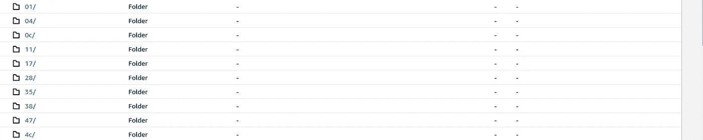

# 如何通过版本控制轻松确保数据科学的再现性

> 原文：<https://medium.com/geekculture/how-to-ensure-reproducibility-easily-in-data-science-through-version-control-1777ae3b15a?source=collection_archive---------30----------------------->

## 人工智能

## 了解如何使用 DVC 对模型和数据进行版本化


Photo by [Yancy Min](https://unsplash.com/@yancymin?utm_source=unsplash&utm_medium=referral&utm_content=creditCopyText) on [Unsplash](https://unsplash.com/s/photos/github?utm_source=unsplash&utm_medium=referral&utm_content=creditCopyText)

# **简介**

曾经在数据科学项目中工作过，然后你意识到在几次尝试之后，你无法复制令人敬畏的数据清理技术或你构建的辉煌架构，或者你调整得如此之好的超参数，以至于你的模型曾经达到超过 99%的准确性。可悲的是，每个 ML 从业者在他们的数据科学之旅中都经历过这种情况。

数据和模型版本化是每个机器学习生命周期的一个非常重要的方面，所有 ML 工程师和数据科学家都应该认真对待。不能过分强调版本化模型或数据众多好处:

*   它确保您的实验是可重复的
*   它允许在正确的时间部署正确的版本
*   它跟踪每一次修改。
*   它允许与队友轻松协作。

不幸的是，传统的版本控制方法 Git 不能有效地处理大文件，因此导致对正确跟踪模型和数据的版本控制工具的需求不断增加。在本文中，我们将看看如何通过使用 DVC(数据版本控制)的数据和模型版本化来实现可再现性。

# 什么是 DVC

要理解什么是 DVC 以及它是如何工作的，你需要首先理解 Git(一个版本控制系统)是如何工作的。本教程不会涵盖这一点，所以最好去看看 Udacity 的一个免费课程，名为*版本控制与 Git* ，涵盖了这一点。

你可能会问，DVC 到底是什么？

> “数据版本控制，或 DVC，是一个数据和 ML 实验管理工具，它利用了您已经熟悉的现有工程工具集(Git、CI/CD 等)。)”根据 dvc.org 的[DVC 的](https://dvc.org/doc)

[DVC](https://dvc.org/) 做了很多事情，其中之一是它在实验过程中跟踪模型或数据文件版本的能力。使用 DVC 和使用 git 一样简单。

它可以用来跟踪本地和几个常见的远程存储解决方案，如 S3，Azure，GCP 的大文件。一旦文件被添加到 DVC，它就会创建一个元数据文件，作为原始数据的占位符，可以像大多数 Git 源代码一样轻松地进行版本控制和跟踪。


Source: [DVC](https://dvc.org/doc)

DVC 的神奇之处在于，它不仅限于跟踪模型和数据，它可以跟踪任何东西，只要它太大，git 无法有效处理。在本教程中，我们将重点关注使用 DVC 本地和远程版本化模型和数据。

# 让我们把手弄脏，

我们需要做的第一件事是安装 DVC 和[boto 3](https://boto3.amazonaws.com/v1/documentation/api/latest/index.html)*(python 的一个* AWS SDK ),因为我们将使用 S3 作为本教程的远程存储:

```
**$ pip install "dvc[s3]"**
```

接下来克隆用于跟踪的存储库:

```
**$ mkdir DVC_GITHUB_CODE 
$ cd DVC_GITHUB_CODE  
$ git clone** [**https://github.com/yourusername/DVC_GITHUB_CODE**](https://github.com/yourusername/DVC_GITHUB_CODE) **.**
```

# 跟踪本地文件

首先，我们初始化 DVC:

```
**$ dvc init**
```

然后我们开始跟踪数据/模型

```
**$ dvc add data.tfrecord**
```

你会注意到这创建了一个`data.tfrecord.dvc`文件和`.dvc/cache` 目录。

`.dvc/cache`本质上是一个内容可寻址的存储器(即存储信息，因此可以根据其内容而不是位置来检索)，DVC 跟踪的文件和目录的不同版本都存储在这里。它可以与任何远程存储同步。关于任何目录或添加文件的信息都存储在`data.tfrecord.dvc`文件中，该文件是一个小文本文件，包含人类可读的内容，如哈希值或 etags、文件路径和许多其他内容(它充当指向原始文件的指针)。



data.tfrecord.dvc content

您可以将跟踪的数据存储在远程存储中(S3、Gdrive、Azure Blob 存储):

```
**$ dvc remote add -d storage** **s3://mybucket/datastorage** **$ dvc push**
```

最后，我们添加、提交并推送到 Git:

```
**$ git add data.tfrecord.dvc .gitignore** **$ TAG="V1"
$ git commit -m "Created data ${TAG}"
$ git tag ${TAG}
$ git push**
```

现在我们本地的`data.tfrecord`正在被 DVC 追踪。要恢复跟踪的 DVC 文件，创建一个新目录，`git clone`和`git pull`您的存储库，然后运行`dvc pull`:

```
**$ dvc pull**
```

你可以在[***Github gist***](https://gist.github.com/seunboy1/f70d5df891aca0409d583b14f499443b)上找到完整的代码。

# 跟踪远程文件

跟踪远程文件略有不同，应该有一些数据(。tfrecord，。zip)或型号(. h5，.tflite，。onnx，。pt)已经在任何远程存储器中。在本教程中，我们将重点关注 AWS S3:



S3 bucket

如前所示，如果 DVC 尚未初始化，我们将从初始化它开始:

```
**$ dvc init**
```

由于我们的数据已经驻留在远程位置，我们将在 S3 上创建一个外部缓存，例如`s3://mybucket/cache`，因为 DVC 要求缓存配置在与被跟踪数据相同的位置。要配置外部缓存，请运行以下命令:

```
**$ dvc remote add s3cache s3://mybucket/cache
$ dvc config cache.s3 s3cache**
```

下一步是使用以下方法跟踪数据:

```
**$ dvc add --external s3://mybucket/existing-data**
```

这将创建一个由 Git 跟踪的`**existing-data.dvc**`文件。你还会注意到在`**s3://mybucket/cache**` 路径中，DVC 会为你的每个数据或者模型版本创建一个类似下图的文件夹结构。这将使数据或模型易于跟踪，而不会丢失信息。



cache directory

接下来，我们添加、提交并推送到 Git:

```
**$ git add  data.dvc" .dvc/config .gitignore
$ TAG="V2"
$ git commit -m "Created data ${TAG}"
$ git tag ${TAG}**
```

你会从教程中注意到，DVC 不处理版本控制，Git 做所有的事情。DVC 只是帮助我们将版本控制扩展到文件。这是完整的代码。

# 结论

现在，您已经了解了版本控制在数据科学中的重要性，以及如何使用 DVC 在本地和远程跟踪对数据所做的更改，我建议您在数据科学之旅中进一步探索该工具。