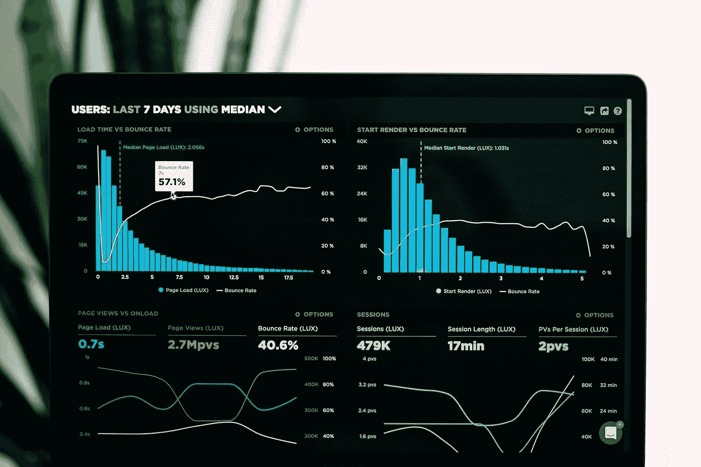

# 如何估算云服务器的 vCPU 内核、内存和磁盘大小？

> 原文：<https://medium.com/geekculture/how-to-estimate-vcpu-core-memory-disk-size-for-a-cloud-server-31fa26c883f5?source=collection_archive---------2----------------------->

## 在为应用程序设置云服务器的过程中，评估 vCPU、RAM/内存、存储磁盘大小、HDD/SSD 等系统要求的步骤。

User statistic dashboard. Source: [Luke Chesser from Unsplash](https://unsplash.com/@lukechesser)

我搜索了很多地方，但没有找到任何完整的指南来指导我们如何对**云服务器硬件**进行**粗略估算**…