# 如何使用 RudderStack 将数据从 Hugo 网站传输到 Google Analytics

> 原文：<https://medium.com/geekculture/how-to-event-stream-data-from-your-hugo-site-to-google-analytics-using-rudderstack-91e3b1f308b2?source=collection_archive---------34----------------------->

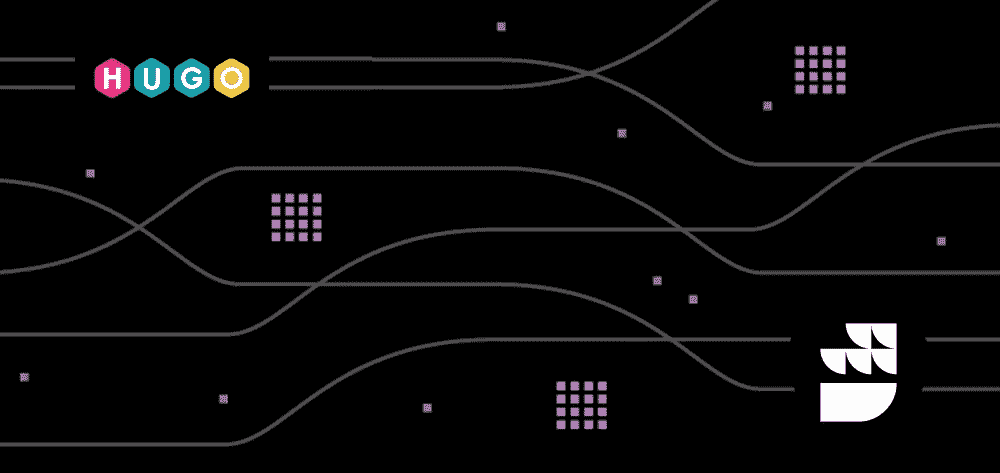

[RudderStack](https://rudderstack.com/) 是一个开源客户数据平台，使您能够从 web、移动和服务器端来源实时跟踪您的客户事件。我们还在 GitHub 上开源了我们的主存储库 [rudder-server](https://github.com/rudderlabs/rudder-server) 。本文将带您完成使用我们的 [JavaScript SDK](https://github.com/rudderlabs/rudder-sdk-js) 将您的 [Hugo 站点](https://gohugo.io/)与 RudderStack 集成的过程。它还将帮助您跟踪实时用户事件，并将它们发送到您选择的目的地。

您可以通过以下三个步骤在 Hugo 站点上轻松实现事件流:

1.将您的Hugo 站点与 RudderStack JavaScript SDK 集成，并设置跟踪代码

2.在 RudderStack 中设置一个工具或仓库目的地，以实时发送所有事件数据

3.部署您的 Hugo 站点并验证事件流

# 先决条件

在开始之前，我们假设您已经在系统上安装了 Hugo 站点。如果您还没有，请访问官方的 [Hugo](https://gohugo.io/getting-started/quick-start/) 安装文档开始安装。

# 步骤 1:将 Hugo 站点与 RudderStack JavaScript SDK 集成

# 在 RudderStack 中创建源

首先，打开 RudderStack 仪表板，设置一个 JavaScript 源来跟踪 Hugo 站点的事件。按照下列说明设置信号源:

1.登录你的[方向舵仪表盘](https://app.rudderstack.com/)。如果您在 RudderStack 没有帐户，请在这里注册。

2.完成后，您将看到以下控制面板:

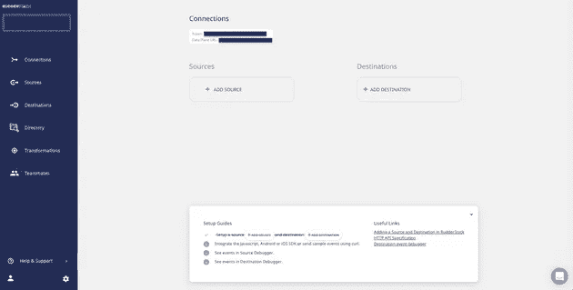

3.注意**数据平面 URL** ，因为你将需要这个 URL 来整合你的 Hugo 站点和 RudderStack。

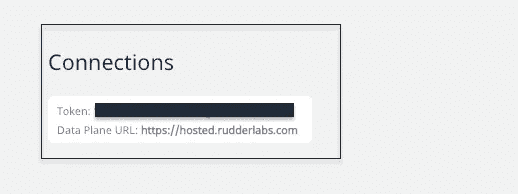

4.接下来，点击**添加信号源**选项，创建一个信号源。如果已经添加，也可以点击左侧导航栏中的**目录**选项，选择**源**下的**事件流**，如图所示。接下来，选择 **JavaScript** 作为源。

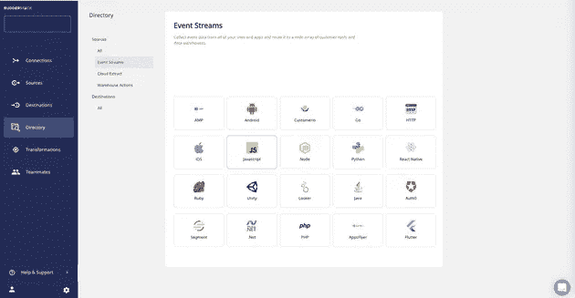

5.为您的 JavaScript 源添加一个名称，然后单击下一个的**。**

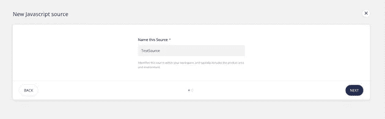

6.现在 JavaScript 源代码已经配置好了，可以跟踪事件了。记下与该信号源相关的**写键**。您将需要此密钥来设置 RudderStack 与您的 Hugo 站点的集成。

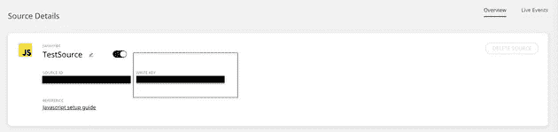

# 将您的 Hugo 站点与 RudderStack 集成

将 RudderStack JavaScript 代码与您的 Hugo 站点集成，并使用以下步骤设置跟踪代码:

1.  打开您的 index.html 文件并在`<head></head>`标签中插入以下代码:

…正在等待要点…

> ***重要提示:*** 您可以参考我们的 Hugo 站点样本，该样本位于 [RudderStack Hugo 站点库](https://github.com/rudderlabs/rudder-analytics-hugo)中，了解更多关于修改这些文件的信息。

# 步骤 2:在 RudderStack 中创建一个目的地工具，用于路由 Hugo 站点事件

RudderStack 支持超过 80 个第三方工具和平台，在这些平台上你可以安全地发送你追踪的事件。在本节中，您将使用 RudderStack 集成将 Hugo 站点事件路由到 [Google Analytics](https://docs.rudderstack.com/destinations/google-analytics-ga) 。为此，请遵循以下步骤:

1.点击方向舵仪表盘左侧导航栏中的**目的地**，然后选择**添加目的地**，如图所示:

> ***注意*** *:* 如果您已经在 RudderStack 中配置了一个目的地，并且想要将您的事件数据发送到那个平台，您可以使用**连接目的地**选项。

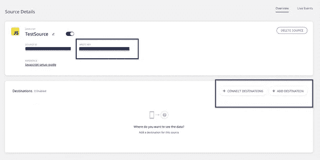

2.选择**谷歌分析**作为您的目的地。

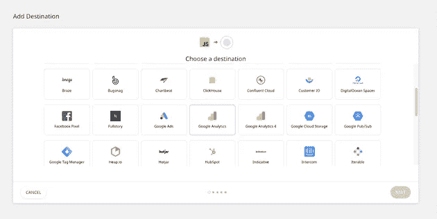

3.给你的目的地添加一个名字，点击下一个**，如图所示:**

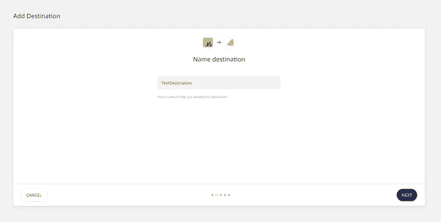

4.一旦目的地被命名，将它连接到您已经在**步骤 1 中配置的 **JavaScript** 源——将您的 Hugo 站点与 RudderStack JavaScript SDK** 集成。

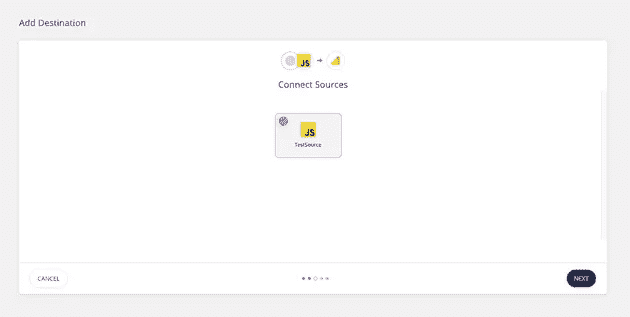

5.接下来，在**连接设置**页面上，使用您的 Google Analytics **跟踪 ID** 和其他可选设置来配置您的 Google Analytics 目的地，如下所示。然后，点击下一个的**。**

6.在将您的事件发送到 Google Analytics 之前，Rudderstack 还为您提供了转换它们的选项。要了解这个特性的更多信息，请查看我们的[用户转换文档。](https://docs.rudderstack.com/adding-a-new-user-transformation-in-rudderstack)

7.恭喜你！Google Analytics 现在被配置为目的地。现在，您将能够在您的控制面板中看到以下源-目标连接:

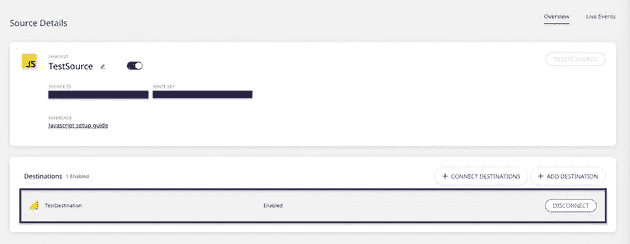

# (备选)步骤 3:为 Hugo 站点事件创建一个仓库目的地

> ***重要:*** 在 RudderStack 中将数据仓库配置为目的地之前，您需要在您的数据仓库中设置一个新项目。此外，您需要创建一个具有相关权限的新 RudderStack 用户角色。遵循我们的[文档](https://docs.rudderstack.com/data-warehouse-integrations)来获得如何为您的首选数据仓库做这件事的逐步说明。

在本教程中，您将配置一个 [Google BigQuery 仓库目的地](https://rudderstack.com/integration/bigquery/on)来路由来自 Hugo 站点的所有事件。您还可以按照我们的文档来设置一个 BigQuery 项目，并为服务帐户提供所需的权限。

一旦项目设置完毕并分配了所需的用户权限，请遵循以下说明:

1.从目的地目录中，选择 **Google BigQuery** :

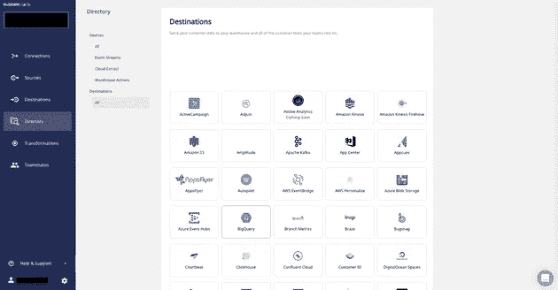

2.说出您的目的地，然后点击**下一步**。

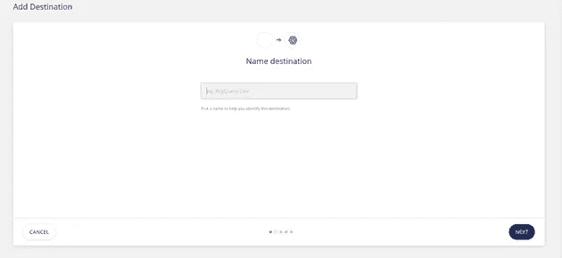

3.现在，连接到 JavaScript 源，您将从中跟踪 Hugo 站点事件。然后，点击下一个的**。**

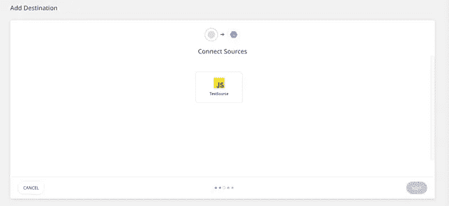

4.指定**连接凭证**。按照这些[指令](https://docs.rudderstack.com/data-warehouse-integrations/google-bigquery#setting-up-google-bigquery)添加 **BigQuery 项目 ID** 和 **Staging GCS 存储桶名称**:

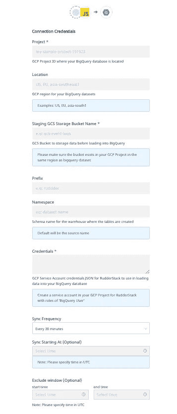

5.完成后，复制私有 JSON 文件的内容。

瞧啊。现在，您已经成功地在 RudderStack 中将 BigQuery 设置为仓库目的地。

# 步骤 3:部署 Hugo 站点并验证事件流

既然已经配置了事件源和目的地，那么就验证事件流是否正在工作。为此，部署您的 Hugo Site 应用程序，并测试事件是否被 JavaScript 源跟踪并交付到您的 Google Analytics 目的地。

请遵循以下步骤:

1.在您的终端或命令提示符下，导航到包含 Hugo 站点的文件夹。

2.要部署 app，执行 **hugo server -D** 命令，如图所示:

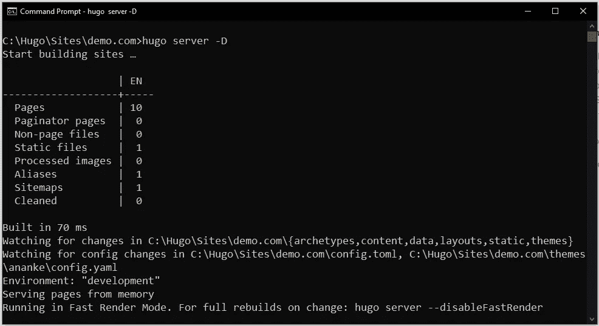

3.通过访问 cmd 中提到的服务器地址或浏览器上的 [http://localhost:1313/](http://localhost:1313/) 导航到您的 Hugo 站点。

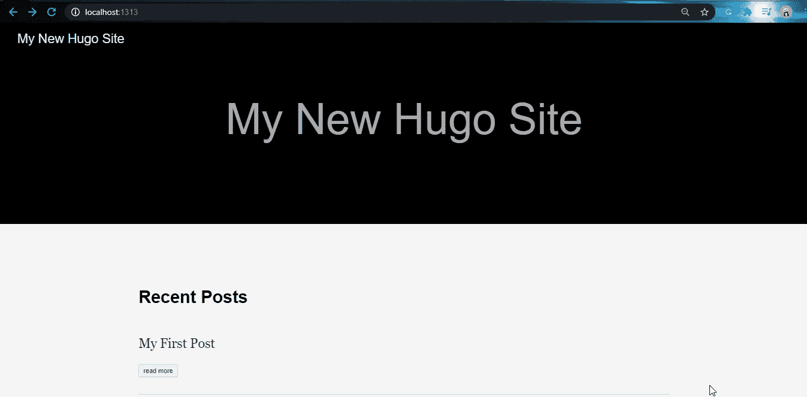

4.接下来，验证`rudder-analytics.js` (RudderStack 的 JavaScript SDK)是否已经正确加载。为此，打开浏览器的**开发者工具**，导航到**网络**标签。以下截图突出显示了 Google Chrome 的这一选项:

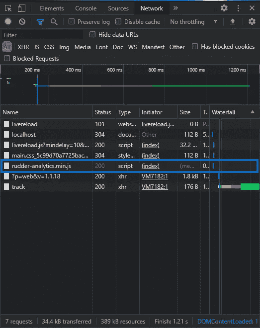

5.现在，通过点击 RudderStack 仪表板页面上您的 JavaScript 源代码的**实时事件**选项卡，检查 RudderStack 是否可以跟踪不同的页面视图和点击:

> ***注意*** *:* 部署您的应用程序后，Hugo 站点有时会延迟一段时间才开始发送事件，并在您的仪表板和目的地中可见。别担心。捕获并发送所有事件；请注意，他们可能需要几分钟才能出现。

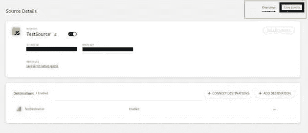

6.太好了！RudderStack 已成功跟踪并捕获事件:

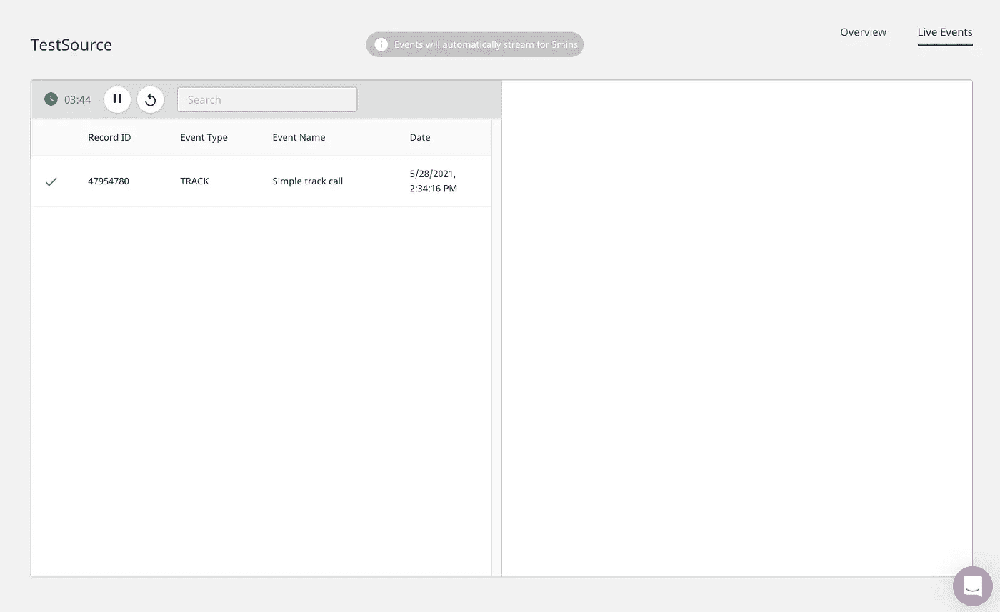

7.接下来，检查事件是否被发送到您的 Google Analytics 目的地。为此，转到您的谷歌分析仪表板，导航到**实时** > **事件**选项。

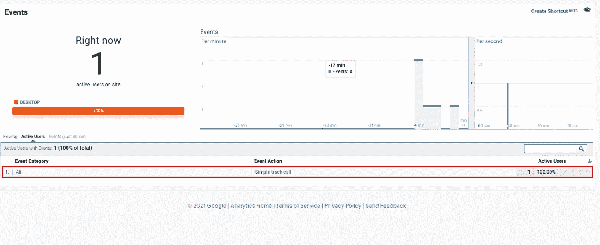

如您所见，Hugo 站点上有一个活动用户，事件调用是可见的。这表明事件已被成功跟踪和交付。您还将在您的 Google BigQuery 仓库中收到该事件。

# 摘要

Web analytics 便于收集和分析网站上的用户行为数据。它帮助公司了解他们的用户行为，以便优化性能和创造更好的最终用户体验。RudderStack 使公司能够安全地执行 web 分析。

在本文中，通过将 Hugo 站点与 RudderStack JS SDK 集成并设置跟踪代码，您了解了如何使用 Rudderstack 从 Hugo 站点捕获实时事件数据。您还探索了如何将 Google Analytics 作为目的地集成到 RudderStack 中，以便将实时事件数据从 Hugo 站点路由到 Google Analytics 平台。

# 免费注册并开始发送数据

测试我们的事件流、ELT 和反向 ETL 管道。使用我们的 HTTP 源在不到 5 分钟的时间内发送数据，或者在您的网站或应用程序中安装我们 12 个 SDK 中的一个。[入门](https://app.rudderlabs.com/signup?type=freetrial)。

本博客最初发表于:
[https://rudder stack . com/guides/how-to-event-stream-data-from-your-Hugo-site-to-Google-analytics-using-rudder stack](https://rudderstack.com/guides/how-to-event-stream-data-from-your-hugo-site-to-google-analytics-using-rudderstack)