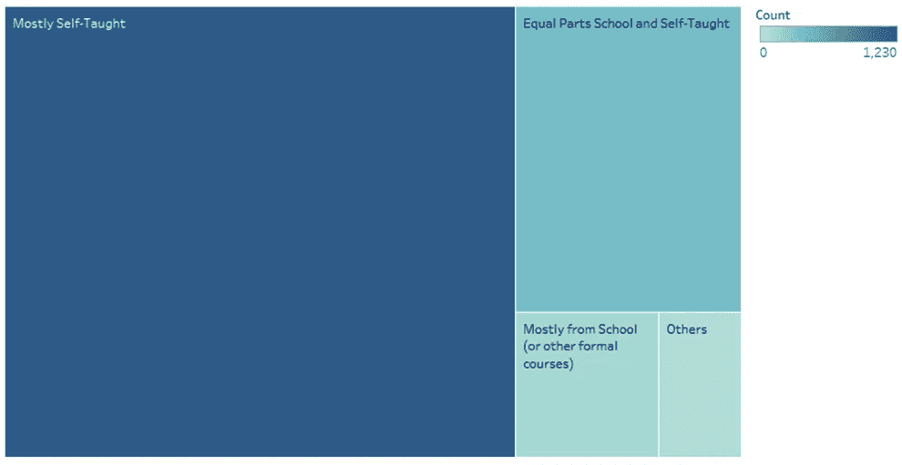
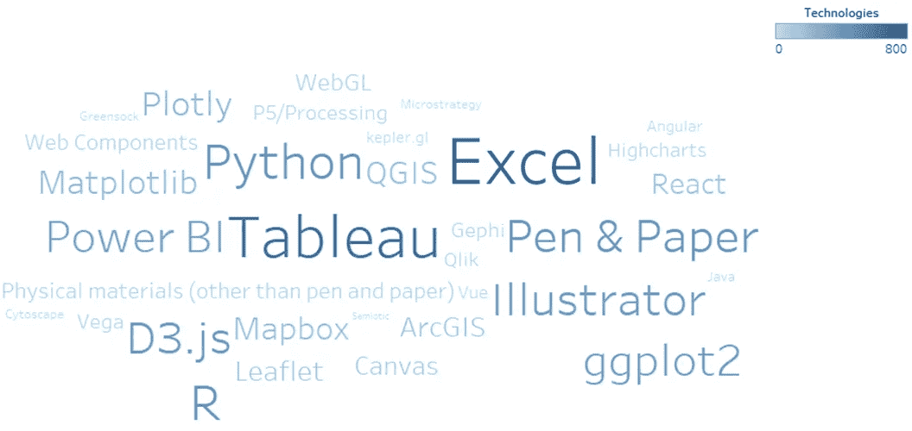
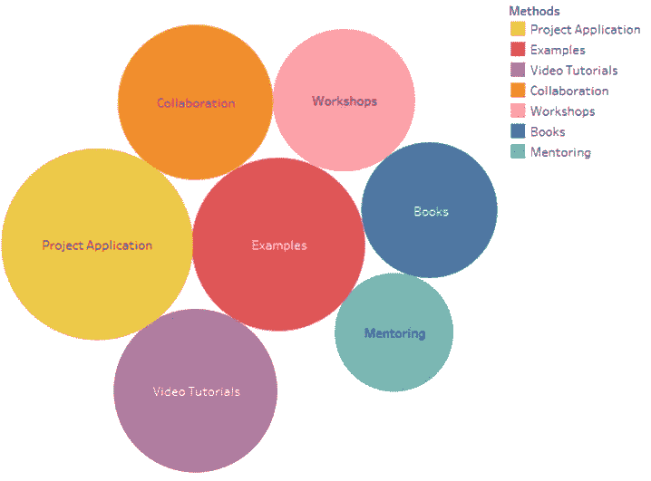

# 如何在数据可视化方面出类拔萃？

> 原文：<https://medium.com/geekculture/how-to-excel-in-data-visualization-67072f9545a0?source=collection_archive---------5----------------------->

## *一个我如何通过数据回答这个问题的小故事。*

数据科学需要的主要技能之一是数据可视化。数据可视化是数据和信息的图形化表示。这项技能非常迷人，因为你将通过同时涵盖技术和艺术，以一种有组织和创造性的方式展示你的见解。

当我在以前的课程中创作视觉效果时，有时我会遇到困难和挑战。一个问题开始在我脑海中形成，我需要找到一个答案。问题是“如何在数据可视化方面出类拔萃？”。

在我们 dataviz 课堂的第一次作业中，提供给我们的数据是来自[数据可视化协会](https://www.datavisualizationsociety.com/)的关于 2020 年人口普查的数据。早在现在我就想像数据科学家一样思考和行动，这就是为什么我借此机会回答我的问题。根据他们的[网站，](https://www.datavisualizationsociety.com/census)该调查的主要目标是了解数据可视化领域的人员是谁，他们如何工作，以及他们面临的挑战是什么。

当我浏览数据集的时候，一些新的问题开始出现在我的脑海中，这些问题可以帮助我找到主要问题的答案。在完成一系列任务后，以下是我在数据集中挖掘的见解:

1.  **他们如何学习数据可视化？**

Figure 1

在图 1 中，使用了一个树形图来直观显示受访者如何学习数据可视化。根据图表，我们可以看到“**大部分是自学的**”类别的颜色最深。我们可以说，大多数回答调查的数据可视化专家都是按照自己的进度研究数据可视化的。

**2。他们使用什么技术？**

Figure 2

在显示数据集中最常用的类别时，最好使用单词云图表。除了它简单，它可以很容易地告诉观众你的主要目标。在图 2 中，我们很容易看出受访者使用最多的技术是 **Excel、Tableau、R 和 Python** 。

**3。发展数据可视化技能的方法有哪些？**

Figure 3

从图 3 所示的气泡图中，我们已经可以根据圆的直径来确定我们需要的信息。受访者认为最有用的方法是**项目申请、示例和视频教程**。

**分析我们收集的信息…**

从这些，我们可以得出结论，如果一个人想超越或学习数据可视化:

*   个人必须有学习数据可视化的热情。
*   可以考虑学习 Excel、Tableau、R 或者 Python 等数据可视化工具。
*   项目应用程序、示例和视频教程有助于培养数据可视化技能。

亲爱的读者你好！我希望你喜欢阅读我在 medium 上的第一个故事:)希望这能对你的数据科学之旅有所帮助。