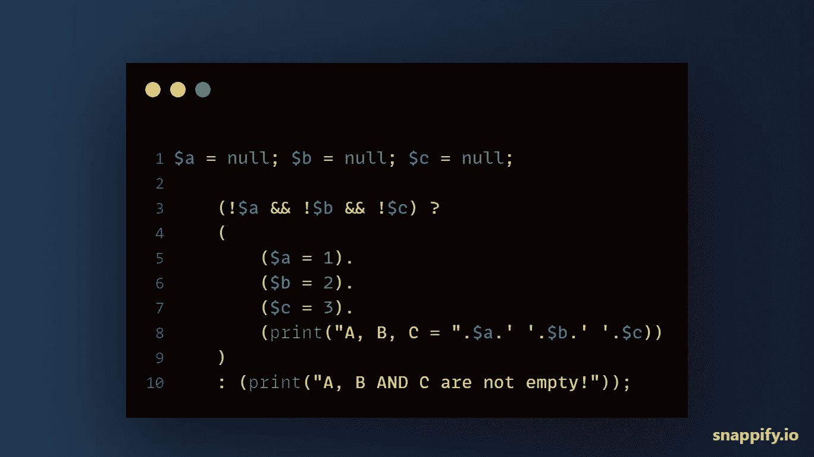
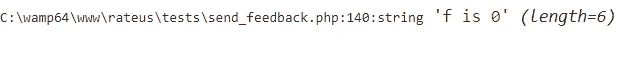

# 如何在一个三元块中执行多个动作— PHP

> 原文：<https://medium.com/geekculture/how-to-execute-multiple-actions-in-a-ternary-block-php-38548d0236c6?source=collection_archive---------8----------------------->

execute multiple actions in a ternary block php — Simon Ugorji

我写过不少关于三元运算符的教程。

我的上一篇文章是关于在 JavaScript 的三元块中执行多个动作的。今天，我们将重点讨论 PHP。

# 句法和逻辑

考虑下面的代码

## 关于上面的片段

*   使用三元运算符，我们能够检查变量是否为空。一个&美元&！$ b&！$c) 。
*   现在，如果变量为空，我们将为每个变量重新赋值，并打印出它们的当前值。
*   但是如果变量不为空，我们会打印“A，B，C 不为空”。

## 逻辑

在我以前的帖子中，我解释过如果你想在 JavaScript 的三元块中执行多个动作，你必须使用一个**逗号(，，**来分隔动作，但是在 PHP 中，这是完全不同的。

在 PHP 中，如果你使用一个**逗号(，)**来分隔你的动作，你会遇到语法错误。

所以最好的方法是用**括号()**将你的个人行为分组，然后用**句号(。)**把它们分开。

然而，我认为三元运算符在 PHP 中没有很好地实现，或者可能有另一种方法来处理它，或者可能是因为我运行的 PHP 版本。

以下是在 PHP 中使用三元运算符时可能会困扰您的一些问题。

*   不能在三元块中使用 echo 语句。

当您运行上面的代码片段时，您会得到一个语法错误。

但是，您可以使用其他替代方法，如(print、print_r 和 var_dump)来输出变量。

*   尽管支持 print 关键字，但仍然不能用它嵌套三元块。

> 回想一下:嵌套一个三元块就像在条件中添加 else if 和 else

上面的片段写道，

*如果变量 f 等于零，输出 f 为零，否则如果变量 f 等于一，输出 f 为一*

运行该代码段时，它将无法正确执行。您将从重复两次的 print 语句中获得输出。

但是如果我们用一个 **var_dump 或 print_r** 替换 print 关键字，我们将得到正确的输出。

代码将按预期执行，因为我们期望确切的输出**“f 是 0”**。

*   你不能在嵌套一个三元块的同时在其中执行多个动作。

我认为这是目前为止使用三元运算符最重要的方面。但是它不起作用，我更喜欢您对小代码逻辑使用三元运算符，对复杂逻辑使用本机 if/else 语句。这与 JavaScript 中提供的不同。

# 最后

在 PHP 中，只对单个条件使用三元运算符，并且可以在该条件中执行多个操作。但是如果您希望添加 **else if / else** ，我建议您切换到本机 **if / else** 语句。

也许，PHP 开发人员会在将来的更新中更新 PHP 解释三元块的方式，但在此之前，我建议您坚持使用原生的 if / else 语句

我相信，在这一点上，我已经让您理解了什么是三元运算符，以及如何在 PHP 和 JavaScript 中使用它们。

谢谢大家！