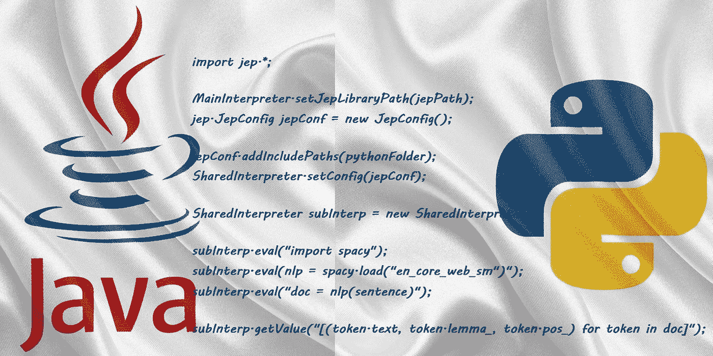

# 如何从 Java 执行 Python 模块

> 原文：<https://medium.com/geekculture/how-to-execute-python-modules-from-java-2384041a3d6d?source=collection_archive---------3----------------------->



Photo by [Peakpx](https://www.peakpx.com/)

## 逐步指南

## 本教程基于 macOSX，带有用于 Python 3.8/3.9 和 Java 11 的 M1 芯片

# **介绍。**

根据我的实践，我遇到的最后一个案例是当基础应用程序引擎是 Java 时的任务，我应该添加一个新的机器学习功能。这里的关键挑战是 ML 特性在 Python 中。

那我们要做什么？我们对这项任务应用什么样的解决方案？一个可行的解决方案是在 docker 中运行这个服务。或者我们可以找到另一个更有效的产品友好型解决方案:通过 **Jep 库(Java Embedded python)直接从 Java 代码中执行 Python 代码。**

# ***什么是 JEP 图书馆——一个*** 纯粹的巫毒教本身。

下面是他们在 GitHub 上常见问题的一些引文:

> Jep 使用 JNI 和 CPython API 在 JVM 中启动 Python 解释器。当您在 Java 中创建一个解释器实例时，将为该 Java 解释器实例创建一个 Python 解释器，它将保留在内存中，直到用`Interpreter.close().`关闭该解释器实例
> 
> 由于需要管理一致的 Python 线程状态，创建解释器实例的线程必须在对该解释器实例的所有方法调用中重用。

这里有一个关于 Python 模块执行的引用:

> Jep 应该与任何纯 Python 模块一起工作。它可以与各种 CPython 扩展一起工作。开发人员报告说，Jep 可以与 NumPy、Scipy、Pandas、TensorFlow、Matplotlib、cvxpy 等等一起工作。

速度性能是一个至关重要指标，尤其是当您的应用程序处理大数据时。我的研究中的测试表明，使用 JEP 几乎是纯粹的 python 执行。

# 如何为您的项目设置 JEP。

假设你的系统中有 Java (Maven)和 Python。 ***在 Java*** 项目中，在`*pom.xml*` 文件中，你设置了一个依赖关系:

The pom.xml dependency for running Python from Java

在项目终端中运行:

```
mvn clean installormvn clean install -DskipTests
```

你在 Java 里安装了 JEP！

要在 Python 中安装 JEP ***，运行*** :

```
pip install jep 
```

此命令安装最新的 JEP 版本。如果需要，您可以指定特定的 JEP 版本。在我的例子中，我使用 JEP 4.0.3 版本。

这里的版本不兼容性很大。Python 版本和 Jep 库版本越低，使用的 java 语法就越复杂(反之亦然)。但是最新的 JEP 版本可以很容易地执行 JEP 旧版本的语法。

在您的系统中，必须设置一个环境变量。对于 macOSX，它将像在终端中运行一样:

```
export DYLD_LIBRARY_PATH="<your_user>/myenv/lib/python3.8/site-packages/jep"$DYLD_LIBRARY_PATH
```

不要忘记在你的`*~/.zshrc*`文件中添加相同的一行！JEP 正在寻找 macOS 上的`*libjep.jnilib*`文件和 Linux 上的`*libjep.so*` 文件。

此外，对于 Linux 系统，它将是一个不同的环境变量名称:

```
export LD_LIBRARY_PATH="<your_user_path>/myenv/lib/python3.8/site-packages/jep"$LD_LIBRARY_PATH
```

你建立了 JEP 图书馆。现在可以直接从 Java 执行 Python 了。

# Python 3.8 macOSX M1 芯片的语法。

首先，我们应该定义 JEP 库路径(特别是 Java 将搜索 Python 执行的位置)并初始化 MainInterpreter 对象:

Example of how to set up a Python Path for Jep library in Java

第二步—设置 JEP 配置(我们应该添加 Python 库来操作和我们的项目文件夹)。然后，创建一个 SharedInterpreter 对象。SharedInterpreter 将直接执行 python 代码或 python 执行文档:

Example of how to set up the Jep configurations and to create a SharedInterpreter for Python execution

我有一个带有两个简单函数的 python 文档来检查 JEP 的工作。一个函数应该使用本地 Python 库来搜索目录中的特定文档。第二个函数调用更复杂的 Python 库 Spacy。在 Jep 运行之前，确保在 Python 中安装了包含下载模型的 Spacy 库:

Example of simple Python functions for Jep check

现在，让我们从 Java 运行 Python 文档函数:

Example of function run from the python_functions.py document (python 3.8)

输出是:

```
>>> [Apple, Apple, PROPN, NNP, nsubj, Xxxxx, true, false]
>>> [is, be, AUX, VBZ, aux, xx, true, true]
>>> [looking, look, VERB, VBG, ROOT, xxxx, true, false]
>>> [at, at, ADP, IN, prep, xx, true, true]
>>> [buying, buy, VERB, VBG, pcomp, xxxx, true, false]
>>> [U.K., U.K., PROPN, NNP, dobj, X.X., false, false]
>>> [startup, startup, VERB, VBD, dep, xxxx, true, false]
>>> [for, for, ADP, IN, prep, xxx, true, true]
>>> [$, $, SYM, $, quantmod, $, false, false]
>>> [1, 1, NUM, CD, compound, d, false, false]
>>> [billion, billion, NUM, CD, pobj, xxxx, true, false]
```

这太棒了。我们可以直接从 Java 调用和执行 Python！但是等等，我在文章开头提到的其他 Python 版本的语法呢？

# Python 3.9 macOSX M1 芯片的语法。

我在更高的 Python 和 Jep 版本之前说过，Java 中更简单的语法。之所以如此，是因为在 Python 3.9+版本的最新 Jep 版本中，JEP 开发者在你做“pip install jep”时，增加了对 Python 路径的自动搜索。下面来看看语法！

Example of how to set the path for jep and create the SubInterpreter for executing python3.9

四行代码，我们就有了一个 Java 的 python3.9 解释器！现在，您将看到如何从已经看过的文档中运行 Python 函数。

Example of how to run python3.9 functions from Java Jep

打印输出将与 Python 3.8 版本相同。那都是乡亲们！！

# 结论。

在本教程中，您了解了如何从 Python 3.8 和 Python 3.9 版本的任何 Java 应用程序中执行 Python 代码。

文章中的所有代码示例都可以在 macOSX M1 芯片和 Linux 上运行。您只需要为每个系统正确设置 Jep 库。

# 来源。

1.  [Jep 库 GitHub](https://github.com/ninia/jep)
2.  [我的 GitHub 项目及代码示例](https://github.com/Galina-Blokh/jep-java-python)