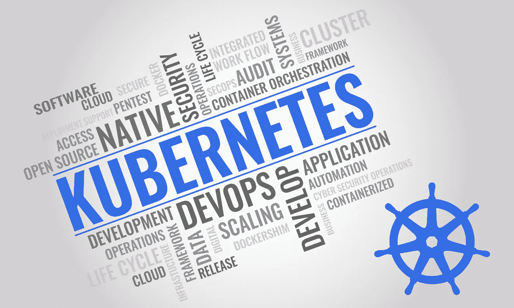

# 如何向业务团队解释 Kubernetes

> 原文：<https://medium.com/geekculture/how-to-explain-kubernetes-to-a-business-team-281f94bf67d?source=collection_archive---------15----------------------->

## 如果你从事 IT 工作，需要向业务团队解释 Kubernetes，这里有 3 种方法可以让你更容易理解。

Kubernetes 在科技界得到了很多关注。但它几乎完全不为商业界的任何人所知。这种情况并不罕见。技术发展如此之快，以至于业务团队对他们所依赖的系统越来越不熟悉。

当您需要与企业讨论某项特定技术时，这使得事情变得更加困难。那么你如何向商业团队解释像 Kubernetes 这样的东西呢？

# Kubernetes 的技术定义是什么？

我发现的最简单的 Kubernetes 的定义是这样的。Kubernetes 是一个可移植、可扩展的开源平台，用于管理容器化的工作负载和服务，有助于实现声明式配置和自动化(来源:[https://kubernetes . io/docs/concepts/overview/what-is-kubernetes/](https://kubernetes.io/docs/concepts/overview/what-is-kubernetes/))

这个定义对几乎所有在 DZone 或其他科技网站上阅读这篇文章的人都有意义。不幸的是，这对商业利益相关者来说毫无意义。业务用户不知道什么是容器化的工作负载。他们也不知道为什么有人需要声明式配置。

当向业务团队解释这项技术时，你不能使用技术语言。你必须以业务团队能够理解的方式解释 Kubernetes 是什么。

# 让解释 Kubernetes 不那么痛苦的 3 个技巧

因此，如果你发现自己需要向商业观众解释 Kubernetes，试试以下 3 个建议。

1.  不要解释它(这不是一个笑话——阅读下面的原因)
2.  不解释技术。解释技术为他们做了什么。
3.  描述一个没有 Kubernetes 的世界

# 技巧一:不要解释

如果你认为你需要向一个商业团队解释 Kubernetes，停下来问问自己是否真的需要。营销团队不会向其他业务部门解释他们的工具和方法。他们为工作选择合适的工具，然后继续工作。你需要解释 Kubernetes 或者你可以直接使用它吗？

> 问问你自己你真的需要解释吗？

问问自己解释的目的是什么？你不太可能培训企业如何使用 Kubernetes。更有可能是你在要求资金来实施。如果是这样的话，你需要关注 Kubernetes 会为他们做什么。

# 技巧二:不要解释技术。解释它为他们做了什么。

在你确定你需要向一个商业团队谈论 Kubernetes 之后，你需要想出该说些什么。这部分很难，你需要避免谈论技术的诱惑。相反，关注 Kubernetes 为企业做了什么。

这里有一些例子。

*   Kubernetes 保持应用程序和软件运行，即使突然有一大群人使用它。使用量的突然增加不会使系统崩溃。
*   Kubernetes 可以降低 IT 硬件的成本。Kubernetes 有助于在现有系统中安装更多的软件和服务。你可以把它想象成俄罗斯方块游戏的大师——Kubernetes 可以把我们需要的东西放进可用的空间。
*   Kubernetes 保守秘密。Kubernetes 可以在 IT 网络中建立密室，黑客很难找到。使用 Kubernetes 存储密码比使用一些旧技术更安全。

还有比这更多的好处，但是这三个有助于描述商业价值。他们用一种非技术性的方式来做这件事。

在与企业交流时，思考他们为什么会从 Kubernetes 中受益。这告诉你为什么他们会关心，当人们关心时，他们会注意。

# 技巧 3:描述一个没有 Kubernetes 的世界。

如果你想在你的公司里实施 Kubernetes，这将有助于展示没有它的生活。举例说明当前 IT 系统的局限性，并强调转向新事物的价值。

和技巧 2 一样，不要解释技术。相反，解释技术阻止了业务的发展。以下是一些可能与您的公司和情况相关的示例。

*   如果没有 Kubernetes，公司的发展将需要更多的资金。旧系统通过添加服务器或购买更多云存储来扩展。Kubernetes 充分利用了我们现有的系统，意味着我们不必经常购买新设备。
*   突然增长会使系统瘫痪。获得 50%以上的用户可能对业务有好处，但如果当前的系统无法处理，服务将会停止。这种类型的中断对业务非常不利。Kubernetes 将使扩展变得更简单，并减少服务停机时间。
*   当前的系统故障需要时间来修复。当系统出现故障时，我们必须找到并解决问题。这需要时间。Kubernetes 可以自动查找和修复一些问题。如果有 IT 问题，您的业务团队可能永远不会知道，因为它是由 Kubernetes 自动修复的。

这些例子可能不适合你的确切情况，但你得到的想法。描绘一幅没有 Kubernetes 的生活画面，你将有助于提出升级的理由。

# 结论

我们大多数人都试图避免向业务团队解释技术。但有时我们无法避免。如果你和业务团队谈论 Kubernetes，确保你真的需要。需要解释技术还是需要解释为什么需要技术？

如果你确实需要向业务团队解释 Kubernetes，避免技术细节。关注 Kubernetes 对业务的贡献。描绘一幅有无它的未来图景。做到这一点，业务团队就会明白 Kubernetes 为他们做了什么。即使他们根本不知道它是如何工作的。

(图片[鸣谢:Jaiz Anuar](https://www.istockphoto.com/portfolio/JaizAnuar?mediatype=illustration) )

*(文章还刊登在 DZone.com*[这里](https://dzone.com/articles/how-to-explain-kubernetes-to-a-business-team) *)*

*原载于 2021 年 11 月 19 日 https://chrisfenning.com**的* [*。*](https://chrisfenning.com/how-to-explain-kubernetes-to-a-business-team/)