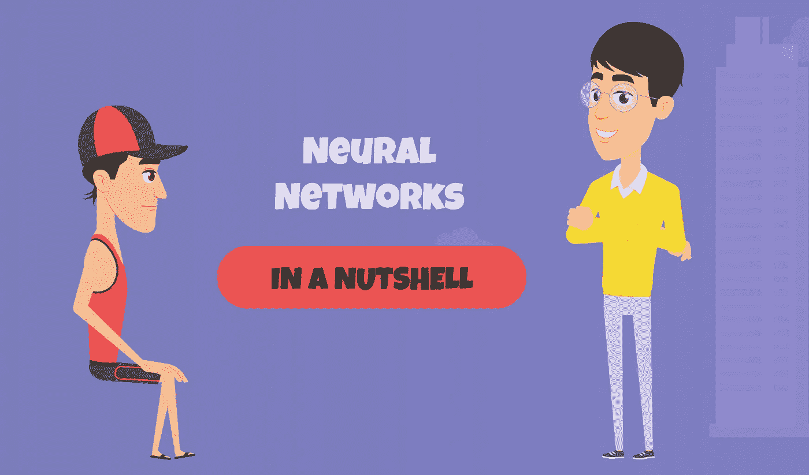
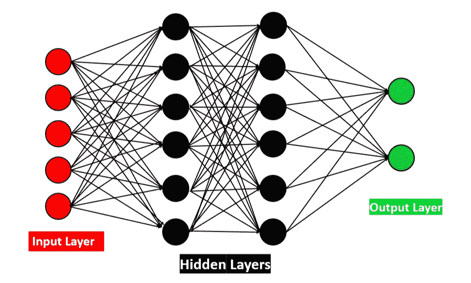

# 如何向六年级学生解释神经网络概念

> 原文：<https://medium.com/geekculture/how-to-explain-neural-network-concepts-to-a-sixth-grade-student-b853174da2d5?source=collection_archive---------11----------------------->

## 这篇文章试图以一种可理解的方式解释深度学习的概念，即使是正在上学的学生也能理解

事实上，深度学习并不是一个很难理解的概念。对于完全的初学者，我已经在这篇[五分钟文章](https://t.co/9fYohumhe2?amp=1)中解释了人工智能、机器学习和深度学习。这将有助于你理解本主题中的一些基本内容。

我们将在这篇文章中学到的东西。

1.  什么是神经网络？
2.  它是如何工作的？
3.  什么是激活功能？

*深度学习就像海洋。我将在后续的文章中讨论与此相关的所有其他主题。*

## 什么是神经网络？

让我们逐字解释一下。“神经的”意思是“神经元”。神经元是我们身体中的一个细胞，我们全身大约有 10 个⁵神经元。神经元负责在我们整个身体系统内传递信息。例如，如果你触摸某个东西，你手上的神经元会将信息传递给大脑中的神经元，并告诉它们你正在触摸某个东西。它通过网络传递信息，这意味着你手中的神经元和你大脑中的神经元之间有联系。在生物学术语中，我们称这个网络为“轴突”。同样，我们身体中的所有神经元都是相互联系的。“网络”是对两个或更多事物之间联系的想象。

*把我们身体内的细胞想象成不到一毫米大小的人，它们在我们的身体内工作，以保持我们的身体始终以平稳的方式运转。神经元是我们的造物主派来为你工作的工人(更准确地说，是为你的身体工作)。它们都是相互联系的，并且有很好的协调性。你不需要付钱给他们。*

好吧，但是这个神经元在深度学习中做什么呢？

我对此进行了研究，了解了许多新事物。让我们来看看这个故事，曾经科学家们厌倦了这种机器的程序化活动。除了他们传递给它的指令(以代码的形式)，它没有做任何事情。但是这些贪婪的科学家期望从这些无辜的机器身上得到更多。他们认为如果它像人类一样有一些智能，它会做得更多。他们将这些机器与人类进行了比较。机器比人更快更精确。但是我们不需要像对机器那样一直指导人类。他们认为，如果某种东西具有某种智能，同时又更快、更精确，它就能在这个世界上做任何事情。所以他们决定人工给这些机器注入智能。但是在那个时候，他们不知道如何去做。所以他们研究了人类大脑是如何工作的，他们开始了解我们大脑中的神经网络。他们只是想制造一个这样的，所以他们只是模仿这种神经网络机制，并将其人工注入机器。经过漫长的过程，他们获得了成功。这就是深度学习是如何诞生的，并在当今世界上做了许多令人难以置信的事情。

**神经网络是如何工作的？**

在了解神经网络的工作机制之前，先听听这个故事。六年级教室里有二十名学生。有一天，他们的老师心情很好，就想用一种创新的方式教给学生一些东西。他把他所有的学生带到学校的操场上，让每个人站成一个队列。现在学生们站成一排，每个人之间有一米的距离。那位老师从字典中选了一个单词，他确保这个单词不会被六年级学生所熟悉。他以恰当的方式对队列中的最后一个人说出了那个词。现在的游戏是，每个学生都应该把单词传给站在他们前面的人，直到它传到队列中的第一个人。在它到达第一个人手中后，第一个人应该试着在一张纸上用精确的拼写写下那个单词。那位老师将从第一个人那里收集试卷，并把这个拼写与字典中那个单词的拼写进行比较。最后，他会根据论文中单词的书面拼写与原始拼写的匹配程度进行评分。比较之后，他在纸上写下他的分数，并把它给了第一个人。在第一次尝试中，他给这个单词的拼写打了满分 10 分中的 4 分。现在，第一个人应该把这张纸递给他后面的学生，队列中的每个人都应该继续传递这张纸，直到它再次到达最后一个人手中。现在队列中的每个人都想在第二次机会中增加分数。最后那个人又一次清晰地传达了这个信息。这一次每个人都在这个传球游戏中表现出色，以增加评级得分。每个人都非常小心地获取输入，并同样清晰地传递给站在他面前的学生。现在他们 10 分中得了 7 分。他们再次抓住机会以同样的方式把分数提高到更高，直到他们达到完美。

这是发生在一所学校的故事。我在这个背景下讲这个故事的原因是，这就是神经网络的工作方式。

让我们看看神经网络的架构，有一个输入层和输出层。在里面有许多隐藏的层。输入层是队列中的最后一个，输出层是队列中的第一个。隐藏层是教室里的其他学生。在神经网络中，这些隐藏层都是极其聪明的人。下图将帮助你更好地理解神经网络。

上述故事是一个基础，很容易理解神经网络如何工作。我们来看看神经网络作品的实际工作机制。输入层是从用户那里获得输入的层。例如，如果你想知道某个地方的房子的价格，想一想有什么可能的方法来找到该建筑的实际价值。

1.  评估建筑状况。
2.  数卧室的数量。
3.  考虑到建筑的位置。

有很多参数。在机器学习中，我们通常称之为特征。因为这些东西会帮助我们评估建筑的实际价值。这些特性是独立的，因为位置的值不会影响卧室数量的值。但是我们将要发现的也是一个依赖的特征。因为，我们想知道房子的价格，它根据这些独立特征的价值而变化。

但是有一件事我们必须考虑。这些所有的特点都将在同一水平上有助于计算房子的价格？不…

在这里我告诉你原因。如果我们想知道最近上映的电影有多好，我们会问我们组里不同的人关于已经看过这部电影的情况。考虑一下，如果你从他们那里得到一个褒贬不一的评价，但是如果你的团队中有一个人是电影爱好者，并且对此给出了积极的评价，那该怎么办呢？我们比其他人更重视他的话，对吗？用机器学习的行话来说，就是你对他的话/评论赋予了更大的权重。

同样，一些独立特征对从属特征的影响比对其余特征的影响更大。首先，我们的神经网络不知道如何为所有特征设置权重。在第一次拍摄中就这样做是非常幼稚的。因此，最初它会以随机的方式给所有的特征固定一些相等的权重，就像我们认为在新学校的第一天，教室里的所有学生都是中立的一样。它将从输入层获得所有这些输入特征，并将它发送到神经网络中的所有隐藏层进行处理。就像队列中的最后一个学生从老师那里获得输入单词，并将其发送给队列中的所有学生。

具有权重的特征被添加，并在隐藏层的末端向激活函数给出最终结果(它出现在输出层之前)。他是神经网络中最聪明的一个，把处理过的数据变成有意义的形式。考虑他是站在二十个人队列中的第一个人，他在纸上写单词的拼写(我们给第二十个人输入)。这在神经网络中称为前向传播。在学生传递游戏中，在得到老师的评分后，学生反向传递结果，直到最后一个人，对吗？这就是神经网络中误差反向传播的工作原理。

**什么是激活功能？**

是的，这是完整的神经网络过程中的重要功能。它以合理的格式给出了我们想要的输出。

例如，假设你从市场上买了一些蔬菜，交给你的厨师，让他做蔬菜汤。从你那里收集了所有的蔬菜后，你的厨师把这些蔬菜给了他的下属，并要求他们为你做一份好的蔬菜汤。当他们完成烹饪后，他会把汤整齐地放在你的桌子上。现在这位厨师正在激活整个烹饪过程中的功能。你不需要关心里面的过程，只要你的深度学习模型中存在激活函数，他就会以你想要的方式呈现输出。

如果你正在处理一个二进制分类问题，你只想得到最终的结果，要么是“是”，要么是“否”。它将根据输入要素的值在内部进行一些计算，并将计算的最终结果提供给激活函数。它可能是一个连续的数字，我们不需要担心，它会把这个连续的数字映射成 0 和 1，然后给你一个二进制形式的结果。因为这是我们想要的。

有很多激活功能，我会在另一篇文章中讲述。

> 在这篇文章中，我已经介绍了神经网络中的一些基本概念，并试图在我的后续文章中尽快写出如何用 python 实现所有这些东西。