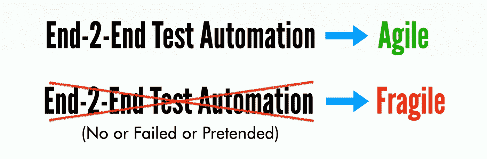

# 如何揭穿假敏捷公司的假 UI 测试自动化？

> 原文：<https://medium.com/geekculture/how-to-expose-fake-ui-test-automation-in-fake-agile-companies-5f7f11a877ad?source=collection_archive---------17----------------------->

## 大多数软件公司声称的“敏捷”是假的。只需问一个简单的问题:“给我看看你的 CI/CT 服务器中的自动化功能测试报告？”

在过去的十年中，许多软件项目都声称要做敏捷/开发运维，其中一些…