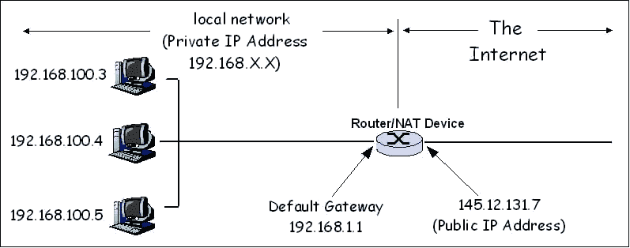
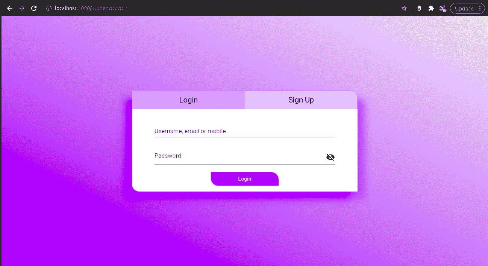
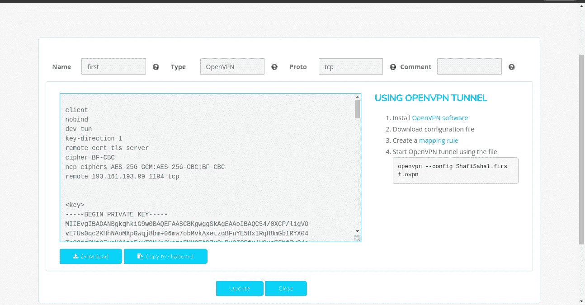
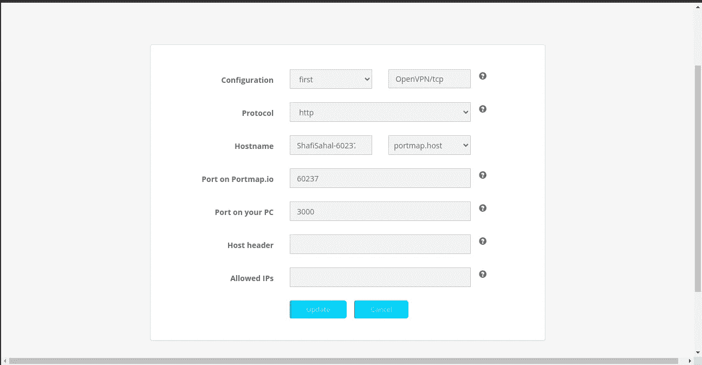
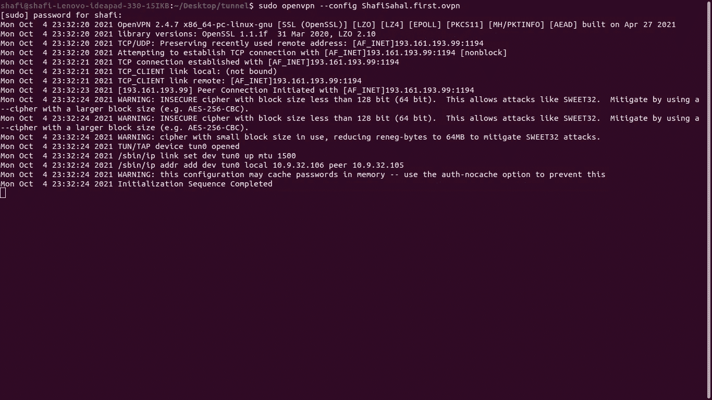
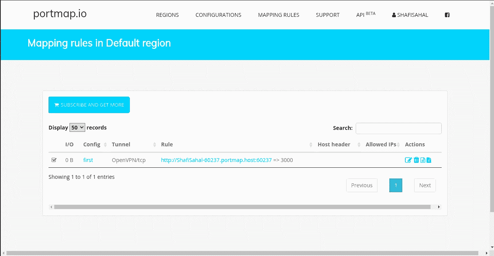
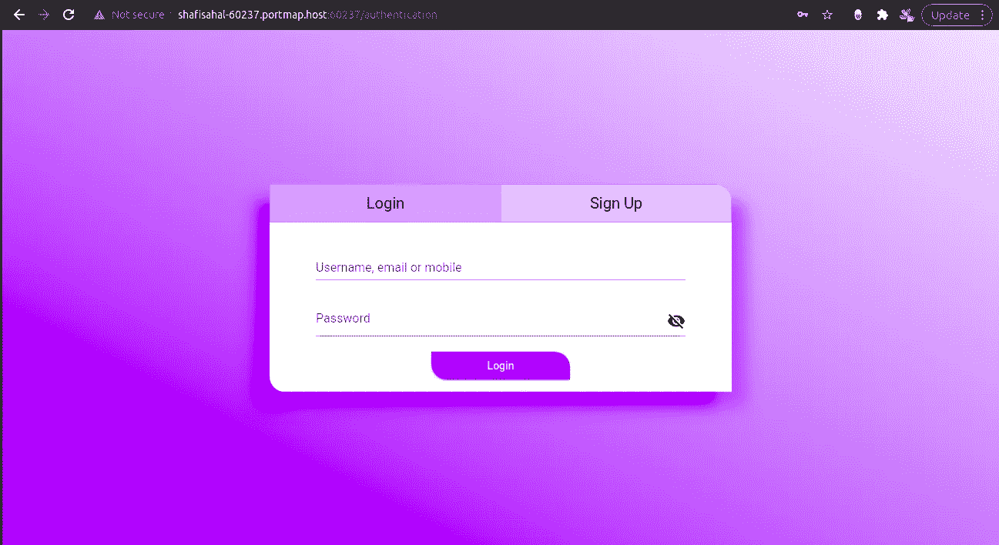

# 如何在没有公共 IP 地址的情况下将您的 PC 暴露在互联网上？

> 原文：<https://medium.com/geekculture/how-to-expose-your-pc-to-the-internet-without-a-public-ip-address-c7a2c808ab6b?source=collection_archive---------1----------------------->


互联网是迷人的:让每个人都联系在一起，让在家工作成为现实，让获取信息变得廉价而快捷，然而互联网的基本概念非常简单。只是一些共享文件。你访问的每一个网站或网络应用都只是存储在网络中另一台电脑上的一些文件。当有人输入 URL 时，一个请求被发送到特定的计算机，计算机将所需的文件发送回发出请求的人，并在浏览器中查看这些文件。即使基本概念是如此简单，互联网只是在非常非常大的范围内影响了世界。这真的是一场革命。

当它能够从网络中的另一台计算机请求文件时，我们能与另一台计算机共享我们的文件吗？互联网只是一个分布式网络，所以我们也可以与另一台计算机共享文件。假设你开发了一个很酷的 web 应用程序，你想把它展示给你的朋友或者外界。它可以在主机提供商的帮助下完成，你只需上传你的网络应用程序的文件，它就运行在提供商提供的服务器上。

如果你的应用程序准备投入生产，那么在其他平台上托管是非常好的，因为它更安全，托管你的应用程序的机器将具有更高的性能，并且互联网连接速度也将非常快。

但有时你只想简单地向某人展示你的应用程序，而不是让每个人都可以使用，或者你可能想在开发的同时获得对你的应用程序的反馈。在一个平台上托管，学习如何在一个托管平台上托管，这个阶段可能太多了。此外，动态 web 应用程序没有完全免费的托管解决方案。要么是使用量有限制，要么是要付费。

对此有一个完美的解决方案，那就是将你的电脑直接连接到互联网，这样你就可以让你机器上的服务器监听来自互联网的请求，而不需要主机。任何能够访问您机器中的服务器的人都可以向它发送请求或与之通信。那么，我们该怎么做呢？为此，让我们进入一些基本的网络。

# IP 地址；网络地址

IP 地址类似于物理地址。假设你要给朋友送快递，你提供他家的地址。与 IP 地址相同有助于识别网络中的机器。当您在浏览器中键入一个 URL 时，该 URL 在 [DNS(域名系统)](https://www.cloudflare.com/en-in/learning/dns/what-is-dns/)的帮助下被翻译成相应的 IP 地址，请求被发送到特定的 IP 地址。全世界目前都在使用被称为 IPV4 地址的第 4 版 IP 地址

IPV4 地址是 32 位数字地址。可能有 40 亿个 IPV4 地址。因此，如果我们为每台机器分配一个 IPV4 地址，那么这台机器就可以在整个网络中被唯一地识别，并且可以与之通信。如果是这样的话，每个人都可以很容易地将他们的电脑暴露在互联网上，但现在不是这样了。

即使 IPV4 地址可以有 40 亿个值，它也会随着互联网的快速发展而耗尽。因此，到目前为止，只有互联网服务提供商和其他如数据中心或托管服务提供商拥有唯一的 IPV4 地址。想要有一个属于自己的独一无二的 IP，有点难。这些唯一的地址被称为公共 IP。

专用 IP 地址是您的路由器用来识别本地网络中的计算机的地址。因此，ISP 可能会为您的路由器分配一个公共 IP 地址，这样路由器就会有一个 IP 地址池。连接到路由器的每台机器都将从地址池中获得一个 IP 地址。路由器分配的这些 IP 地址是私有的，称为私有 IP 地址。路由器本身也将有一个私有 IP 地址，称为默认网关。本地网络中的一台机器向该默认网关 IP 发送请求。

# 网络地址转换



Source: [https://www.comparitech.com/blog/vpn-privacy/nat-firewall/](https://www.comparitech.com/blog/vpn-privacy/nat-firewall/)

NAT 将公共 IP 映射到相应的私有 IP，即当本地网络中的机器通过互联网向服务器发送请求时，它首先将请求发送到路由器的私有 IP，然后 NAT 将私有 IP 映射到路由器的公共 IP。当服务器向机器发回响应时，它将请求发送到路由器的公共 IP，NAT 将路由器的公共 IP 映射到发送方的私有 IP。

因此，如果设备共享同一个本地网络，就不需要为每台设备分配公共 IP。这也增加了安全性，因为没有人能够直接连接到 NAT 后的设备。[如果您的路由器有公共 IP，您可以通过端口转发将您的电脑暴露在互联网上，这非常简单](https://www.lifewire.com/how-to-port-forward-4163829)。

问题是有时甚至路由器也没有公共 IP，因为路由器就在另一个 NAT 之后，这意味着路由器本身是一个更大的本地网络中的设备。ISP 可以使用 NAT 并为路由器分配私有 IP，而不是为每台路由器分配公有 IP。因此，在 ISP 下面会有一个路由器本地网络，在每个路由器下面，会有一个计算机或移动电话本地网络。这是为了提高安全性，也是为了减少公共 IP 的使用。

# 在没有公共 IP 的情况下将 PC 暴露于互联网



这是我在 Nodejs 服务器上运行的应用程序，端口为 3000。这个应用程序在我的电脑上。

要在没有公共 IP 的情况下将 PC 暴露于互联网:

*   下载并安装 OpenVPN。在我的 ubuntu 20.04 中，它是预装的。
*   转到[https://portmap.io/](https://portmap.io/)
*   创建一个帐户(免费)
*   单击“配置”选项卡
*   添加新配置，选择协议，给出配置名称，然后保存配置并下载配置文件。



*   转到映射规则选项卡并创建新的映射规则。
*   将协议设为“http”
*   在“您的 PC 上的端口”字段中，提供服务器在您的计算机上运行的端口。在这种情况下，3000 作为我的服务器运行在 3000 上。
*   保存规则。



*   现在打开终端，导航到下载配置文件的位置，输入命令

```
sudo openvpn --config <Your downloaded config file name>
```

如果出现“初始化序列完成”消息，您就可以开始了。



[现在，OpenVPN 建立了一个从你的机器到 portmap.io 网站的隧道。](https://www.cloudflare.com/en-in/learning/network-layer/what-is-tunneling/)将保存映射规则后由 portmap.io 生成的 URL 发送给你的朋友，当他们点击它时，会向 portmap.io 发送一个请求到 URL 中的指定端口，portmap.io 会将该 URL 重定向到你电脑中的指定端口。



现在，您可以在世界任何地方与您的服务器进行连接和通信！！！