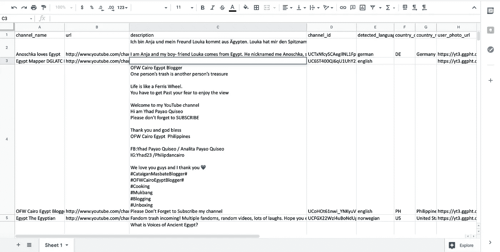

# 如何从频道爬虫搜索结果中提取所有 YouTube 频道数据… &更多。

> 原文：<https://medium.com/geekculture/how-to-extract-all-youtube-channel-data-from-channel-crawler-search-results-more-5cba65b44c?source=collection_archive---------10----------------------->

在浏览热门问答平台时，我经常会遇到这样的问题:

如何获取所有 Youtube 频道 id？

*我如何从 Youtube 描述中提取所有的电子邮件 id？*

*如何从 ChannelCrawler 获取所有频道？*

*如何在 excel 中下载频道爬虫搜索结果？*

*如何获得某个特定类别的所有 Youtube 影响者？*

我将在这篇文章中尝试给你一个回答这些问题的方法。

频道爬虫是一个强大的工具。该网站收录了近 100 万个 Youtube 频道，你可以搜索并获得几乎任何频道。不受 Youtube 排名算法的影响，ChannelCrawler 搜索是一个很好的搜索和过滤工具。

然而，ChannelCrawler 返回 1000 个结果，并且在一个页面上只显示其中的 20 个。其余的结果可以通过分页浏览获得——一次 20 个。对于试图对某个特定主题进行研究的人来说，这可能会有点令人沮丧。

那么，比方说，如何将所有结果保存到一个 excel 文件中，以便在方便的时候进行分割呢？

好吧，这就是你的答案！

注意:您必须熟悉在您的计算机上运行代码才能从中受益。这篇 2 分钟的文章将带你到达那里。

[任何会 google 的人都可以运行代码。](https://codifylife.medium.com/anyone-who-can-google-can-run-code-7a758394c5e4)

确保安装第 8 行和第 17 行之间的程序“需要”的所有包。

现在来看代码:

Code to export all channelcrawler search results!

您可以更改程序的前 5 行来调整您的查询设置。它们是自己命名的。

第 6 行是要将数据导出到的文件名。程序会创建它。这个文件将与程序在同一个目录中。

结果将如下所示:

以下字段是为您提取的。

频道名称、频道 Id、频道 URL、描述、描述中检测到的语言、频道的国家和国家代码、用户的照片 URL、频道的类别、用户的最后上传日期&重要的是——在频道描述中检测到的任何电子邮件 Id 或外部 URL。

**隐私声明:** *文中所列代码或技术均未违反*[*channel crawler*](https://channelcrawler.com/robots.txt)*或*[*Youtube*](https://www.youtube.com/robots.txt)*所设定的任何隐私政策。自 2021 年 3 月 14 日起，该规范尊重两个 robots.txt 文件中的排除条款。*

**程序员加分题:**

您能否通过编程方式更改上述程序第 2-5 行的变量，找出如何从 Channel Crawler 获取所有 1M 以上频道的详细信息？

对于新手用户来说，这种数据提取方法被称为抓取或爬行。谷歌使用类似的技术来索引整个网络。频道爬虫十有八九使用相同的方法从 Youtube 收集数据，或者至少最初会使用相同的方法来播种数据库。

所以我们刚刚学习了如何抓取频道爬虫。有趣！

刮痧的替代品？

有，有！Youtube 通过[数据 API](https://developers.google.com/youtube/v3)公开其公共数据。但是，每天的限额是 10000 个积分。通过 API 的每次搜索花费 100 信用点，并且最多返回 50 个结果。

仅此而已！