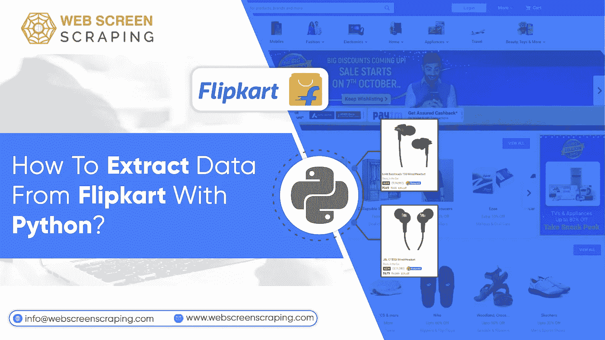
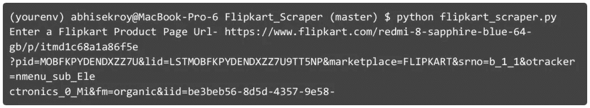
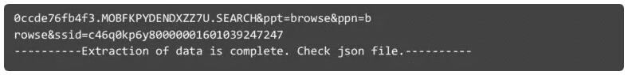
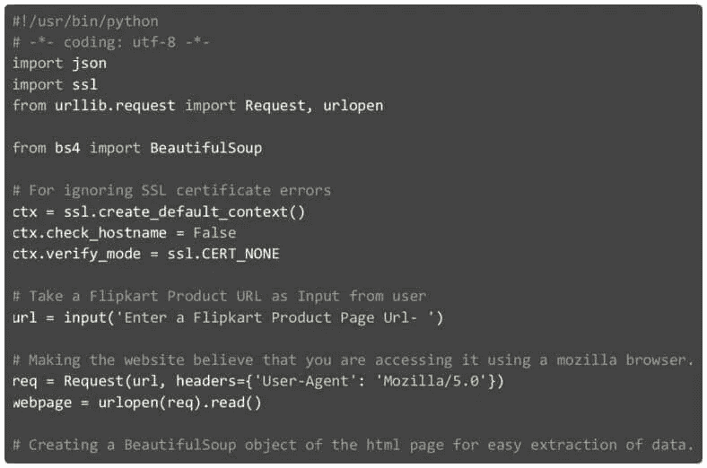
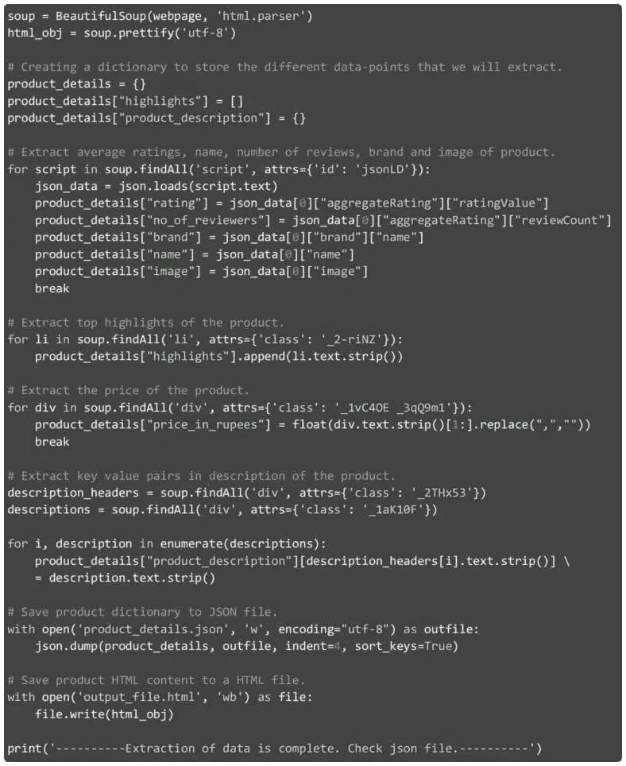
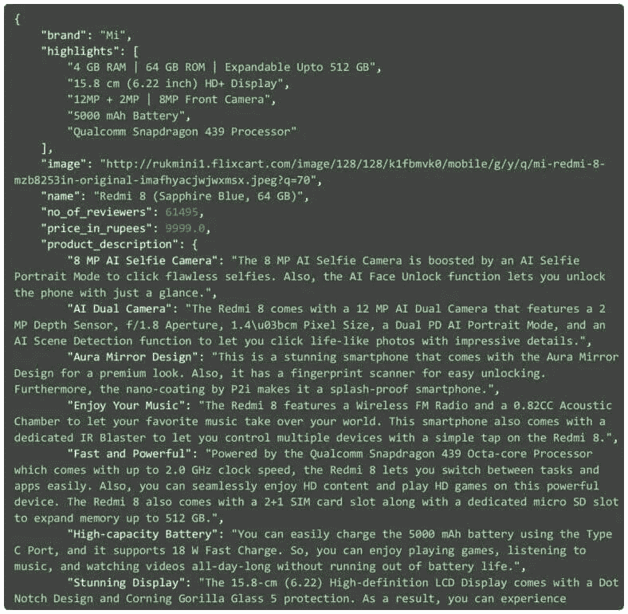

# 如何用 Python 从 Flipkart 中提取数据？

> 原文：<https://medium.com/geekculture/how-to-extract-data-from-flipkart-with-python-2ed04d1a73f2?source=collection_archive---------39----------------------->

作为最大的电子零售商之一，Flipkart 有大量的数据可供网络抓取工具抓取。Flipkart 是一个你需要运行爬虫来获得高质量数据的网站。让我们看看如何使用 Python 抓取 Flipkart 数据。

# 网页抓取步骤 Flipkart Python 代码

在开始编码之前，你需要有 Python 3.7，BeautifulSoup 库，还有 Atom，一个代码编辑器。一旦完成设置，只需继续运行下面给出的代码。

理解代码是非常重要的，这样你就可以优化它，使用它来迭代许多网页，或者更改代码来[抓取 flipkart 数据](https://www.webscreenscraping.com/flipkart-product-data-scraping-services.php)和其他电子商务网站。我们首先导入所有需要的内部和外部库，并忽略 SSL 证书错误。然后，Awe 接受来自用户的 URL，这需要是来自 Flipkart 的产品页面 URL。我们在下面给出的脚本框中使用了给定的 URL:

在获取 URL 并将其存储在变量中之后，我们驱动一个 HTTP GET 请求并抓取 HTML 内容。然后，我们读取网页并将它们转换成一个 BeautifulSoup 对象，以便轻松地遍历网页内容。我们还美化了 HTML 内容，并将其保存到变量中。

现在我们已经在 [BeautifulSoup](https://www.webscreenscraping.com/how-to-implement-web-scraping-using-beautifulsoup-and-python.php) 对象中获得了 HTML 数据，我们将创建一个名为“product_details”的字典，我们将在其中保存从网页中抓取的各种数据点。我们从具有属性“id”的初始“script”标记开始，获取值“jsonLD”。在其中，我们获得 JSON 值，通过这个值我们可以获得评级、总评论者、产品名称、品牌名称和图片。之后，我们选择所有具有属性“class”设置的“li”标签，如“_2-riNZ”。所有这些标签都有特定的产品亮点，我们从中剔除一个，并附加到“product_details”中的“亮点”属性。

# 用于从 Flipkart 抓取数据的代码

定价是最重要的数据点之一，大多数电子商务网站都是从这些数据点中提取竞争对手的数据。我们很容易地从网页中的初始“div”标签开始，该标签具有属性“class ”,获取值集为“_1vC4OE _3qQ9m1”。最后，我们捕获保存在不同描述头中的各种描述。所有这些都是以键值格式抓取的。描述头在“div”标签列表中可用，该标签具有属性“class”设置，如“_ 2THx53”。不同的描述保存在“div”标签中，这些标签具有像“_1aK10F”这样设置的属性“class”。

当数据被抓取并保存到我们创建的字典中时，我们需要将其保存到名为“product_details.json”的 JSON 文件中。同样，我们将增强的 HTML 保存在名为“output_file.html”的文件中。这是需要的，以便可以手动分析 HTML 以及可以找到更新的数据点。以前手工分析 HTML 内容时，这段代码中不同的数据抓取点是可能的。

# 我们使用网页抓取 Flipkart 抓取的数据

由于我们的代码运行良好，让我们看看我们收集的数据。提供了产品 URL 后，下面给出的 JSON 文件就是我们得到的结果。我们来深入分析一下。在具有孤立值的数据点中，包括:

在其他要点中，我们强调列出了关键产品的详细信息。产品描述有主要值对的列表。为了更好地理解，只需浏览下面给出的 JSON 文件。

# 网页抓取限制

运行代码时，您可能会面临不同的约束。最初，当需要长时间缓冲 URL 时，如果输入的是无效的 URL 或者不是 Flipkart URLs，那么肯定会抛出异常。所有这些都需要处理。相比之下，虽然提供了有效的 URL，但并不是所有的产品都有数据点，这是我们在代码中收集的。所有的场景都需要通过异常处理来处理。

# 结论

在 Web 屏幕抓取方面，我们的使 [web 数据抓取](https://www.webscreenscraping.com/web-scraping-services.php)成为一个简单的解决方案，并减少了提交需求和插入抓取数据过程中的大量工作。我们知道，在您的业务中收集数据以及注入数据以做出数据驱动的决策并不困难。这就是我们的网络抓取解决方案帮助公司轻松实现数字飞跃的原因。

请在评论区留下您的宝贵反馈，并联系我们了解您对 [Flipkart 数据抓取服务](https://www.webscreenscraping.com/flipkart-product-data-scraping-services.php)的所有需求。

【https://www.webscreenscraping.com】最初发表于**。**