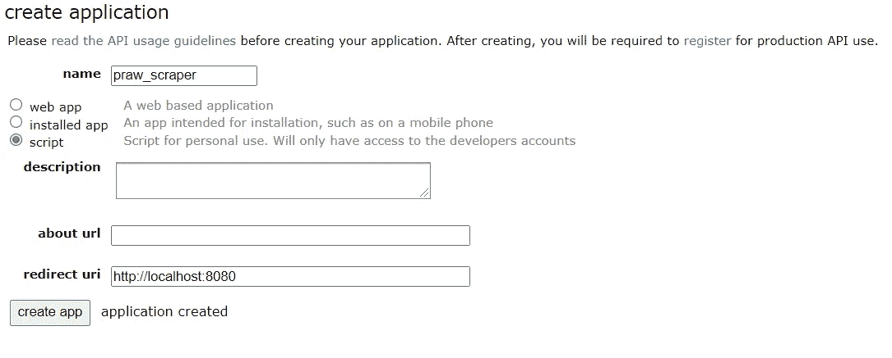
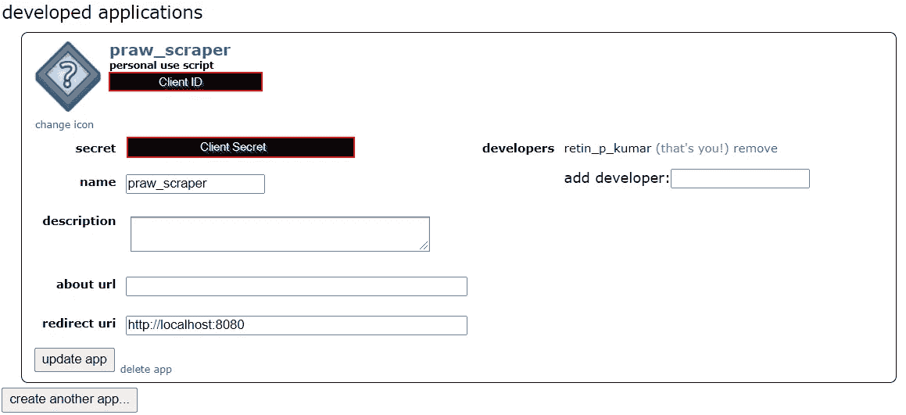
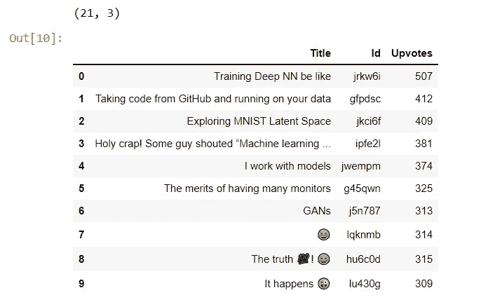

# 如何使用 python 提取 Reddit 帖子

> 原文：<https://medium.com/geekculture/how-to-extract-reddit-posts-for-an-nlp-project-56d121b260b4?source=collection_archive---------0----------------------->

## 并将其用于您的自然语言处理相关项目


Photo by [Brett Jordan](https://unsplash.com/@brett_jordan?utm_source=medium&utm_medium=referral) on [Unsplash](https://unsplash.com?utm_source=medium&utm_medium=referral)

年底到了，我们又带着另一篇数据摘录文章回来了。我很高兴今年以一个[**数据刮贴**](/geekculture/how-to-build-a-simple-web-scraper-using-beautifulsoup-2f2f0f97dc47) 开始在介质上写作，以另一个结束一年。

这一次，我们将从 Reddit 帖子中提取数据。所以，事不宜迟，我们开始吧。

现在，您应该具备以下要求，才能成功完成本次动手练习。

1.  **您的系统中安装了 Python 3.6** 或以上版本。
2.  一个 **Reddit 账户**
3.  Reddit 帐户**客户 id** 和**客户机密**
4.  一个 Reddit 账户**用户代理。**

前两个是不言自明的。但是对于客户机 id、客户机机密和用户代理，请跟我来。

# 获取您的客户 ID 和密码

一旦你在你的系统中安装了 Python3.6 或更高版本，并为你自己创建了一个 Reddit 帐户，然后登录你的 Reddit 帐户。然后，去[reddit.com/prefs/apps](https://www.reddit.com/prefs/apps)


Image by Author([https://medium.com/@retinpkumar](/@retinpkumar))

现在，正如你在图中看到的，点击**“创建应用程序”**按钮。在创建应用程序时，选择**“脚本”**，然后给你的应用程序起一个你自己选择的名字。你可以避免填写描述和关于网址，因为它不是强制性的。

现在，你要在重定向 uri 处输入**“http://localhost:8080”**或**“http://localhost:[你选择的端口号]”**，按**“创建 app”**。



Image by Author([https://medium.com/@retinpkumar](/@retinpkumar))

现在，您已经创建了您的应用程序，您可以在左上角的**“个人使用脚本”**下找到您的客户端 id。



Image by Author([https://medium.com/@retinpkumar](/@retinpkumar))

同样，你可以看到你的**【秘密】**也就是你的客户秘密。

# 创建刮刀

现在，是时候穿上我们的开发者外衣，运行终端了。

首先要做的是安装一个名为**‘PRAW’**(Python Reddit API Wrapper)的库。您可以通过在终端中运行以下命令来做到这一点。

```
pip install praw
```

一旦你完成了 PRAW 的安装，是时候把它导入到你的脚本中了。

```
import praw
```

现在，我们将使用“praw”库中的 Reddit 类创建 scraper 实例。

为此，让我们首先**定义将为我们访问数据的 user_agent** 。你可以给任何你喜欢的名字。在这里，我决定用**“praw _ scraper _ 1.0”。**

然后，使用您的 Reddit 帐户凭证创建一个 Reddit 实例，如下所示。

请注意，如果您希望收集超过 100 篇帖子，您只需指定您的用户名和密码。

```
# Define user agent
user_agent = "praw_scraper_1.0"

# Create an instance of reddit class
reddit = praw.Reddit(username="username",
                     password="password",
                     client_id="client id",
                     client_secret="client secret",
                     user_agent=user_agent
)
```

现在，指定需要从中抓取数据的子编辑。

```
# Create sub-reddit instance
subreddit_name = "deeplearning"
subreddit = reddit.subreddit(subreddit_name)
```

通过显示来确认您的子编辑是否正确。

```
# Printing subreddit info
print(subreddit.display_name)
```

现在，我们将使用 subreddit 对象来提取数据

让我们导入 pandas 库并创建一个数据框。

```
import pandas as pd

df = pd.DataFrame()
```

如果您的系统中没有安装 pandas，您可以使用下面的代码来这样做。

```
pip install pandas
```

现在，我们需要知道你能在 Reddit 上找到的各种类型的帖子。这些可以分为**新的，顶级的，热门的，有争议的，上升的，镀金的。**

如果您不知道可以抓取哪些项目，请运行下面的代码并传入 subreddit 对象。它将列出所有可能的属性，你可以使用这个对象。

```
vars(submission)
```

对于这篇文章，我将收集**‘新’**类别下的 21 篇文章的标题、id 和投票。为此，让我们创建 3 个列表来存储每个帖子的详细信息。

```
titles=[]
scores=[]
ids=[]
```

现在，为了访问新的帖子，我们应该使用 subreddit 实例创建一个 generator 对象，并循环遍历我们希望抓取的所有帖子。

创建对象时，我们可以传入一个名为**“limit”**的参数，该参数将限制我们希望抓取的帖子的数量。

但是，有一个警告。

请记住，当我们创建 scraper 应用程序时，我们提到了我们的用户 id 和密码，以便根据需要抓取尽可能多的帖子。

我们可以通过设置参数**“limit = None”来实现。**

默认情况下，如果您不提及 limit 参数，scraper 将获取 100 篇帖子的详细信息。因为我们将我们的帖子限制为 21 个，所以我们将在我们的对象中传递 **"limit=21"** 。

```
for submission in subreddit.new(limit=21):
    titles.append(submission.title)
    scores.append(submission.score) #upvotes
    ids.append(submission.id)
```

现在，我们已经将所需的详细信息提取到列表中，我们将创建一个数据框并查看我们收集的数据。

```
df['Title'] = titles
df['Id'] = ids
df['Upvotes'] = scores #upvotes

print(df.shape)
df.head(10)
```

综上所述，我们有…



Image by Author([https://medium.com/@retinpkumar](/@retinpkumar))

给你。这个动手贴到此为止。

**但是等等，还有更多…**

如果你想从一篇文章的网址中提取细节怎么办？让我们看看它是怎么做的。

# 从 URL 提取数据

为您希望从中抓取数据的 url 创建一个 url 变量。

```
input_url = "https://www.reddit.com/r/europe/comments/r0hthg/sweden_is_taking_the_lead_to_persuade_the_rest_of/"
```

这是我从 Reddit 上抓取的一个随机网址。

如果你查看任何 Reddit URL 的结构，它看起来像这样:

```
https://www.reddit.com/r/ <subreddit name> / comments / <user id> / <title> /
```

我们可以使用字符串分割，从 URL 中提取子编辑名称、用户 id 和标题。

一旦你有了这些，你可以在我们的 scraper 中使用 subreddit 名称，并将标题附加到我们的最终数据框中。

**但是用户 id 呢？**

我们可以使用用户 id，通过以下代码提取更多详细信息:

```
userid_from_url = input_url.split("/")[6]
more_details = reddit.submission(id=userid_from_url)
```

在 **vars()** 函数中传递该对象，您将获得包含与您的用户 id 对应的属性和值的 dictionary 对象。您也可以将此信息追加到最终的数据框中。

所以，这篇帖子到此结束。希望你喜欢。

祝你和你的家人有一个美好、繁荣和快乐的新年，并祝你再攀高峰，心想事成。


Photo by [Sincerely Media](https://unsplash.com/@sincerelymedia?utm_source=medium&utm_medium=referral) on [Unsplash](https://unsplash.com?utm_source=medium&utm_medium=referral)