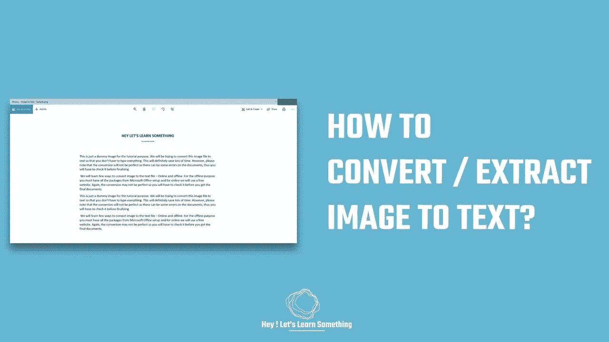

# 如何从图像中提取文字？

> 原文：<https://medium.com/geekculture/how-to-extract-text-from-images-e4afe9e0de80?source=collection_archive---------11----------------------->

我们将离线和在线两种方法

你想从图像中提取文本吗？如果答案是肯定的，那么这里有两种简单的方法来复制图片中的文字。我们将使用在线和离线两种方法，您可以在方便的时候使用任何一种。但是，请注意，您可能需要对提取的文本进行一些调整。