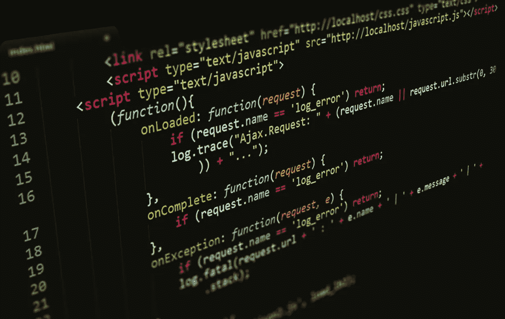
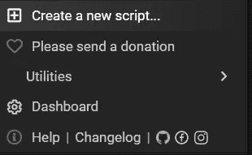

# 如何用 Javascript 放屁…

> 原文：<https://medium.com/geekculture/how-to-fart-with-javascript-5796ce2fc23c?source=collection_archive---------6----------------------->

我看到你仍然点击了这个故事来了解如何😉所以让我们开始吧



**这是一个点击诱饵吗？？？😕**

老实说，不，在这篇文章中，我们将看到一个名为`Audio()`的原生浏览器 API，它允许我们在网页上播放音频文件，并利用这一知识，为什么不制作一个程序，每当你点击一个链接或按钮时，播放一个屁的声音👀

**好吧，但我如何编写这样的脚本在每一页上运行**

好了，现在是我向你介绍 ***用户脚本和脚本管理器*** 的时候了

用户脚本只是一个 javascript 文件，它在页面加载之前运行，所以可以把它想象成一个扩展，但它更容易制作，你可以指定它应该运行的模式或特定网站

**什么是脚本管理器，我如何获得它？**

脚本管理器是一个方便的扩展，允许您运行这些用户脚本。这是他们赖以生存的环境

有两个流行的脚本管理器值得一提，Chrome 的 [TamperMonkey](https://chrome.google.com/webstore/detail/tampermonkey/dhdgffkkebhmkfjojejmpbldmpobfkfo?hl=en) 和 Firefox 的 [GreaseMonkey](https://addons.mozilla.org/en-US/firefox/addon/greasemonkey/)

**如何安装脚本或编写自己的 DO？**

有很多关于如何使用这两个脚本管理器的教程，最好的开始方式是[这个教程](https://simply-how.com/enhance-and-fine-tune-any-web-page-the-complete-user-scripts-guide)，因为在这篇文章中我们更关心如何编写我们的 javascript

**让我们开始编码**

就像我说的，用户脚本只是一个 javascript 文件，在任何网页加载之前运行，或者作为我们提供的模式，所以要为 TamperMonkey 编写一个新的用户脚本，请遵循以下步骤

1️⃣点击扩展，然后“创建一个新的脚本”，如下图所示



2️⃣一旦你看到文本编辑器就粘贴这个非常简单但令人讨厌的代码🙄

`alert("OMG THIS IS WORKING")`看到了吗？就这么简单，现在让我们指定它应该运行的页面模式，我将指定任何包含 https 的内容，因此添加元数据部分—脚本的上半部分

`// @include https://*`现在重新加载页面，你会看到一个非常烦人的警告😞

**用户脚本结构的快速概述**

1.  看起来像注释的上部称为元数据

基本上，我们添加任何与脚本相关的库或配置，有些是

*   `@include`用于指定脚本应该运行的网页
*   `@match`与之颇为相似
*   `@run-at`帮助您决定何时开始执行脚本[“文档-开始”、“文档-结束”、“文档-正文]，]

关于这些的完整参考资料，请点击查看文档

2.然后另一部分是你的代码应该去哪里，你可能会立即注意到的一件事是自调用函数

该语法告诉脚本立即执行该函数，而不是像下面的例子中那样执行

```
function greeting(){alert("welcome home")}
greeting()
```

**现在是时候使用音频 API 了**

关于 javascript，我最喜欢的部分是原生的[浏览器 API](https://developer.mozilla.org/en-US/docs/Web/API)以及它们用很少的代码为你的 web 应用提供了多少功能，所以有一个 API 引起了我的注意并给了我灵感，那就是`Audio()`

这个 api 只是允许我们加载和播放一个音频文件，为此我刚刚谷歌了一下 3D 音效，给自己弄了一个……身体乐器声音效果👼

让我们看看它的实际效果，好吗

```
let fart = new Audio(URL_TO_FILE);
fart.play();
```

请戴上耳机🎧

这是使用 API 的最基本的方法，但是我相信你来这里不是为了看两行代码，所以让我们给这个用户脚本添加一些逻辑

**认真用 JAVASCRIPT 编码个屁**

所以这个脚本的步骤非常简单明了:

1️⃣等待页面加载

2️⃣使用`querySelectorAll()`抓取所有的按钮和链接元素

3️⃣为每个元素添加一个点击事件的事件监听器

4️⃣希望科尔一家不会挡我们的路😫

没有进一步的原因，让我们用代码实现这个算法

现在你知道了！一个用户脚本，每当你点击一个链接或按钮时就会放屁😆

现在刷新页面，到 YouTube 上，享受😌

**常见问题**

唯一的问题，我遇到了，并尝试了无数的修复，以解决最可靠的方式是 **CORS** 这是一个浏览器安全政策，你可以阅读关于[**在这里**](https://developer.mozilla.org/en-US/docs/Web/HTTP/CORS)

**我到底要用用户脚本做什么呢**

嗯，任何事情，实际上任何事情，一旦你有了坚实的 javascript 基础，这真的不是很难，然后你可以发布你自己的用户脚本或安装脚本

**你说发表？但是如何**

我自己最喜欢的地方是[油腻的叉子](https://greasyfork.org/en)那里有社区提供的大量脚本，这也是分享你的脚本的最好方式

你甚至可以从[这个链接](https://greasyfork.org/en/scripts/436075-the-fart-effect)下载这个脚本

感谢阅读，请联系我的不和谐:继兄#2048 任何帮助，我会尽全力💕