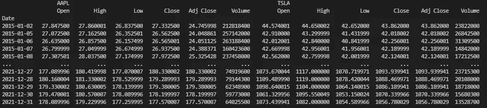
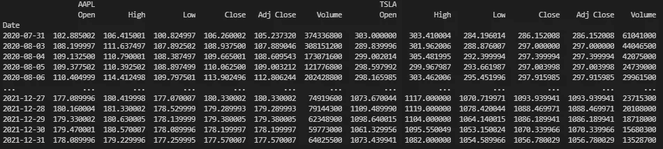
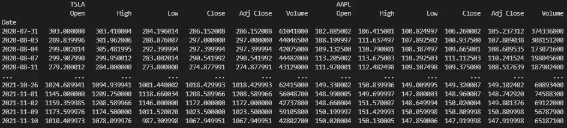

# 如何用多级列索引筛选 Pandas 数据框架:股票

> 原文：<https://medium.com/geekculture/how-to-filter-a-pandas-dataframe-with-a-multi-level-column-index-stocks-1ae0e6fdb439?source=collection_archive---------8----------------------->

用多级列索引过滤雅虎财经的数据框架。


Photo by [Patrick Weissenberger](https://unsplash.com/@ricktap?utm_source=medium&utm_medium=referral) on [Unsplash](https://unsplash.com?utm_source=medium&utm_medium=referral)

## 什么是多级列索引？

多级列索引是定义数据帧列标签的一种分层方式。一个列可以存在于多个列标签中。

## 获取数据

我们将练习过滤来自雅虎财经的数据帧。为此，我们首先需要检索数据。

我们将从特斯拉和苹果检索 2015 年第一天到 2022 年第一天的数据。

```
pip install yfinanceimport yfinance as yfdf = yf.download("TSLA AAPL", start="2015-01-01", end="2022-01-01",group_by="ticker")print(df)
```



*Image by author.*

这个使用 yfinance 的查询为我们提供了一个带有两组列标签的数据框架。顶部的列标签定义了股票代码的名称:AAPL 和 TSLA。第二列标签为它们各自的顶部标签定义开盘价、最高价、最低价、收盘价、调整收盘价和成交量。

## 现在进行过滤。

假设我们只想看到苹果收盘价高于 100 美元的行。

```
df2 = df[df.AAPL[‘Close’] > 100]
print(df2)
```



*Image by author.*

这一行应该是:

```
The dataframe where data under the “AAPL” column label in the “Close” column is greater than 100.
```

请注意，我们使用了“.”导航第一列标签。

现在让我们尝试在过滤“AAPL”的同时过滤“TSLA”。

```
df3 = df[(df.AAPL['Close'] > 100) & (df.TSLA['Volume'] > 40000000)]print(df3)
```

这一行应该是:

```
The dataframe where:
Data under the “AAPL” column label in the “Close” column is greater than 100\. 
AND 
Data under the “TSLA” column label in the “Volume” column is greater than 30000000.
```



*Image by author.*

希望这篇教程为你节省了一些时间。

感谢您的阅读，请务必关注更多数据科学技巧！