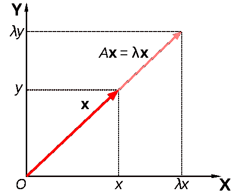

# 如何在 R 和 Python 中都求特征值和特征向量

> 原文：<https://medium.com/geekculture/how-to-find-eigenvalues-and-eigenvectors-in-both-r-and-python-e112cab1c525?source=collection_archive---------11----------------------->

在我的上一篇文章中，我讨论了特征值和特征向量，以及如何使用 Python 中的 numpy 数组来计算它们。这篇博文的链接可以在这里找到:-[https://tracyrenee 61 . medium . com/interview-question-what-is-enforeign-and-feature vector-e7c 7052 f 731 b](https://tracyrenee61.medium.com/interview-question-what-is-eigenvalue-and-eigenvector-e7c7052f731b)

因为我花了相当多的时间研究这个话题，所以我认为…