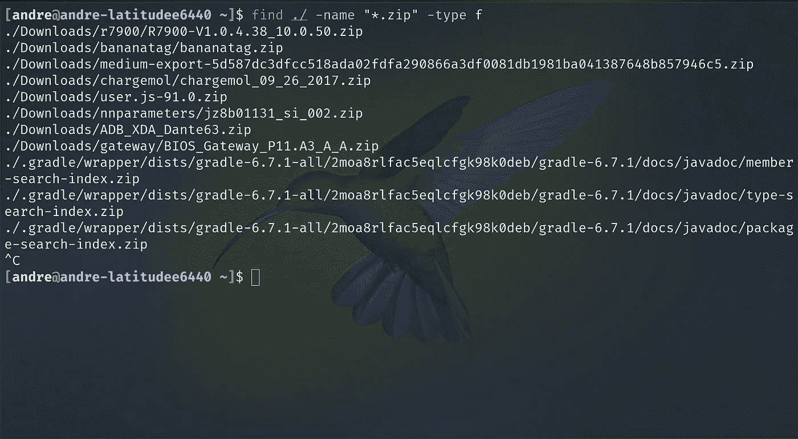
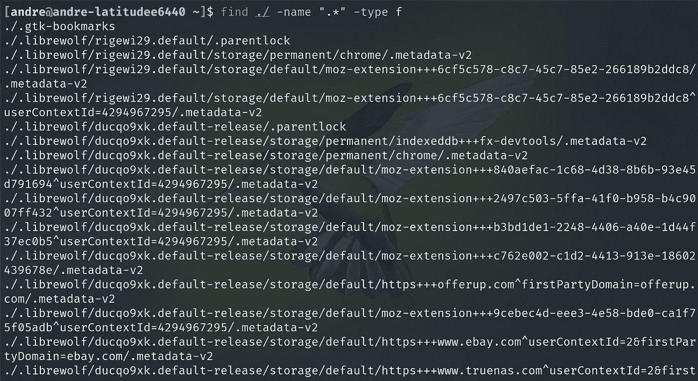

# 如何在 Linux 中查找文件？

> 原文：<https://medium.com/geekculture/how-to-find-files-in-linux-6ed09a98c899?source=collection_archive---------2----------------------->

## 学习在 Linux 中查找文件所需的命令


Photo by [Viktor Talashuk](https://unsplash.com/@viktortalashuk?utm_source=medium&utm_medium=referral) on [Unsplash](https://unsplash.com?utm_source=medium&utm_medium=referral)

在 Linux/GNU 系统中，有一个 GNU util 命令叫做 find 命令。命令允许您查找系统中的文件和目录。该命令根据一组参数有选择地过滤出 Linux 系统上所有文件的列表。这一点很重要，因为您可能需要操作一批文件来自动执行 Linux 系统上的任务。

这是如何在 Linux 上找到文件的指南。

## 查找命令的结构

```
find [-H] [-L] [-P] [-D debugopts] [-Olevel] [path..] [expression]
```

*   -H、-L 和-P 命令控制符号链接的处理。
*   **路径**:在其中查找所有文件的根路径
*   **表达式**:用于过滤文件的表达式

[在这里注册我的电子邮件列表。](/subscribe/@drechang)

## 查找命令表达式

*   [-name name]:匹配的名称
*   [-lname name]:匹配名称的符号链接文件
*   [-type f/d]:选择文件或目录。两者都留空
*   [-gid n]:匹配的 gid
*   [-group gname]:匹配组或 GID 的名称
*   [-path path]:包含匹配的路径
*   [-regex regex_pattern]:文件名与 regex 模式匹配
*   [-wholename wholename]:文件名与全名匹配
*   [-ilname pattern]:与-lname 相同，但不区分大小写
*   [-iname 模式]:与-name 相同，但不区分大小写
*   [-ipath 模式]:与-path 相同，但不区分大小写
*   [-iregex 模式]:与-regex 相同，但不区分大小写
*   [-iwholename pattern]:与-wholename 相同，但不区分大小写
*   [-links n]:文件有“n”个链接
*   [-mmin n]:最后修改于“n”分钟前
*   [-mtime n]:最后修改时间为“n*24 小时”分钟前
*   [-perm /group=permission]:具有权限的文件

## find 命令的示例

下面是一些利用 find 命令执行操作的示例。

**查找扩展名为**的文件

```
find ./ -name "*.zip" -type f 
```



Photo 1 from Dre Chang

**文件可执行文件**

```
find ./ -perm /a=x
```


Photo 2 from Dre Chang

**查找隐藏文件**

```
find ./ -name ".*" -type f
```



Photo 3 from Dre Chang

## 了解有关查找命令的更多信息

您可以在 Linux 机器上使用下面的命令获得 find 命令的手册页。

```
man find
```

IT 和工程领域是快速发展的领域。跟不上意味着你将被落在后面。跟上的最好方法是保持最新的新闻和教育内容。[订阅免费电子邮件列表，将你的职业生涯提升 10 倍。](/subscribe/@dretechtips)

**加入我们，因为 50 多名想要快速跟踪其职业生涯和知识基础的人已经注册。**

**相关内容**

*   [Linux 下如何安全删除文件？](/geekculture/how-to-securely-delete-files-in-linux-ce6ad1205922)
*   如何安全地连接到您的服务器？
*   [Unix 文件系统讲解](/geekculture/unix-file-system-explained-9d3554de9d46)