# 如何使用机器学习在 Spotify 上找到新歌

> 原文：<https://medium.com/geekculture/how-to-find-new-songs-on-spotify-using-machine-learning-d99bd8855a18?source=collection_archive---------11----------------------->


Photo by [Sašo Tušar](https://unsplash.com/@sasotusar?utm_source=medium&utm_medium=referral) on [Unsplash](https://unsplash.com?utm_source=medium&utm_medium=referral)

# 介绍

> “音乐给宇宙赋予灵魂，给心灵插上翅膀，给想象力以飞翔，给万物以生命。”—柏拉图

从淋浴时即兴演奏新版经典*糖果女孩*到在高保真节拍的帮助下专注于家庭作业，音乐在我的生活中扮演着巨大的角色。我有适合各种场合的各种类型的播放列表:长途汽车驾驶、篮球训练、庆祝、家务、放松等等。作为流行音乐收听应用 Spotify 的日常用户，我体验过它给用户的歌曲推荐。每天，Spotify 都会根据我的每一种音乐品味定制几个播放列表。此外，还有一个专门用于寻找新音乐的播放列表，名为“每周发现”

最近，我觉得 Spotify 的推荐 ***没有击中要害*** 。所以，我自己动手开始了这个项目:开发一个机器学习算法来推荐歌曲，并将它们添加到我的 Spotify 帐户的播放列表中。

在本文中，我将带您完成实现我的目标的每一步:

1.  通过实现 Spotify 的 API 来收集官方 Spotify 帐户的前 50 首歌曲 ***1300+*** *播放列表*，创建数据管道以构建近 ***10，000 首歌曲的可扩展数据集*** 以用作歌曲推荐
2.  抓取用户的热门歌曲，使推荐者基于使用 Spotify 的 API
3.  探索用户流历史以了解音乐偏好
4.  开发准确率为 99.5%的分类算法用于推荐歌曲
5.  将算法推荐的歌曲保存到用户帐户内的 Spotify 播放列表中

如果你想直接进入代码，在我的 GitHub 上查看[。](https://github.com/lognorman20/spotify_recommender)

# 目录

## [简介](#14c1)
[目录](#d01b)
[数据工程& ETL](#11fa)
[数据探索](#ea62)
[模型开发](#d5a3)
[用法](#a122)
[结论&下一步](#4833)
[联系](#3d0d)

# 数据工程和 ETL


要向用户推荐歌曲，就要准备好要推荐的歌曲。为了做到这一点，我使用了 Spotify 的 API 建立了一个包含将近 10，000 首歌曲的播放列表。该播放列表可以更大；我选择坚持 10，000 首歌曲，因为我觉得这足以满足我的目的。如果你想重新创建这个播放列表，看看我的 GitHub 上的[数据工程笔记本。](https://github.com/lognorman20/spotify_recommender/blob/main/data_engineering.ipynb)

出于几个原因，我决定使用 Spotify 的官方播放列表。

1.  流派和音乐类型的数量。为了让这个算法发挥作用，它必须给出每一种类型的推荐。由于 Spotify 有近 1400 个不同长度的播放列表，它是可供选择的最佳账户。
2.  这些播放列表会定期维护。每个播放列表会不断更新新歌曲，删除旧的和不太流行的歌曲，并根据播放列表的用户量身定制。这使得我的算法能够推荐现在和未来都很流行的歌曲。
3.  Spotify 的播放列表已经广为人知并受到关注。例如，播放列表 Rap Caviar 拥有 1360 万粉丝。这些播放列表不是无缘无故地受欢迎——每个播放列表都有人们喜欢的高质量歌曲，我可以用它们作为推荐。

我创建了一个函数来遍历 Spotify 的每个播放列表并获取播放列表 ID:

```
*# Getting playlist IDs from each of Spotify's playlists*
*playlists = sp.user_playlists('spotify')*
*spotify_playlist_ids = []*
*while playlists:*
 *for i, playlist in enumerate(playlists['items']):*
 *spotify_playlist_ids.append(playlist['uri'][-22:])*
 *if playlists['next']:*
 *playlists = sp.next(playlists)*
 *else:*
 *playlists = None*
*print(spotify_playlist_ids[:20])*
```

从那里，我通过使用播放列表 ID 从每个播放列表中获得前五十个曲目 ID:

```
*# Creating a function to get the first 50 tracks IDs from a playlist* **def** getTrackIDs(playlist_id):
    playlist = sp.user_playlist('spotify', playlist_id)
    **for** item **in** playlist['tracks']['items'][:50]:
        track = item['track']
        ids.append(track['id'])
    **return**
```

然后得到了每首歌的曲目特征:

```
*# Creating a function get features of each track from track id*
**def** getTrackFeatures(track_id):
  meta = sp.track(track_id)
  features = sp.audio_features(track_id)

  *# meta*
  track_id = track_id
  name = meta['name']
  album = meta['album']['name']
  artist = meta['album']['artists'][0]['name']
  release_date = meta['album']['release_date']
  length = meta['duration_ms']
  popularity = meta['popularity']

  *# features*
  acousticness = features[0]['acousticness']
  danceability = features[0]['danceability']
  energy = features[0]['energy']
  instrumentalness = features[0]['instrumentalness']
  liveness = features[0]['liveness']
  loudness = features[0]['loudness']
  speechiness = features[0]['speechiness']
  tempo = features[0]['tempo']
  time_signature = features[0]['time_signature']

  track = [track_id, name, album, artist, release_date, length, popularity, danceability, acousticness, energy, instrumentalness, liveness, loudness, speechiness, tempo, time_signature]
  **return** track
```

我将每首歌曲及其音频特征放入一个数据框中。这个数据帧包含 9，819 首歌曲。

既然歌曲推荐数据框已经完成，就该创建填充了用户喜爱的曲目的数据框了。

使用 Spotify 的 API，我获得了用户最近几个月最喜欢的 50 首带音频功能的歌曲:

```
*# Getting top 50 tracks from user*
results = sp.current_user_top_tracks(limit=1000, offset=0,time_range='short_term')*# Convert it to Dataframe*
track_name = []
track_id = []
artist = []
album = []
duration = []
popularity = []
**for** i, items **in** enumerate(results['items']):
        track_name.append(items['name'])
        track_id.append(items['id'])
        artist.append(items["artists"][0]["name"])
        duration.append(items["duration_ms"])
        album.append(items["album"]["name"])
        popularity.append(items["popularity"])

*# Create the final df* 
df_favourite = pd.DataFrame({ "track_name": track_name, 
                             "album": album, 
                             "track_id": track_id,
                             "artist": artist, 
                             "duration": duration, 
                             "popularity": popularity})
```

创建完两个数据集后，我删除了可能导致数据泄漏的列。这些列包括歌曲名称、歌曲专辑、歌曲艺术家和发行日期。所有这些特征对这首歌来说都太独特了，有可能成为数据中的错误。

最后，我向每个数据集添加了一个“favorite”列。用户喜爱的歌曲数据集中的每首歌曲在该列中接收值 1，但是播放列表歌曲数据集中的每首歌曲接收值 0。这造成了最喜欢的类和不喜欢的类之间的不平衡，我将在模型创建部分处理这个问题。

我还删除了播放列表歌曲数据集中的重复歌曲和最喜欢的歌曲数据集中的重复歌曲，因此该算法不会推荐用户已经知道并喜欢的歌曲。这确保了两个数据集中的每首歌曲只出现一次，并消除了在训练集和测试集中同时出现一首歌曲的可能性。这样一来，用于推荐的歌曲数量从 9，819 首下降到了 8，883 首。

现在数据可以通过模型传递了！

# 数据探索和可视化

虽然不需要收到歌曲推荐，但了解更多关于我的收听历史是这个项目的亮点之一。

需要明确的是,“数据探索和可视化”笔记本中使用的数据与用于创建推荐算法的数据不同。探索笔记本中使用的数据是 Spotify 发给我的过去两年的流媒体历史记录。如果你想在这个项目中使用笔记本来探索你的流媒体历史，请查看我的 [GitHub repo](https://github.com/lognorman20/spotify_recommender/blob/main/data_exploration.ipynb) ，并按照自述文件中的说明获取你的流媒体历史。

以下是我使用 Matplotlib 和 Seaborn 创建的一些可视化效果:

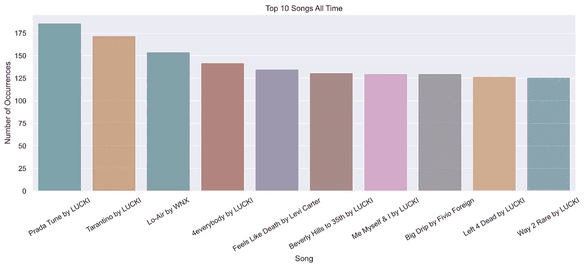

Fig. 1: Top 10 Songs All time by Times Listened To

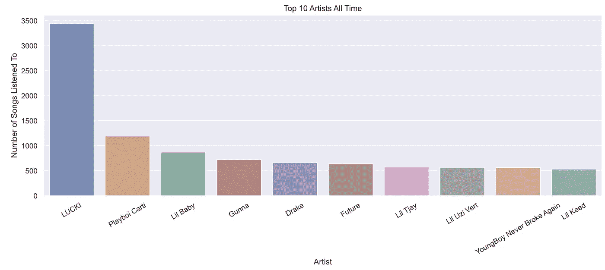

Fig. 2: Top 10 Artists of All Time by Number of Times Listened To

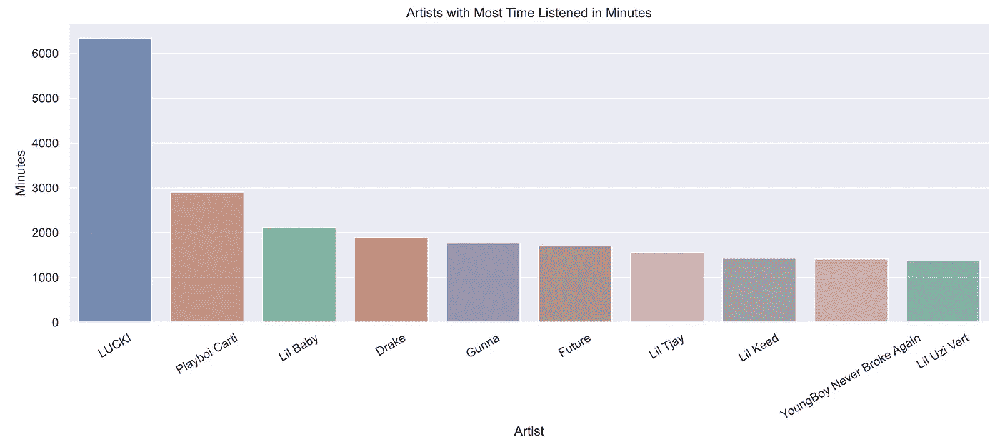

Fig. 3: Artists with Most Time Listened in Minutes

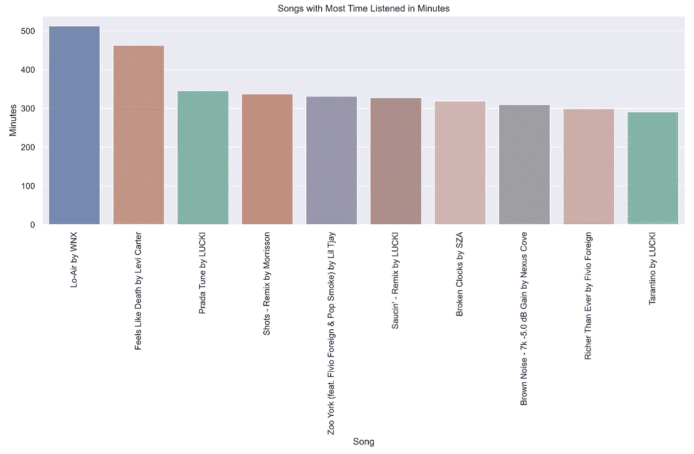

Fig. 4: Songs with Most Time Listened in Minutes

上面的数字很有道理——当我学习时，我只听 Lofi beats 或艺术家 LUCKI 的歌曲列表。

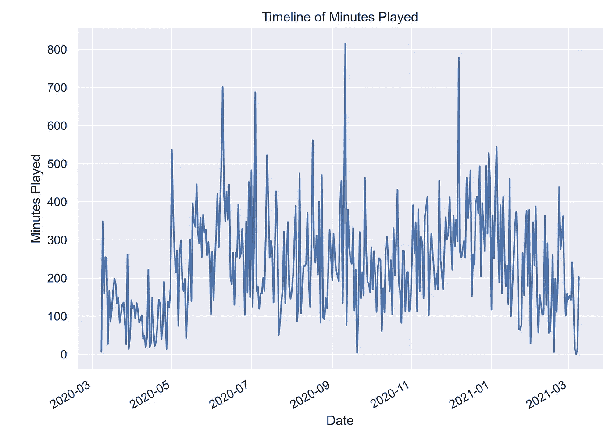

Fig. 5: Timeline of Minutes Played

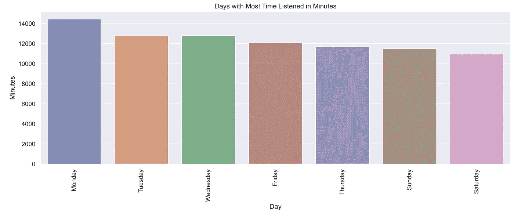

Fig. 6: Days with Most Time Listened in Minutes

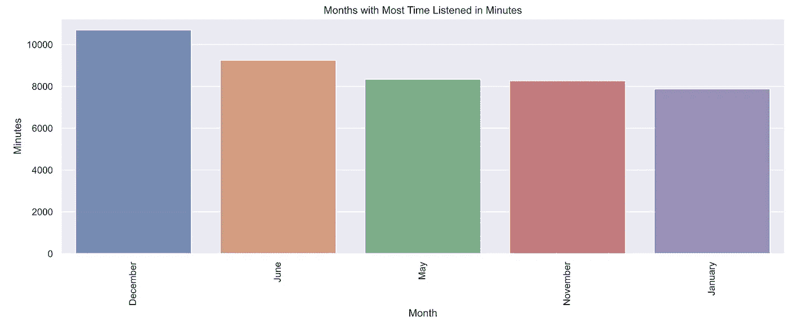

Fig. 7: Months with Most Time Listened in Minutes

我还探索了歌曲的特点。以下是对每种方法的描述:

声音——浮动——从 0.0 到 1.0 的置信度度量，表示轨道是否是声音的。1.0 表示音轨是声学的高置信度。

可跳舞性——浮动——可跳舞性描述了一个轨道基于音乐元素的组合适合跳舞的程度，包括速度、节奏稳定性、节拍强度和整体规律性。值 0.0 最不适合跳舞，1.0 最适合跳舞。

能量——浮动——能量是一个从 0.0 到 1.0 的度量，代表强度和活动的感知度量。通常，高能轨道感觉起来很快，很响，很嘈杂。

乐器性——浮动——预测轨道是否不包含人声。“Ooh”和“aah”在这种情况下被视为乐器。乐器度值越接近 1.0，轨道不包含人声内容的可能性就越大。

活跃度—浮动—检测录制内容中是否有观众。

响度—浮动—轨道的整体响度，以分贝(dB)为单位。

speech inence—float—speech inence 检测音轨中是否存在口语单词。

价数——浮动——从 0.0 到 1.0 的一种度量，描述轨道传达的音乐积极性。

速度—浮动—轨道的总体估计速度，以每分钟节拍数(BPM)为单位。在音乐术语中，速度是给定作品的速度或节奏，直接来源于平均节拍持续时间

Mode-int-Mode 表示轨道的调式(大调或小调),即衍生旋律内容的音阶类型。大调用 1 表示，小调用 0 表示。

key — int —估计的轨道整体调。

以下是它们之间的相互关系:

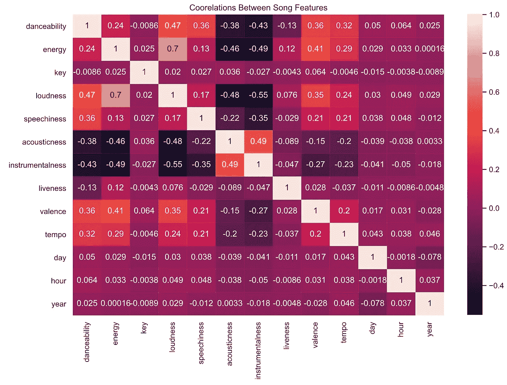

Fig. 8: Correlations Between Audio Features

如果你想看更多我的数据分析，[在 GitHub 上看我的数据探索笔记本](https://github.com/lognorman20/spotify_recommender/blob/main/data_exploration.ipynb)。

# 模型开发

如果你愿意，跟随我的 GitHub 上的[笔记本。](https://github.com/lognorman20/spotify_recommender/blob/main/model_creation.ipynb)

我合并了在数据工程部分创建的两个数据集，因此我可以为模型创建一个训练和测试集。我之前提到过，目标列“最喜爱的”不平衡。喜欢和不喜欢的比例是 **50:9769** 。为了缓解这个问题，我使用 SMOTE 对‘favorite’类进行过采样。为此，我决定创建自己的训练/测试分割，而不是使用 Sklearn 的 train_test_split 模块:

```
*# Shuffle your dataset* 
shuffle_df = df.sample(frac=1)

*# Define a size for train set* 
train_size = int(0.8 * len(df))

*# Split dataset* 
train_set = shuffle_df[:train_size]
test_set = shuffle_df[train_size:]# Create X and y from train set
X = train_set.drop(columns=['favorite', 'track_id'])
y = train_set.favorite# Create X_train and y_train using oversampler
oversample = SMOTE()
X_train, y_train = oversample.fit_resample(X, y)
```

过采样后，喜爱的和不喜爱的比率是 1:1。

如果我不进行过采样，我的模型会将大多数歌曲预测为主要类别，在这种情况下，0 或“非最爱”。过采样平衡了训练数据，因此模型将能够训练以准确区分喜爱和不喜爱的歌曲。

我没有对不喜欢的类进行过采样，因为我会因为多数类压倒少数类的事实而丢失大量数据。

在平衡了训练数据之后，我拆分了测试数据。

```
# Creating X_test and y_test
X_test = test_set.drop(columns=['favorite', 'track_id'])
y_test = test_set['favorite']
```

既然已经对数据进行了预处理，那么是时候测试一些机器学习模型了。

在这一点上，你可能想知道，“洛根，为什么你选择使用分类算法，而不是传统的推荐方法？”

我的模型选择思想与阿尔伯特·爱因斯坦的以下引述一致:

> "一切都应该尽可能简单，但不能更简单。"

从我听音乐的经验来看，我要么喜欢这首歌，要么不喜欢这首歌，从而对歌曲进行二进制推荐。我觉得分类算法比过滤音乐的推荐系统更适合处理这项任务。此外，传统的推荐系统需要大量的数据来训练，由于 Spotify API 的限制，我受到了限制。如果我要继续开发这个项目，我会使用另一个音频库，如 Librosa，基于我现有的音频特性进行更多的特性工程。

我选择试验的三个模型是

1.  逻辑回归。当试图对像这个项目这样的结构化数据进行分类时，逻辑回归通常会给出快速、可靠的结果。这是我将测试的最简单的模型，因此，它将是一个基线。
2.  决策树分类器。使用决策树算法，我们从树根开始，在导致最大信息增益 IG 或减少最终决策不确定性的特征上分割数据。我相信该模型将在收集的数据上表现良好，因为它的决策性质和数据集的规模/结构。例如，如果用户数据显示可跳舞性值超过 0.8 的歌曲，则模型将能够排除可跳舞性小于该值的歌曲。
3.  RandomForestClassifier。我选择这个模型是因为它除了具有随机性之外，还与决策树分类器相似。有时候，自发会做得更好。

为了评估每个模型的准确性，我交叉验证了关于 f1 分数的十倍的训练数据。在计算模型的准确性时，F1 分数考虑了假阴性和假阳性。如果我们使用通用的 accuracy_score 方法，错误的预测将被视为正确的预测，这可能会使模型看起来比实际更准确。

逻辑回归将基线得分设定为 83%的准确度。

决策树分类器以 99.3%的准确率超过了基线。

RandomForestClassifier 在 DecisionTreeClassifier 的基础上略有提高，准确率达到 99.7%。

这些分数引发了一些危险信号。首先，我检查了这些类是否不平衡，事实并非如此。然后，我在交叉验证中添加了更多的折叠，以确保不会发生过度拟合。接下来，我再次检查了训练数据，以确保没有可能导致数据泄漏的列。最后，我看了一下每个模型的混淆矩阵。

逻辑回归的混淆矩阵(基线):

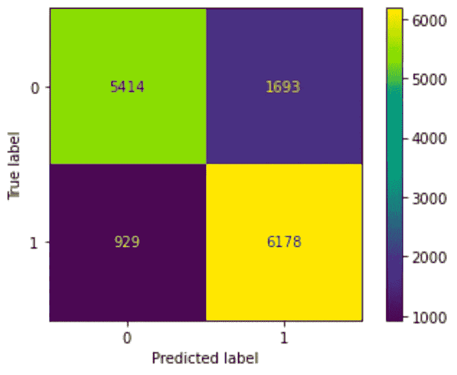

Fig. 9: Logistic Regression’s Confusion Matrix

决策树分类器的混淆矩阵:

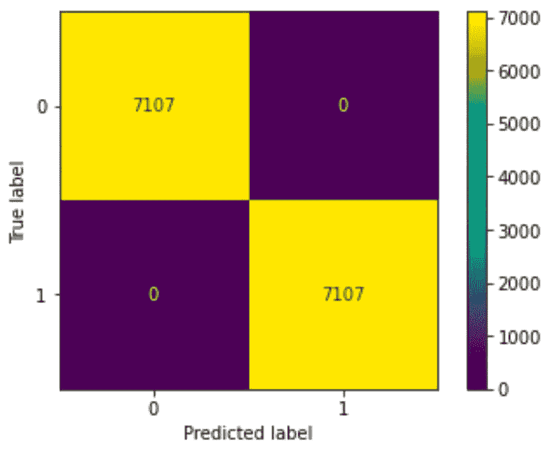

Fig. 10: DecisionTreeClassifier’s Confusion Matrix

RandomForestClassifier 的混淆矩阵:

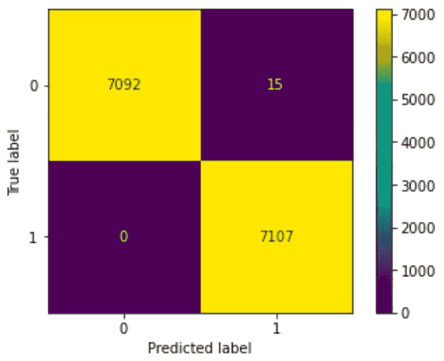

Fig. 11: RandomForestClassifier’s Confusion Matrix

尽管 RandomForestClassifier 的准确率最高，但混淆矩阵显示决策树分类器确实有更高的准确率，因为它的假阳性和假阴性更少。在测试数据上获得几乎相同的结果后，我决定使用决策树分类器作为我的推荐算法。

由于该模型基于收藏夹数据集对最喜爱的歌曲有一个非常特殊的概念，因此有必要接受可能不是绝对最喜爱的歌曲。最初，我总共收到了 6 首歌曲推荐，因为该模型在决定哪首歌曲是最喜欢的歌曲方面不是非常宽松。我用一个阈值和 Sklearn 的 proba 函数解决了这个问题。

```
*# Predicting if a song is a favorite*
prob_preds = pipe.predict_proba(df.drop(['favorite','track_id'], axis=1))
threshold = 0.30 *# define threshold here*
preds = [1 **if** prob_preds[i][1]> threshold **else** 0 **for** i **in** range(len(prob_preds))]
df['prediction'] = preds
```

我将阈值定义为 0.3，以便从近 10，000 首歌曲中获得大约 20 首歌曲推荐供选择。如果您喜欢推荐播放列表中更多或更少的歌曲，您可以使用此值进行播放。

# 使用

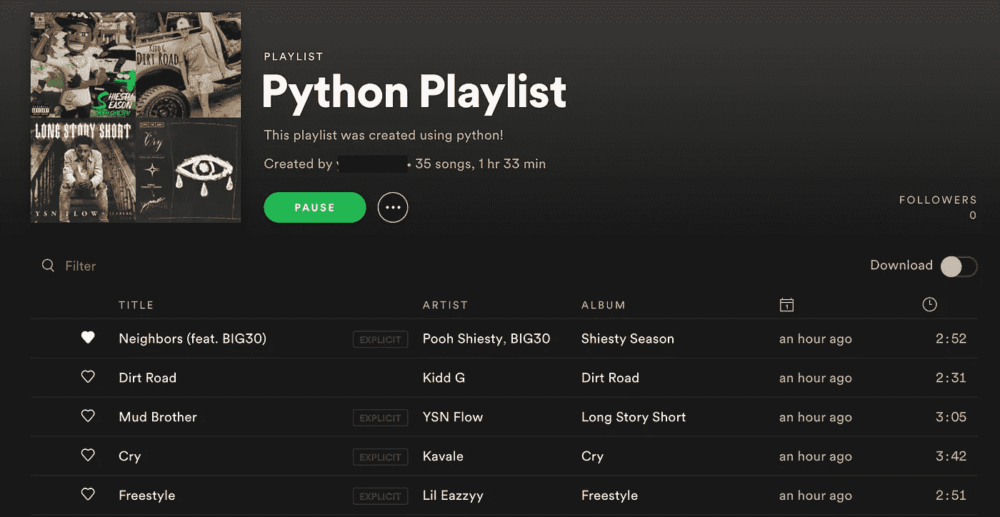

Fig. 12: Exemplar Playlist Created from Algorithm

既然已经预测出了最喜欢的歌曲，就可以将它们添加到用户 Spotify 帐户内的播放列表中。

我写了一个在账户上创建播放列表的功能。

```
*# Creating a function that builds a playlist in the user's spotify account*
**def** create_playlist(sp, username, playlist_name, playlist_description):
    playlists = sp.user_playlist_create(username, playlist_name, description = playlist_description)
```

另一个向刚刚创建的播放列表添加歌曲的功能。

```
*# Getting the playlist ID of the most recently made playlist* 
playlist_id = fetch_playlists(sp,username)['id'][0]*# Function to add selected songs to playlist*
**def** enrich_playlist(sp, username, playlist_id, playlist_tracks):
    index = 0
    results = []

    **while** index < len(playlist_tracks):
        results += sp.user_playlist_add_tracks(username, playlist_id, tracks = playlist_tracks[index:index + 50])
        index += 50*# Adding songs to playlist*
list_track = df.loc[df['prediction'] == 1]['track_id']
enrich_playlist(sp, username, playlist_id, list_track)
```

# 结论和后续步骤

据此，我们开发了一个歌曲推荐的播放列表(图 12)！我听了这个播放列表，让我说——这个播放列表不错。虽然并不完美，但它捕捉了从福音音乐到说唱音乐到 Lofi 音乐的各种类型的歌曲，符合我的音乐品味，并向我介绍了我在过去几天重复播放的歌曲。如果我想要一些新的果酱，我会使用这个推荐器。

如果你想试试这篇文章中的推荐者，[看看我的 GitHub](https://github.com/lognorman20) 。请告诉我你对它推荐的歌曲有什么看法！

当我反思这个项目时，我意识到它可以深入到什么程度。如果我继续开发这个项目，我会这样做:

1.  利用数据管道从官方 Spotify 播放列表中构建更大的歌曲数据集，用于推荐
2.  创建一个 web 应用程序来托管推荐者。最初我打算这样做；然而，由于 Spotify API 中的一个错误，我不能。
3.  为每首歌曲添加更多功能
4.  扩展算法的功能，根据歌曲、用户选择的播放列表、流派、关键字等进行推荐

总之，这个项目是一个爆炸创造。

# 接触


欢迎在 LinkedIn 上联系我，在 Github 上关注我的工作！

[LinkedIn](https://www.linkedin.com/in/logannorman/)
GitHub