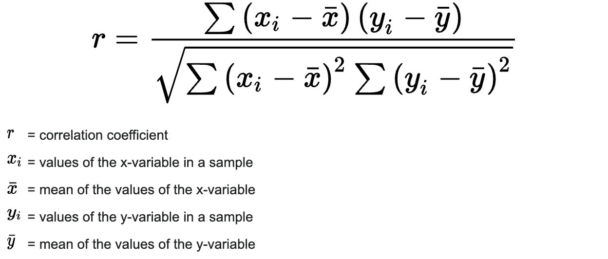
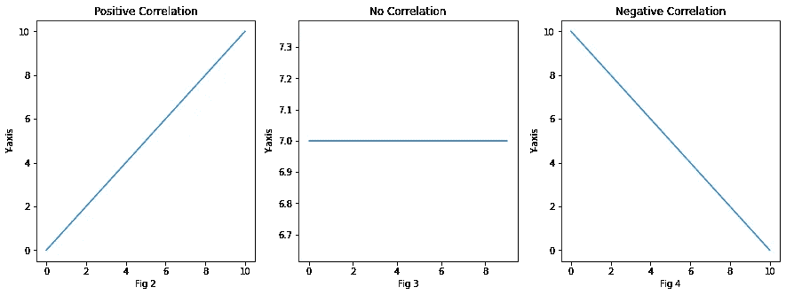
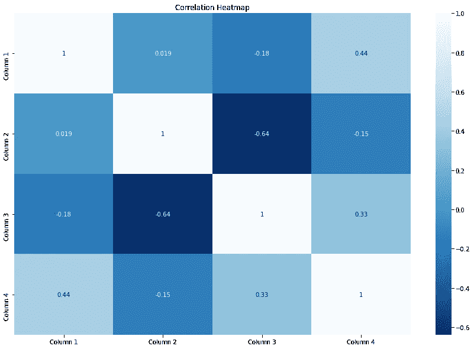

# 如何找到连续变量之间的相关性，并用 python 可视化？

> 原文：<https://medium.com/geekculture/how-to-find-the-correlation-between-continuous-variables-and-visualise-it-using-python-7faf5b028ae0?source=collection_archive---------10----------------------->

特征选择是建立一个好的机器学习模型的重要步骤，帮助我们选择这些特征的技术之一是检查数据集不同特征之间的相关性。在本文中，我们将讨论以下内容:

1.  什么是皮尔逊相关系数？
2.  如何找到一个数据集中连续变量之间的相关性？
3.  如何观想这种关联？


## **什么是皮尔逊相关系数？**

**皮尔逊相关系数**基本上是用来找出两个连续变量之间线性关系的强度，用 **r** 来表示。计算相关系数的数学公式如下:



Pearson Correlation Formula (Fig 1)

该相关系数的值范围从 **-1 到 1** ，其中 1 表示正相关图(2)，0 表示不相关图(3)，而-1 表示两个变量之间的负相关图(4)。



Different Types of Correlations

需要注意的是**皮尔逊相关只对连续数据**有效，对分类数据无效，对于分类数据，我们必须使用一种叫做 [**卡方检验**](https://en.wikipedia.org/wiki/Chi-squared_test) 的检验，我们将在后面的博客中讨论。

## **如何找到数据集中连续变量之间的相关性？**

现在，您已经了解了什么是皮尔逊相关系数，我们现在可以继续在 python 中实际找出这个系数值。要找到这个相关系数有两种方法，要么使用 **Pandas** 要么使用 **SciPy** 库，我们将看看这两种方法。

例如，我考虑了 4 个随机初始化的数据列，并将找出所有四列之间的相关性。下面是找出相关系数的代码实现:

## **使用 SciPy:**

当您想要计算较少列的相关性时，最好使用[**stats . Pearson r()**](https://docs.scipy.org/doc/scipy-0.14.0/reference/generated/scipy.stats.pearsonr.html)。

```
import scipy.stats as stats
import numpy as np# initialise random data points
data_1 = np.random.randn(1, 20)
data_2 = np.random.randn(1, 20)# The stats.pearsonr() returns 2 values the correlation coefficient and the p-value
r, p_value = stats.pearsonr(data_1[0], data_2[0])
print(f"Correlation coefficient of data_1 and data_2 = {r}")
```

## **使用熊猫数据帧:**

熊猫有一个内置功能叫做 [**。corr()**](https://pandas.pydata.org/pandas-docs/stable/reference/api/pandas.DataFrame.corr.html)

```
import numpy as np
import pandas as pd# initialise random data points
data_1 = np.random.randn(1, 20)
data_2 = np.random.randn(1, 20)
data_3 = np.random.randn(1, 20)
data_4 = np.random.randn(1, 20)data = {"Column 1":data_1[0], 
        "Column 2":data_2[0], 
        "Column 3":data_3[0], 
        "Column 4":data_4[0]}# Initialise a dataframe with all the columns
df = pd.DataFrame(data)# .corr() can calculate 'pearson', 'kendall', 'spearman' correlations.
print(df.corr(method='pearson'))
```

为了更好地理解，我建议您自己尝试实现这些代码。

## 如何使用热图来可视化这种关联？

既然我们已经发现了这些相关值，如果我们能够将其可视化，以便我们可以轻松地解释结果，那就太好了。为此，我们将使用 **Seaborn** 库并绘制**热图**。该热图的每个方框都代表网格中相应列之间的相关系数。

```
import seaborn as sns
import matplotlib.pyplot as pltfig = plt.figure(figsize=(15,10))
sns.heatmap(df.corr(method='pearson'), annot = True, cmap="Blues")
plt.title("Correlation Heatmap")
```



Fig 5.

热图的对角线将始终显示**值= 1** ，因为它给出了列与其自身的相关性，考虑到列是相同的，该相关性应为 1。因此，现在基于这些值，我们可以找出高度相关的列，并决定要选择的特性。

但是热图不仅仅告诉我们独立变量和目标变量之间的相关性，它还显示了独立变量本身之间是否存在任何显著的相关性，这被称为**多重共线性**，这也是多元线性回归期间特征选择的重要部分，我们将在接下来的博客中讨论。到那时你可以在这里 阅读这个话题 [**。**](https://en.wikipedia.org/wiki/Multicollinearity)

## **结论**

我们现在已经理解了什么是相关性。如何在 python 中找出相关性？以及如何将它可视化以便更好地理解结果。这一个就这么多了！敬请关注即将到来的博客，如果你有任何建议或疑问，请在下面评论或给我发邮件。也请在[**LinkedIn**](https://www.linkedin.com/in/yashowardhan-shinde-1636971b1/)**上与我联系。**祝大家学习愉快！

**邮件 ID:yashowardhanshinde@gmail.com**