# 如何选择完美的礼物(书呆子的方式)

> 原文：<https://medium.com/geekculture/how-to-find-the-perfect-gift-the-nerdy-way-938dd8390cc2?source=collection_archive---------18----------------------->

## 为你爱的人选择最好的礼物(使用 Python 的强大功能)


Image by Katsiaryna Liuntova on Vecteezy

# 我为什么要挖掘产品评论？

你有没有过想给心爱的人买个礼物，却一直拿不准的经历？你是否在阅读产品网站上褒贬不一的评论时感到困惑，不知道该拿什么，该离开什么？在这种情况下，我试图为我的家人买一双网球鞋。你可能已经注意到，经常有令人难以置信的体育产品广告，有名人为产品做担保。我个人觉得它们令人不知所措，令人困惑。因此，我最终会选择一个，并希望它是最好的一个！


Image by Nut Intawiphan on Vecteezy

# 这篇文章是写给谁的？

本文面向那些希望在日常场景中使用数据挖掘，但在解析复杂的数据结构时有困难的数据爱好者。许多想编码的人可能也没有合适的工具来帮助他们可视化数据结构。有些人只是需要一个正确方向的推动。有无数像 itertools 这样的库可以帮助解析，但真正的乐趣在于一步一步地做，并在过程中可视化它，而不是使用一个包却不知道它做什么。注意这篇文章太长了，因为我已经尽可能地提供了视觉指南，这样任何尝试的人都可以跟上。

# 目标

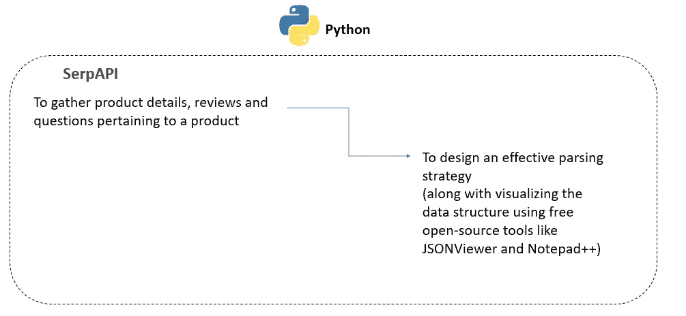

Overall Objective

# 先决条件

请按照[谷歌开发者页面中的步骤为自己获取一个谷歌 API 密匙。](https://developers.google.com/apis-explorer)我们将为此使用 Serpapi。请参考 [SERPAPI 页面](https://serpapi.com/)了解更多关于它的功能。

```
import pandas as pd
api_key = pd.read_csv('Google_API_Key.txt',sep=',',header=None)
from serpapi import GoogleSearchpage_num = 10 # The number of pages that you want Google to return results for
temp_dict = {}
resultsList = [] # A list

for i in range(page_num):
    params = {
      "api_key": api_key[0][0],
      "engine": "google",
      "q": "Men's Tennis shoes",
      "google_domain": "google.com",
      "gl": "us",
      "hl": "en",
      "num": "100",
      "start": i #Pagination - Page Number
    }
    search = GoogleSearch(params)
    temp_dict = search.get_dict()
    resultsList.append(temp_dict)  # We append the dictionary to a list resulting in a list of dictionaries
```

打印结果列表，并使用-

打印(结果列表)

下面是结果的局部视图

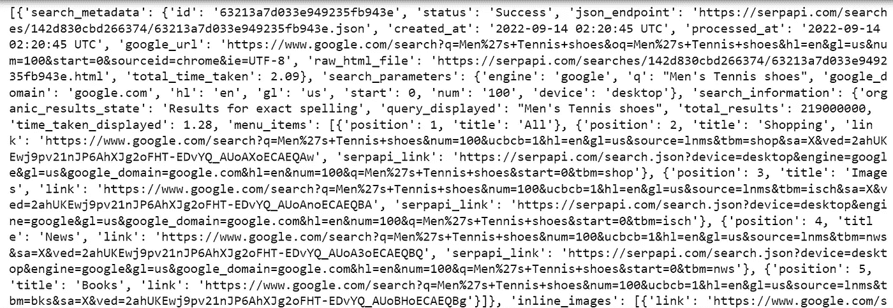

Partial View of the result

## 这看起来很复杂，不是吗？—我们来分解一下


A complex Maze (Source: Microsoft Stock Images)

# 解析策略

我想重申一下，我并不认为阅读这篇文章的每个人都是解析“词典列表”的专家。因此，视觉指南贯穿了整篇文章。

如果你正处于放弃看到结果的复杂性的边缘，坚持一会儿，继续读下去。这不是火箭科学。

下面是理解数据结构并围绕它构建逻辑所需任务的分解。

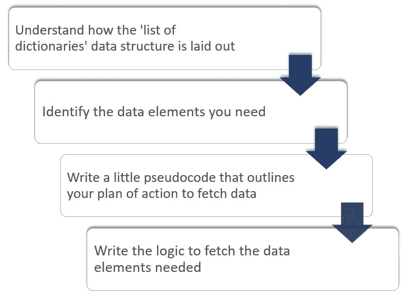

Breakdown of tasks required for the parsing strategy

# 了解“词典列表”的数据结构是如何布局的

提示:我使用工具来可视化如此复杂的结果。我推荐使用的一个工具是 http://jsonviewer.stack.hu/的[T3。](http://jsonviewer.stack.hu/.)为此，只需将“结果列表”的全部内容复制并粘贴到“文本”选项卡中。下面是它的局部视图

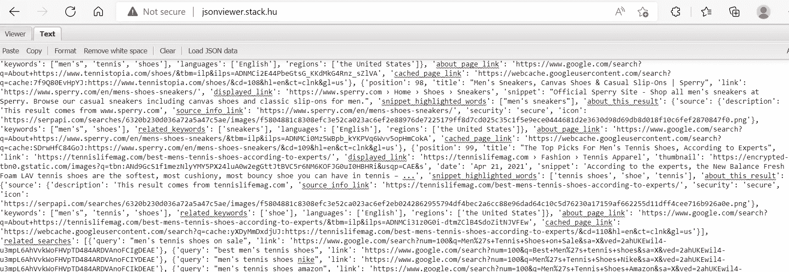

点击“格式”。这会产生一个格式良好的字典列表，使您能够直观地看到嵌套。下面是格式化后的局部视图。

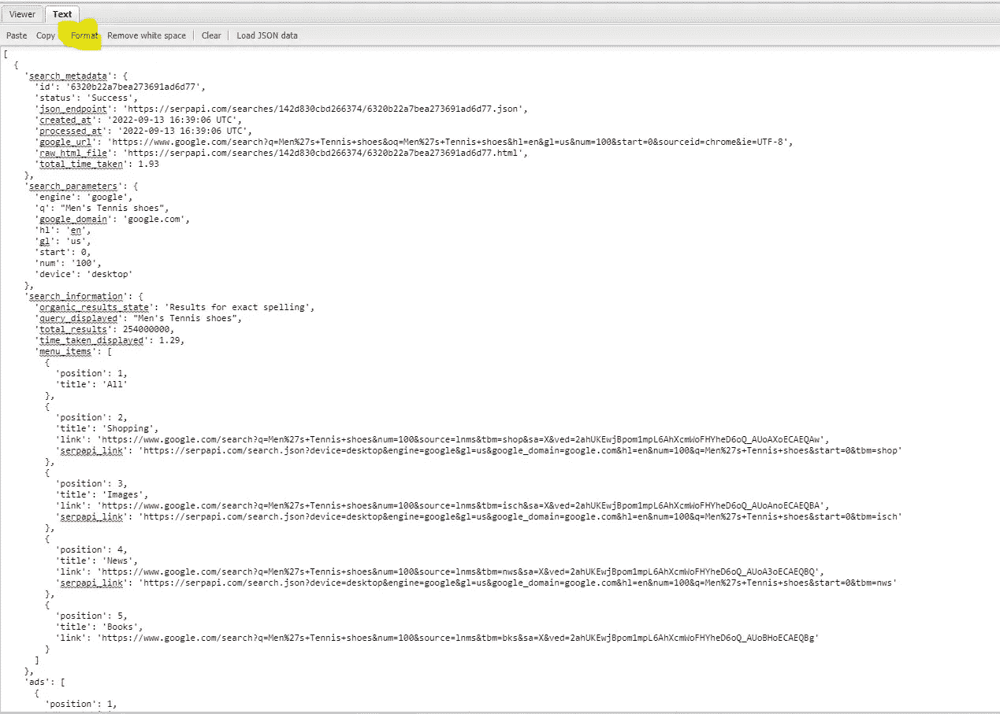

现在，您可以将这些格式化的数据复制并粘贴到文本编辑器中，例如 **Notepad++** ，以便清楚地理解每个元素的开头和结尾以及其中的嵌套元素。Notepad++突出显示括号的开始和结束，使您能够理解字典中的元素。

**重要:**我们从 API 调用中获得的 JSON 结构在其键值中有单引号。但是大多数 JSON 查看者希望在他们的键值中使用双引号。因此，如果您想使用 JSON Viewer 选项卡中的“Viewer”选项卡或“Notepad++”中的 JSON 语言选项，您可以用双引号替换单引号。另一个选择是在 Notepad++的“语言”菜单中选择“JSON”。它提供了展开和折叠功能，以便能够更好地理解数据的分层结构。

使用 **Notepad++的语言- > JSON 特性**，我们了解到数据的结构如下。

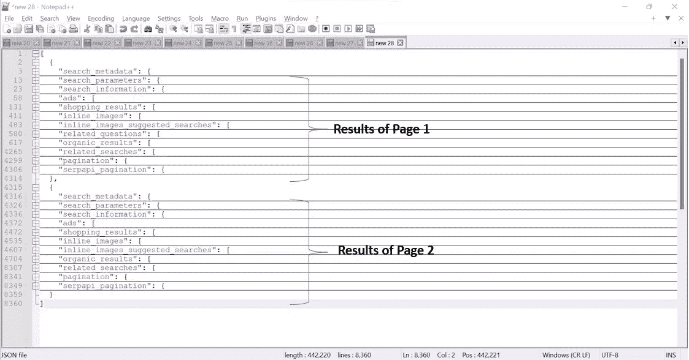

High-level Layout of the data output

# 确定您需要的数据元素

在这种情况下，我们只需要以下列表-

*   购物 _ 结果
*   相关问题
*   相关搜索
*   我会对“有机结果”感兴趣，但我现在可以使用购物结果。
*   这里需要注意的一点是，我们列出的以上每一个列表都是另一个词典列表。让我们仔细看看。这是“shopping_results”结构的快照，其子结构在折叠视图中。

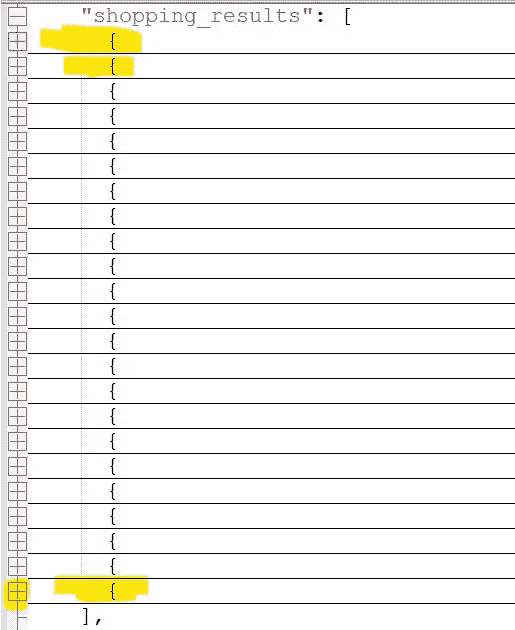

Structure of ‘shopping_results’ with children in a collapsed view

*   现在，我们需要这些列表中的所有数据吗？不。让我们分析每一个“词典列表”来决定什么是真正需要的。

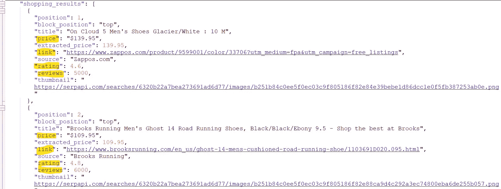

Data to be retrieved from Shopping Results

*   对相关问题和相关搜索重复这个过程，我现在知道我需要什么了。这是我希望从这些数据元素中收集的内容(以及对我们的分析很重要的内容)的高级布局

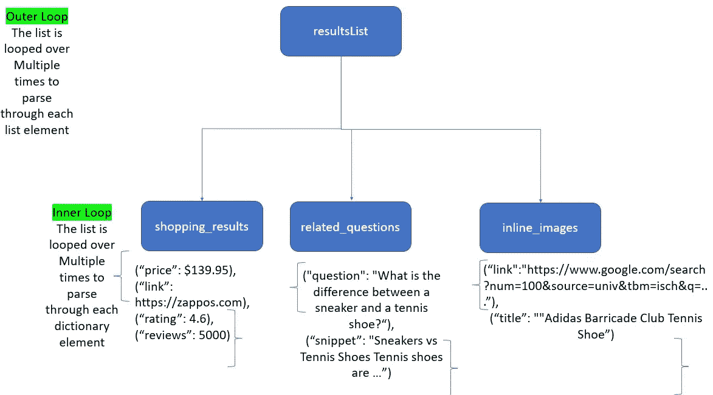

The layout of the Approach

# 写一个**小伪代码**，概述你获取数据的行动计划

1.  **遍历结果列表**，这是一个字典列表(我们现在可以称之为主列表——记住，这不是一个标准术语)

2.访问**第一层**，其中包含子列表——shopping _ results、related_questions 和 inline_images(每个都是字典列表)

**3。为 shopping_results、related_questions 和 inline_images 创建一个**数据框架

**4。循环通过以下-**
**# 4a。shopping_results** —获取特定的字典项目—价格、链接、评分、评论—创建这些项目的元组—将结果元组附加到数据帧

**# 4b。related_questions —** 获取字典项目—问题和片段—创建这些项目的元组—将结果元组附加到数据帧

**#4c。inline_images —** 获取字典项目—链接和标题—创建这些项目的元组—将结果元组附加到数据帧

5.将 shopping_results 追加到数据帧中

# 编写获取所需数据元素的逻辑

*   现在，**跟随伪代码并编写逻辑来解析数据结构。**

**收集购物结果数据**

Code Snippet — Parsing Shopping Results

下面是结果数据框架——“购物结果数据”

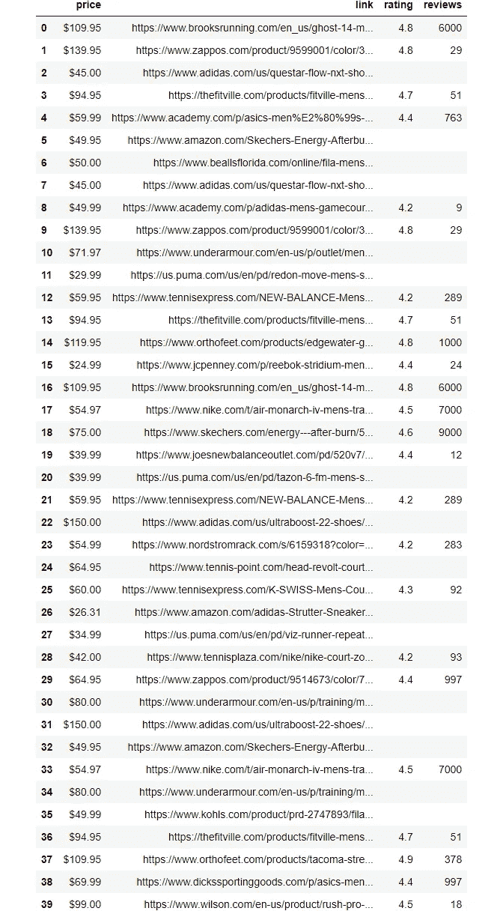

Shopping Results Data

**收集相关问题**

这里，我们可以使用与“Shopping_Results_Data”几乎相同的逻辑。让我们试着用同样的逻辑-

我们最终得到如下所示的 ***键错误*** 。出现这种情况的可能原因是什么？

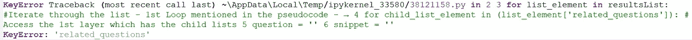

KeyError

## 🤔**可能的原因有**

> 该关键字与“shopping_results”不在同一级别
> 
> (或)
> 
> 2.密钥可能并不总是存在。

让我们检查一下 1 的可能性。为此，我们再次使用 Notepad++来看看 JSON 响应结构。

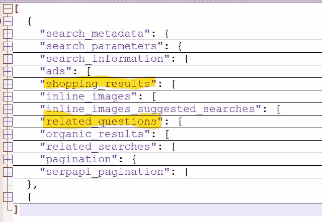

Structure of the JSON response (Outermost level)

看到上面的结构，我们知道“相关问题”与“购物结果”处于同一水平。

唯一的另一种选择是，在某些情况下，密钥可能不存在。因此，如果 resultsList.keys()中的“related_questions ”,我们只需使用简单的总括逻辑来处理相同的问题。

**重要提示**:分页设置为 2 时，API 调用不会给出‘shopping _ results’的关键错误。但是当分页设置为 10 时，似乎有些 JSON 响应没有‘shopping _ results’。因此，对代码进行了编辑，以将无所不包的逻辑应用到正在收集数据的所有三个列表元素。

以下是生成的数据框架“相关问题”

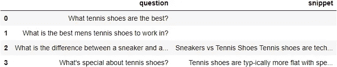

**收集与在线图像相关的数据**

下面是生成的数据帧“inline_image_data”:

下面是数据帧“内联图像数据”

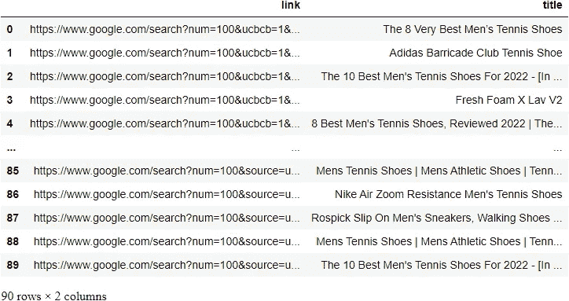

# 结束语

*   我们现在已经收集了我们需要的数据。本文的目的是帮助读者直观地了解数据结构，以便能够编写相关的解析逻辑。这对于那些在努力想象和记住数据结构的同时试图编写逻辑的人来说尤其有用。
*   对这些数据的分析将在另一篇文章中处理。请在此访问相同的[。快乐阅读！](https://mg-subha.medium.com/python-mining-reviews-964809cb5ad3)