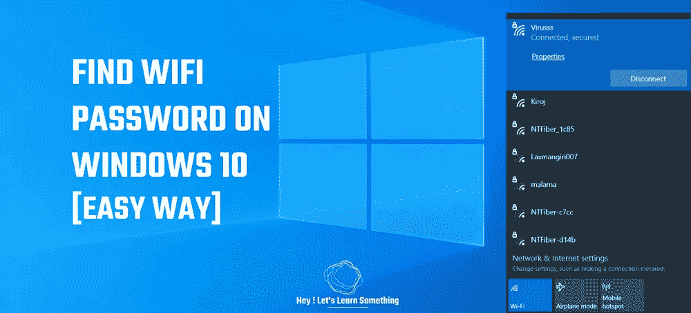

# 如何找到笔记本电脑上的 Wifi 密码？

> 原文：<https://medium.com/geekculture/how-to-find-the-wifi-password-on-your-laptop-3160164ba8ee?source=collection_archive---------16----------------------->

您想知道您的电脑连接的 Wifi 密码吗？那么，这里有一个简单的方法来找到 WiFi 密码，你不需要去任何命令提示符和输入一些奇怪的代码行。

在 Windows 10 上查找 Pc 的 Wi-fi 密码非常容易。不需要任何代码，不需要安装应用程序，没有任何复杂的东西。点击几下，然后…