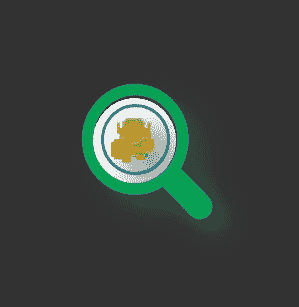

# 自我提升和成长心态——第二部分

> 原文：<https://medium.com/geekculture/how-to-find-your-groove-2-lessons-on-how-being-vulnerable-can-help-you-achieve-more-2b31cdee03d1?source=collection_archive---------24----------------------->

Your journey under the lens

这是我从本·克罗的自我提升方法中学到的东西的延续。

在他的方法中，他强调了提高自我和克服困扰你的三个阶段或“心态”。

在这篇文章中，我将分享你可以用来跟踪进度的心态和工具的信息。