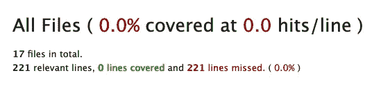
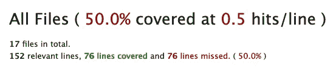

# 修复 SimpleCov 不准确的测试覆盖输出

> 原文：<https://medium.com/geekculture/how-to-fix-inaccurate-test-coverage-outputs-from-simplecov-f4db553e7bee?source=collection_archive---------7----------------------->


Photo by [Charl Folscher](https://unsplash.com/@charlfolscher?utm_source=medium&utm_medium=referral) on [Unsplash](https://unsplash.com?utm_source=medium&utm_medium=referral) — I wish I was doing this kind of testing…

## 不幸的旅程(在 Rails 6 和 Ruby 3 中)

我喜欢 Ruby on Rails。通常，有一个宝石存在，你安装它，一切就像魔法一样工作。不幸的是，这不是我在 SimpleCov 上的经历，simple cov 是我为[https://write-draft.com](https://write-draft.com)建立的一个测试覆盖宝石。当我按照`simplecov`的说明进行设置时，我的输出报告显示了零覆盖率，尽管我已经写了很多测试。这个数字超过了 0。



Screenshot of inaccurate test coverage report

下面是我找出如何让它工作的旅程。作为参考，下面是我的环境设置:

```
MacBook Pro (13-inch, M1, 2020)
ruby 3.0.2p107
rails 6.1.4.1
simplecov 0.21.2
```

为了不被那些不幸的食谱网站(只要给我看他妈的食谱！)，下面是解决方案。

## 解决办法

*   将`simplecov`宝石添加到`:test`组的宝石档案中。运行`bundle install`
*   在`environments/test.rb`中设置`config.eager_load = true`
*   将此添加到顶部的`spec_helper.rb`或`test_helper.rb`

```
require ‘simplecov’
SimpleCov.start ‘rails’
```

*   运行`rails t`

我不想每次都生成这个报告，所以我做了一些改进。

## 改进的解决方案

*   将`simplecov`宝石添加到`:test`组的宝石文件中。运行`bundle install`
*   在`environments/test.rb`中设置`config.eager_load = true`
*   使用这个漂亮的耙子任务(添加到`lib/tasks`)。使用`rails test:coverage`运行

Rake task for running tests with coverage

有了这个解决方案，如果您运行`rails t`，您的测试将在没有覆盖的情况下运行。如果您想要生成您的覆盖率输出，运行`rails test:coverage`。这种方式对我来说更有意义，因为我不想每次运行测试时都生成一个覆盖报告(例如，在我的 CI 管道中)。如果我不打算每次都这样做，最好只在需要使用`simplecov`时才要求。

# 旅程

我首先按照安装说明进行操作:

*   将`simplecov`宝石添加到`:test`组的宝石文件中。跑`bundle install`
*   向`test_helper.rb`添加代码(我使用 minitest)
*   运行`rails test`


WTF？我知道我的测试不怎么样，但它们确实存在。

## 跟随不同解决方案的互联网兔径

首先，我尝试了**在弹簧禁用的情况下运行** ( `DISABLE_SPRING=1 rails t`)。没有骰子。仍然是 0%的覆盖率，但是我确实学会了如何禁用 spring。

其他人建议**将** `**require ‘simplecov'**` **和** `**SimpleCov.start**` **添加到** `**bin/rails**` **文件**的开头，以确保它在测试运行之前启动。这感觉很可疑，但我绝望了，所以我还是试了试。什么都没变。

第三个人指出我需要**将** `**config.eager_load**` **设置为 true** 用于我的测试环境。成功了！🎉



Screenshot of accurate test coverage report

现在，我必须弄清楚这些东西的哪种组合是必要的。我开始排除，直到事情不再起作用。原来，设置`config.eager_load = true`是我唯一需要的。我回去清理了我的`bin/rails`改变，我停止了用`DISABLE_SPRING=1`运行。

经过一个多小时的旅程后，最终的修复其实非常简单。一般都是这样的吧？

在完成`simplecov`的正常安装说明后，设置`config.eager_load = true`。就是这样。希望这为您节省了一点时间:)

## 但是我真的想每次都产生覆盖率吗？

我决定我没有。也许你感觉不一样。那很好。我还想尝试创建自己的 rake 任务，所以我把所有东西都移到了 rake 任务中:

Rake task for running tests with coverage

在做这件事的时候，我学到了一些东西:

## 扩展 rake 名称空间是可能的

我在这里用`:test`名称空间做这件事。我可以添加任务`test:coverage`而不改变默认`:test`名称空间中的任何其他任务。很可爱。

## 如果我的耙子任务需要宝石，我可以在那里要

也许对于更有经验的 rails 开发人员来说这是显而易见的，但是我仍然在学习事情的来龙去脉。在这种情况下，当我运行这个任务时，我只需要`simplecov`，所以我可以从我的`test_helper.rb`中删除它，把它包含在这里，一切都很好！

这就是了。我不幸的漫长求职之旅已经结束了。这是令人沮丧的，但我学到了一些东西。现在，当我想知道我是否应该对我的测试覆盖率感到糟糕时，我可以有一个数字告诉我，而不是一个模糊的直觉😄。

希望分享这篇文章能让下一个走这条路的人少一点痛苦。:)