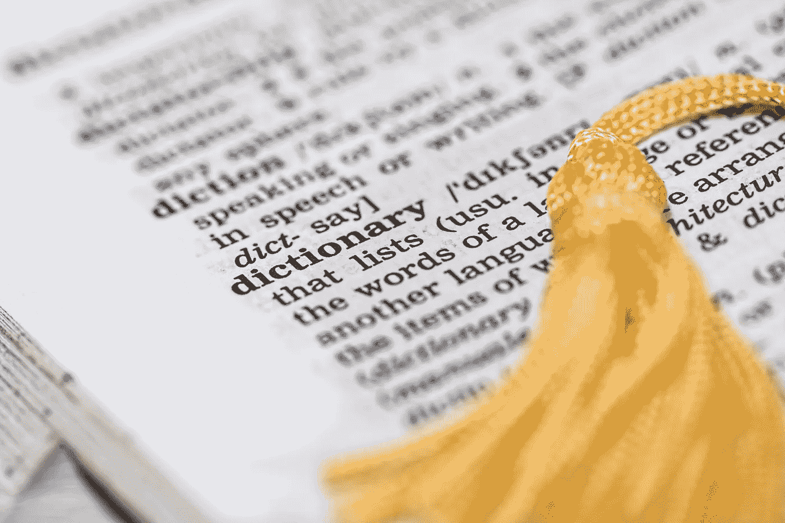

# 如何用一行代码为您的下一个 NLP 项目修复拼写错误的单词

> 原文：<https://medium.com/geekculture/how-to-fix-misspelled-words-for-your-next-nlp-project-with-one-line-of-code-98888a5ff207?source=collection_archive---------4----------------------->

## 自然语言处理

## 了解如何使用 TextBlob 来修复拼写错误并改进自然语言处理项目的模型

Image by Pixabay. Source: [Pexels](https://www.pexels.com/photo/yellow-tassel-159581/)