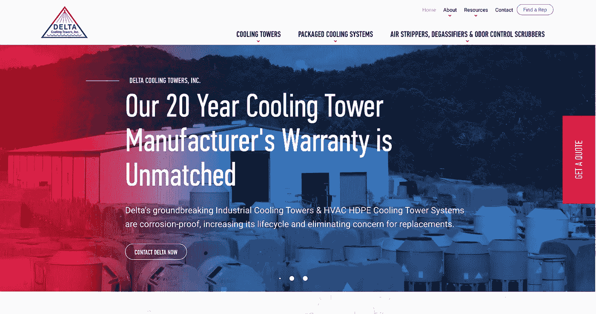

# 如何修复 SEO 瘫痪

> 原文：<https://medium.com/geekculture/how-to-fix-seo-paralysis-be3449b7774c?source=collection_archive---------6----------------------->

## **一个说明性的案例研究**

Delta Cooling Towers’ homepage website design (photo credit: eDesign Interactive)

# 挑战

[三角洲冷却塔](https://deltacooling.com/)开始失去他们长期以来的谷歌主要关键词排名。团队让我们审计他们的网站，诊断问题。

我们能够确定发生了什么，并制定解决方案。因此，我们把三角洲冷却塔放回到谷歌的第一页…