# 如何修复 Firebase Crashlytics 上丢失的 dSYMs

> 原文：<https://medium.com/geekculture/how-to-fix-the-missing-dsyms-on-firebase-crashlytics-5f36d9db51d9?source=collection_archive---------1----------------------->

I was in a hurry for beard shaving

## 入门指南

如果你正在使用一些崩溃报告提供者，如 [Firebase Crashlytics](https://console.firebase.google.com/) 或 [Sentry](https://sentry.io/) 用于你的应用程序，你是否见过类似*“丢失 dSYM 文件”*的问题？

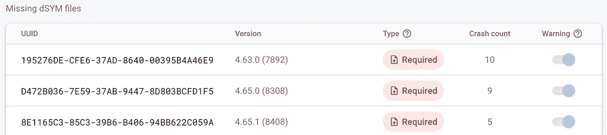

Missing dSYM files on Firebase Crashlytics

我打赌你已经做了！嗯，有一些原因导致 dSYM 文件不能完全上传到 Firebase Crashlytics，在这种情况下，我们必须自己手动上传丢失的 dSYM 文件来解决这个问题。

为什么我们需要解决这个问题？丢失的 dSYM 文件导致 Firebase Crashlytics 无法处理您的崩溃报告，它需要 dSYM 文件来表示从内存地址到人类可读信息的崩溃报告，例如什么是函数名、文件名或数字行导致崩溃。

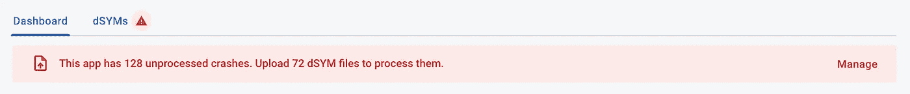

Missing dSYM files cause the Firebase Crashlytics stops processing the crash reports

## 禁用位代码

如果您的应用程序禁用了位代码设置，那么您必须添加[一个构建阶段脚本](https://firebase.google.com/docs/crashlytics/get-started?platform=ios#set-up-dsym-uploading)来自动上传 dSYM 文件。不知何故，这一步错过了一些 dSYM 文件，我们必须找到丢失的文件，然后手动上传。

首先，你必须记住丢失的 dSYM 文件的 UUID，最好把它保存在某个地方:

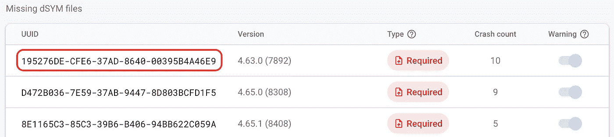

Remember the missing UUID of the dSYM file

现在，我们开始寻找这个丢失的文件！此步骤需要您的应用程序版本的存档文件。如果你从你的机器上存档并上传档案，那么我们可以很容易地在:***Xcode****>***窗口*** > ***组织者>档案中找到它。****

*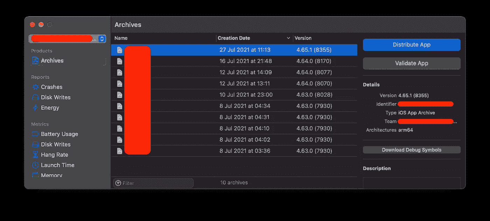*

*Archives in your local machine*

*接下来，选择一个与 Firebase Crashlytics 上的 UUID 应用程序版本相匹配的存档版本。提取其内容以找到 dSYMs 文件夹*

*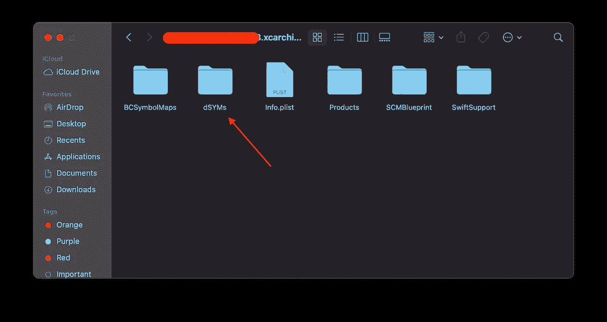*

*Extract the Archived file to find the dSYMs folder*

*现在，通过我们在第一步中获得的名称在这里找到丢失的 dSYM 文件*

*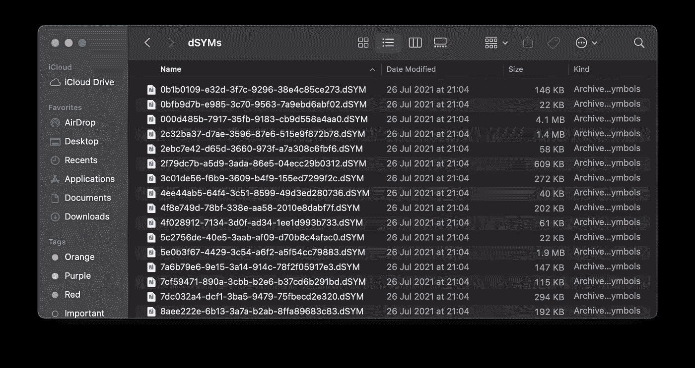*

*All dSYM files inside the dSYMs folder*

*有时，dSYM 文件名不是 UUID，而是二进制名称。要得到某个 dSYM 文件的 UUID，使用这个命令:***dwarfdump-u<dSYM _ file>****

*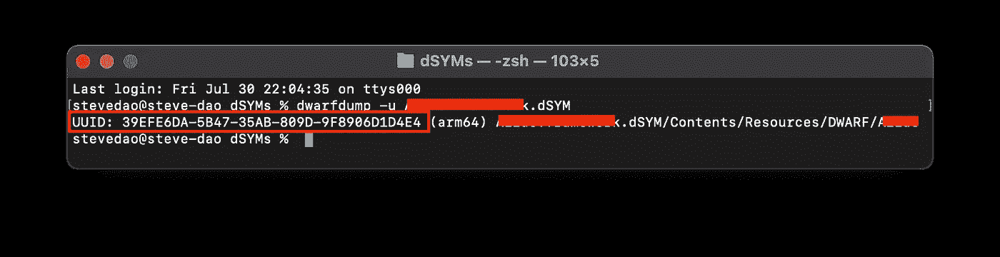*

*Get UUID of a certain dSYM file*

*找到文件后，按照 Firebase crashlytics 的[步骤](https://firebase.google.com/docs/crashlytics/get-deobfuscated-reports?platform=ios#upload-dsyms)手动上传。等待几分钟，让 Firebase crashlytics 再次重新处理崩溃报告，然后问题将被解决。*

*如果您使用 CI/CD 提供商来构建和部署归档，那么请记住将其保存在他们的服务器上，大多数提供商都支持这一目的。*

*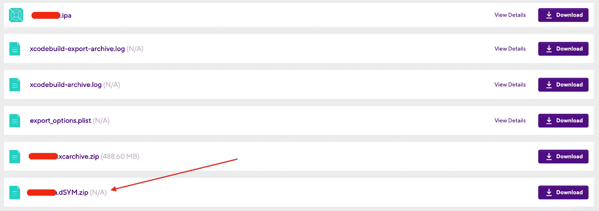*

*Build artifacts on Bitrise*

*一些提供商如 Bitrise 已经将 dSYMs 文件夹分离出来，所以我们可以直接使用它！做上面同样的事情找到并上传丢失的 dSYM 文件。*

> *请记住:永远保存你的存档文件！*

## *启用位代码*

*对于启用了位代码的应用程序，存档的 dSYMs 文件夹中的 dSYM 文件将在 Apple Connect 服务器上重建，然后我们无法使用它们并将其上传到 Firebase Crashlytics。我们必须等到苹果完成处理，然后才能从苹果连接下载*

*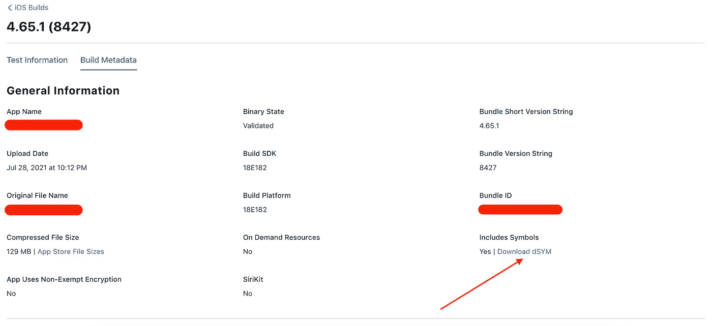*

*Download processed dSYMs from Apple Connect*

*下载后，我们可以按照 Firebase Crashlytics 的手动步骤上传它们。幸运的是，我们可以使用这个浪子的[下载 _dsyms](https://docs.fastlane.tools/actions/download_dsyms/) 插件来自动下载&上传它们，这为我们节省了很多时间！*

*如果您可以在那里找到丢失的 dSYM，您可以再次上传它以修复问题。*

*有时，Apple Connect 会返回一些错误的 UUID，这意味着用户在一个二进制文件上崩溃，丢失了 UUID，但 Firebase Crashlytics 收到了错误 UUID 的 dSYM，因此它们无法链接在一起并导致问题。*

*Firebase Crashlytics 不显示二进制名称，所以手动查找会很麻烦。对于一些崩溃报告提供者，如 Sentry，它可以显示丢失的 dSYM 文件的二进制名称*

*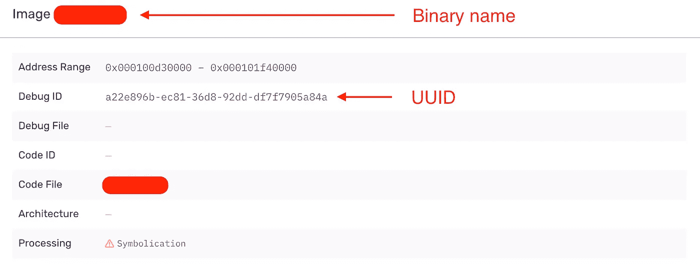*

*Determine the binary name of the missing dSYM file on Sentry*

*幸运的是，我同时使用 Firebase Crashlytics 和 Sentry，所以我可以很容易地根据丢失的 UUID 确定二进制文件的名称，然后在从 Apple Connect 下载的 dSYM 文件夹中找到错误的 dSYM 文件。*

*我希望 Firebase Crashlytics 能尽快支持这个有用的特性！*

## *“烹饪”dSYM 文件*

*在某些情况下，我们确保我们找到了丢失的 dSYM 文件，但差异 UUID，苹果连接返回错误，正如我们上面讨论的一个例子。*

*另一个用例是，当您必须从相同的源代码重新生成二进制& dSYM 文件，但是 dSYM 的 UUID 在每次构建时会有所不同。因为我们的用户报告丢失了 UUID dSYM，所以我们必须将 dSYM 的 UUID 重命名。*

*这一步看起来像我们在“烹饪”丢失的 dSYM 文件！*

> *⚠️⚠️⚠️:你**必须**小心这一步，如果你“煮”错了一个，事故报告就会乱成一团或者无法阅读！*

*希望你小心你要做的事！为此，从我们的 dSYM 文件中打开 DWARF 文件:<my_uuid.dsym>/Contents/Resources/DWARF/<my_binary></my_binary></my_uuid.dsym>*

*你可以通过 Visual Studio 的[十六进制编辑器](https://marketplace.visualstudio.com/items?itemName=ms-vscode.hexeditor)或者任何在线十六进制编辑器工具打开这个 DWARF 文件。我正在使用 [https://hexed.it](https://hexed.it/) 查找我们当前的 UUID &替换为 Firebase Crashlytics 上丢失的 UUID。根据我的经验，搜索 UUID 的前 4 个字符比搜索整个 UUID 要好*

*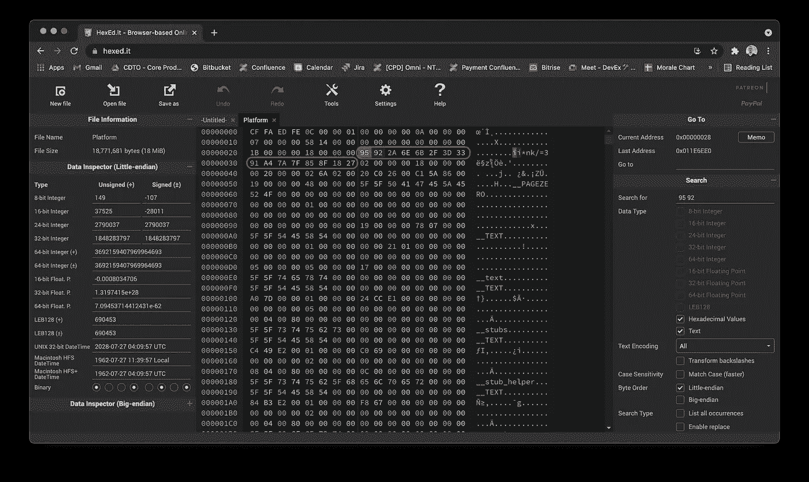*

*Find & replace the UUID in the DWARF file*

*替换后，保存并下载文件，然后替换原来的文件。现在上传“熟”的 dSYM 文件到 Firebase Crashlytics，然后问题就解决了！*

*通过十六进制编辑器工具找不到 UUID？你可以试试这个命令行工具:[https://github.com/schmittsfn/dsymrename](https://github.com/schmittsfn/dsymrename)*

## *结论*

*在本文中，您了解了如何找到丢失的 dSYM 并将其上传到 Firebase Crashlytics，这种方法也适用于其他崩溃报告提供者。*

*请记住，总是存储在您的本地或 CI 服务器上的非位代码应用程序的档案，并小心你在做什么，而“烹饪”dSYM 文件！！！*