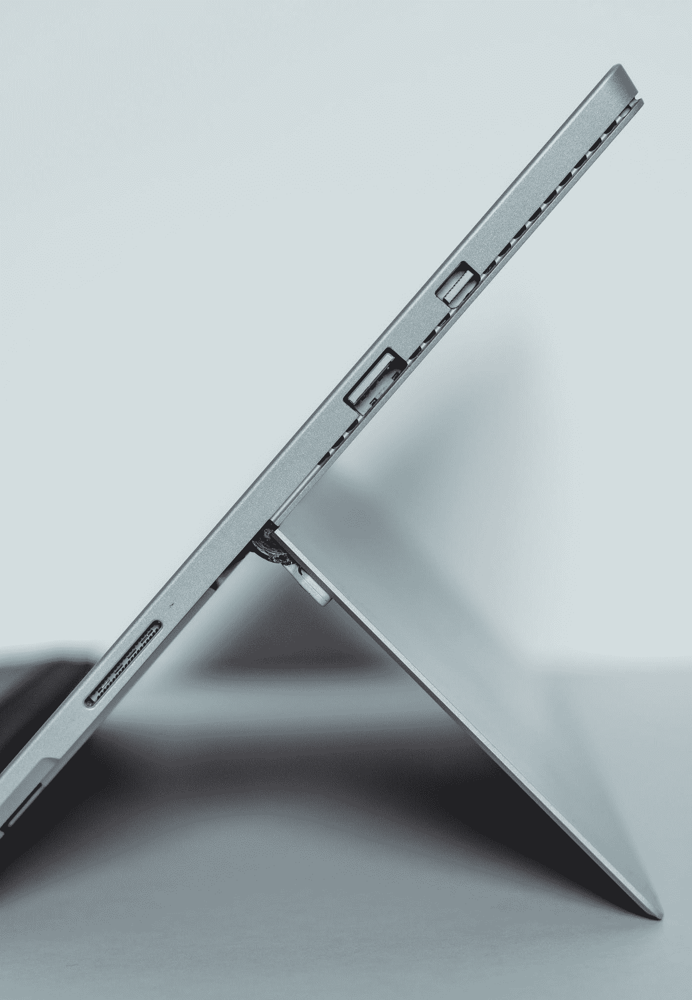
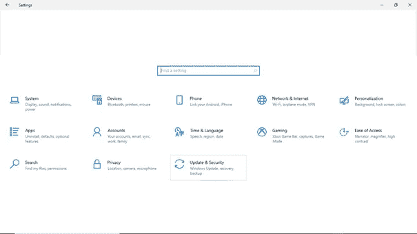
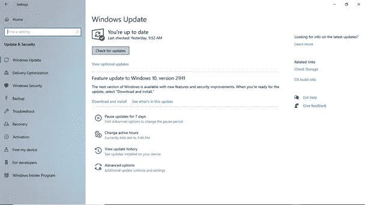
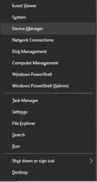
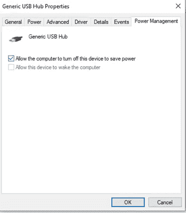

# 如何修复 Windows 10 中无法识别的 USB 端口

> 原文：<https://medium.com/geekculture/how-to-fix-usb-ports-not-recognized-in-windows-10-e75fa8be661a?source=collection_archive---------7----------------------->

**您的一个 USB 端口是否出现故障？以下是解决 Windows 10 问题的最佳方案。**

Photo by [Ashkan Forouzani](https://unsplash.com/@ashkfor121?utm_source=medium&utm_medium=referral) on [Unsplash](https://unsplash.com?utm_source=medium&utm_medium=referral)

完成工作所需的许多有用的外部设备都通过 USB 端口连接到您的 PC，这些设备称为外设，如闪存驱动器、照相机、打印机、便携式硬盘驱动器等。

通常，当您的电脑 USB 端口无法工作或无法识别所连接的设备时，就会出现这种情况。当这种情况发生时，尤其是当你对问题的起因一无所知时，这是令人沮丧的。

如果你发现自己处于这种情况，以下是解决问题的最佳方案。

# **1。** **蛮力尝试速战速决**

首先，将您的 USB 连接到 PC 上的另一个端口，这将帮助您确定问题是出在 USB 端口还是连接的设备上。如果问题仍然存在，将 USB 设备连接到另一台 PC，以确保问题不在设备上；如果错误发生，那么 USB 设备可能有一些问题，否则，USB 端口是问题，因此，请转到下一个解决方案。

# **2。** **安装 Windows 更新**

Windows update 通过最新功能帮助您的 Windows 正常运行。当你安装必要的 Windows 更新，你可以解决 USB，而不是工作错误。按照以下步骤安装 Windows update:

1.导航至 **Windows 开始菜单>设置**或按 **Windows 键+ I** 。

2.在设置中，点击**更新&安全**

3.现在，点击**检查更新**查看是否有可用的更新

4.下载可用的更新，重新启动您的电脑安装更新，然后检查 Windows 10 错误识别错误是否得到解决。

# **3。** **重装设备驱动**

重新安装设备驱动程序是解决 USB 未识别错误的最佳解决方案之一，这将在具有最新功能的 PC 上重新安装设备驱动程序。要重新安装设备驱动程序，请遵循以下步骤:

1.  **在**开始菜单**上右击**或者按 **Windows 键+ X** ，会出现一个右键菜单，点击**设备管理器**

**2。**在**设备管理器**下，导航到**通用串行总线控制器**，然后**双击其上的**。

**3。**接下来，**在**通用 USB Hub** 上右击**，然后选择**更新驱动**，按照屏幕上的提示安装最新的驱动。

成功安装设备驱动程序后，您应该重新启动电脑以使驱动程序更改生效。

# **4。** **更改 USB 控制器的电源管理设置**

按照以下步骤更改 USB 控制器的电源管理设置:

1.  **在**开始菜单**上右击**或者按 **Windows 键+ X** ，会出现一个快捷菜单，点击**设备管理器**

**2。**在**设备管理器**下，导航到**通用串行总线控制器**，然后**双击**。

**3。**接下来，右击**通用 USB 集线器** **>属性>电源管理。**如果勾选了*“允许计算机关闭此设备以节省电源”，则取消勾选，然后点击**确定**以应用更改。*

**

***4。**你应该**对**通用串行总线控制器**下的所有 USB 设备重复这些步骤**。*

***5。** **重启**你的 **Windows 10 PC** 看看问题是否解决。*

*随身携带这个 DIY，可以更轻松地解决 Windows 10 PC 中无法识别的 USB 端口。*