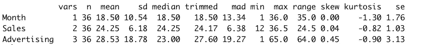
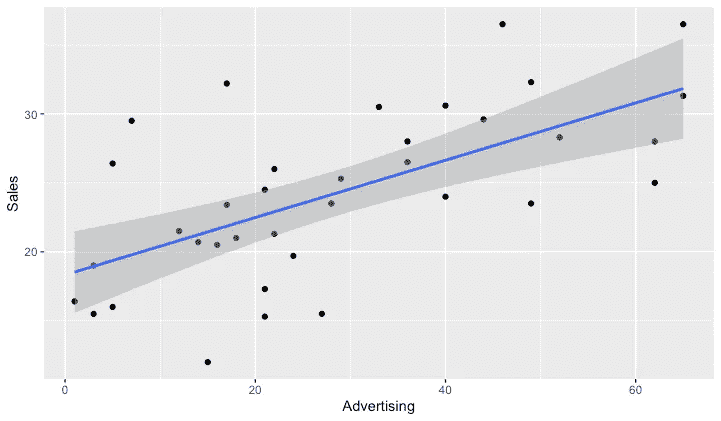
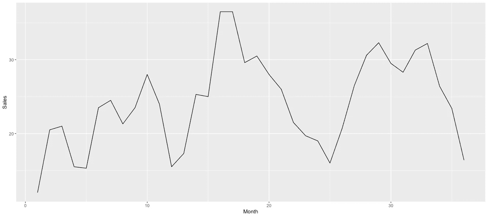
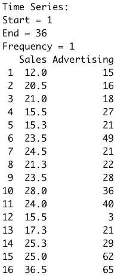
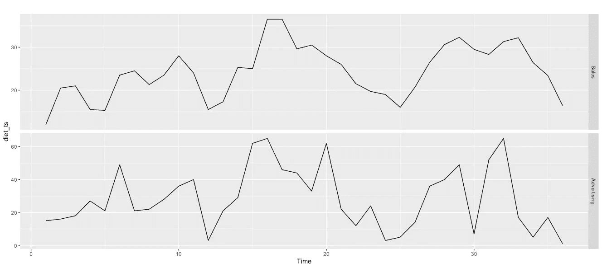
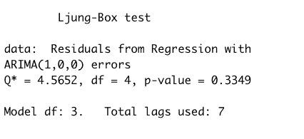
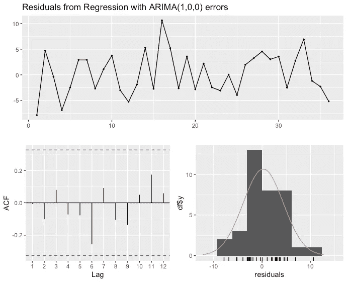
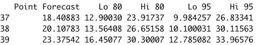
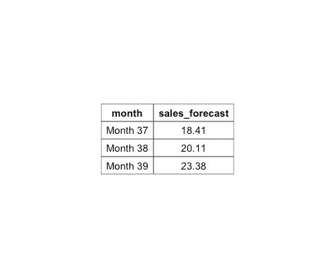

# 如何用 R 中的广告支出预测销售额

> 原文：<https://medium.com/geekculture/how-to-forecast-sales-with-advertising-spend-in-r-36e6fc99760a?source=collection_archive---------2----------------------->

你如何在销售预测中纳入不同的月度广告水平？


It takes money to make money! Or does it?

基于历史数据的销售预测对于任何企业来说都是一个重要且关键的过程。回归对于预测构建非常有用，因为您可以根据独立的因素(如时间)来预测数字输出。但是，如果您想在预测中添加额外的独立变量，如广告支出，该怎么办呢？出现了**动态回归模型。**

除了数据的历史，动态回归模型还考虑了其他因素。线性回归和动态回归的区别在于误差项是一个**【ARIMA】**的自回归综合移动平均过程。ARIMA 模型是一种预测技术，通常提供准确的预测数据，这些数据涉及影响因变量(销售)的多个自变量(广告)。

我会用动态回归法预测销售情况，并把广告考虑在内。这个数据集来自 Wayne L. Winston 的《营销分析:使用 Microsoft Excel 的数据驱动技术》的第 34 章。它包含一种减肥产品 36 个月的销售数据。

我们的数据集有 3 个变量:

1.  月
2.  销售额(千美元)
3.  广告支出(千美元)

但是在我们深入研究之前，我们需要理解一些关于时间序列数据行为的概念。时间序列数据可以包含特定的模式，包括:

**趋势** —观察值随时间增加或减少。
**季节性** —观察值显示日历周期(如季度、月、年等)。
**循环** —观察值上升和下降，但不是由于固定的周期。
**静止的或固定的** —观察不显示任何趋势或季节性。换句话说，没有可预测的模式。

其他需要了解的重要时间序列概念有:

**白噪声** —完全随机的时间序列数据。

**永格盒测试** —确定数据是否为白噪声的显著性测试。较小的 p 值表明数据可能不是白噪声。

# 浏览数据集

让我们了解一下数据，我们将运行 psych 包中的 describe()函数。这一步很好地总结了我们的数据集。

```
#Use describe function from psych package. It gives a good overview of the dataset variables including summary statistics.describe(diet)
```



describe() function output



Scatterplot of Advertising and Sales

首先，销售和广告的散点图。当广告支出高时，销售额通常也高，这也许并不奇怪，但情况并不总是如此。销售和广告之间似乎有很大的可变性，所有的点都离我们的直线很远。



Line chart of sales

如果我们查看一段时间内的销售数据，我们可以看到许多高峰和低谷。肯定会有很多下降，有些看起来是随机的，有些在 12 个月、24 个月和现在的 36 个月左右，这表明销售在圣诞节假期前后下降，但很快回升。这可能是一种减肥产品销售的典型行为，但是因为我们没有这个数据集的实际时间指数，所以我们不会假设这是事实。在其他月份也有其他下跌，但没有明显的模式突出。

# 关于 ARIMA 模型

ARIMA 模型被认为是一种高级预测模型，因为其他时间序列模型不能处理多变量预测。此外，ARIMA 模型可以检测趋势，季节性和新近性。ARIMA 有三(3)个参数或符号:(p，d，q)。

p =自回归
d =差异(季节性)
q =移动平均

自回归模型使用变量过去值的线性组合来预测我们感兴趣的变量(在本例中为销售额)。差异就是连续观察值之间的差异。移动平均模型在类似回归的模型中使用过去的预测误差来预测未来值。

# 如何在 R 中创建一个 ARIMA 对象

为了创建 ARIMA 模型，我们的数据需要是一个时间序列对象，因此我们使用 ts()函数来转换我们的数据框架。我们不需要包含列 1，因为这是我们的月份变量(作为一个整数序列而不是时间索引，但这是可以的)，所以我们将只包含列 2 和 3 的子集。

```
#Convert dataframe to time series object using the ts() function
diet_ts <- ts(data = diet[,c(2,3)])#Check results of transformation
diet_ts
```



The first 16 rows of our time series object

接下来，让我们创建两个变量的时间图。



Time plot of sales and advertising

将两个折线图放在一起看，可以揭示出相当多的见解。这两种折线图看起来具有相同的形状(在相同的位置出现最低点和最高点)，但这并不总是正确的。在第 30 个月，广告支出非常低，但这个月的销售额仍然相对较高。原因之一是过去的广告会影响现在和未来的销售。暴露于 6 个月前甚至 1 个月前的广告，可以产生今天的销售。随着时间的推移，可能会产生递减效应的因素，如广告，可以用在回归模型中，但我们将留待以后讨论。

# 动态回归建模

现在，我们将使用预测包中的 auto.arima()函数来拟合我们的 ARIMA 模型。auto.arima 函数()将决定最佳模型。我们函数中使用的公式是“Sales ”,正如我们的 xreg 对“Advertising”的解释。出于本练习的目的，我们还将添加参数 stationary = TRUE。平稳意味着时间序列在一段时间内是稳定的或者没有趋势。

```
# Fit ARIMA model
fit <- auto.arima(diet_ts[, "Sales"], xreg = diet_ts[, "Advertising"], stationary = TRUE)# Check model fit
fit
```


ARIMA model output

# 输出解释

auto.arima()函数拟合了广告变量的线性回归模型和误差的 ARIMA (1，0，0)模型(1 个自回归参数，0 个差异和 0 个移动平均参数)。我们的广告系数在 xreg 栏的第一位。因此，解释是，广告支出每增加 1000 美元，单位销售额增加 0.09 美元。系数很小，但它是正的。

# 残差

我们将使用 checkresiduals()函数来获取残差。该函数做两(2)件重要的事情:

1.  执行永盒测试。
2.  提供误差的时间图、自相关(ACF)图和残差直方图。

```
#Check Residuals
checkresiduals(fit)
```



Ljung-Box test output

p 值大于 0.05，因此残差是白噪声。



checkresiduals() plot of errors, ACF, & residuals

残差看起来接近正态分布。

# 预测销售额

现在我们有了一个模型，我们可以用它来创建我们的预测。

```
#We need to provide forecast with the future value of our predictor which is Advertising. So here, we will spend 5 in month 1, 12 in month 2 and 40 in month 3.#Create a vector to hold advertising spend
adv_spend <- c(5, 12, 40)#Let's build the forecast
diet_fc <- forecast(fit, xreg = adv_spend)# Plot forecast
autoplot(diet_fc) + xlab("Month") + ylab("Sales")
```


Plot of sales data with three (3) month forward forecast

考虑到我们的输入，我们的预测图看起来是合理的。我们还可以通过在控制台中直接调用我们的预测对象来打印出我们的预测(点预测列)和置信区间。

```
#Print forecast with confidence intervals
diet_fc
```



但是让我们把我们的预测放到一个漂亮的表格里。我们现在已经计划了下一季度的销售。



Table with our forecasts using ggpubr package

# 概述:

1.  我们建立了一个动态回归模型，将广告作为自变量，销售额作为因变量。我们解释了我们的广告系数及其对销售的影响。
2.  我们预测了下一季度的销售额，每个月都有不同程度的广告支出。
3.  **业务用例:**我们可以使用这种技术为营销部门提供短期预测。也许你的营销经理想知道根据不同的广告支出情况，预期的销售额是多少，以便计划营销活动或达到销售目标。

完整的代码可以在 [GitHub](https://github.com/bonheurgirl/Forecasting-in-R/blob/main/How%20to%20Forecast%20Sales%20with%20Advertising%20Spend%20in%20R.Rmd) 上找到。 [GitHub](https://github.com/bonheurgirl/Forecasting-in-R/blob/main/How%20to%20Forecast%20Sales%20with%20Advertising%20Spend%20in%20R.Rmd) 版本包括一个训练数据集来构建我们的预测模型，并在样本外数据上测试模型。

# 参考资料:

温斯顿 W. L. (2014 年)。营销分析:微软 Excel 的数据驱动技术。威利。

《预测:原理与实践》(第二版)Rob J Hyndman 和 George Athanasopoulos，澳大利亚莫纳什大学。