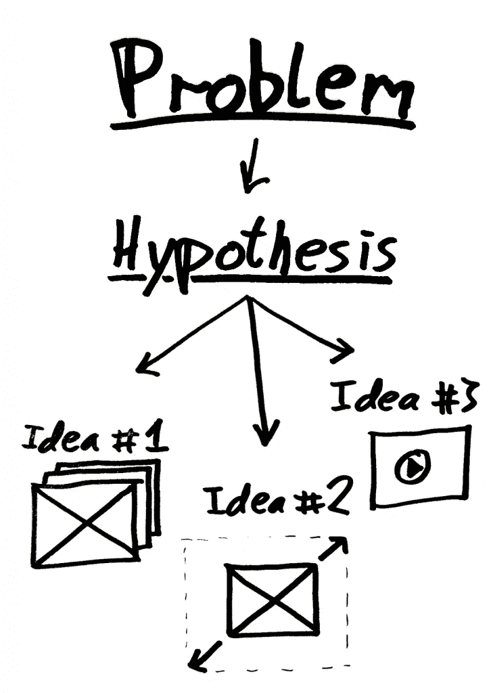

# 如何为 EDA 设计和测试假设

> 原文：<https://medium.com/geekculture/how-to-formulate-and-test-hypothesis-for-eda-a3345b90b25?source=collection_archive---------20----------------------->

Hypothesis explained in a picture

这是你深入建模任何问题之前的第一步。阐明一个假设是非常重要的，因为它为建模设定了一些基本的想法，并给你一条前进的道路。

有两种类型的假设-

1.  **零假设**——由 H0 表示
2.  **替代假设**——由 H1 表示，与原假设相反。

示例-

H0 价格取决于需求。

H1 价格不取决于需求。

为了对给定的数据集制定一个假设，我们需要进行一些基本的单变量和双变量分析，以便我们可以了解两个变量是如何相关的。

1.  首先，我们从识别数据类型开始。
2.  一旦确定了数据类型，我们就寻找 int 或 float 类型的列，并对它们进行单变量分析。计算单变量分析意味着计算列的平均值、标准差、范围、最小值、最大值以及分位数和 IQR=(Q3-Q2)。这也有助于我们识别异常值和异常值。我们还可以考虑图形的偏斜度和峰度，这将告诉我们未来值可能位于价差的何处。峰度或偏斜度单独不是很强的指标，可以与标准差和分位数结合使用。
3.  然后我们进行双变量分析，这是研究任何两个变量之间的关系。它有三种类型-

*   **数值和数值**——为此，我们可以绘制一个散点图，我们还可以计算协方差。
*   **分类和分类** -对于两个分类变量，我们绘制镶嵌图、双向表和堆积柱形图。
*   **数字和分类**——为此，我们可以做箱线图。

通过绘制图表看到这些不同的关系后，我们还可以尝试绘制整个数据集的相关矩阵和热图，以寻找相关性。

既然我们已经有了趋势和相关值，我们就把这些都考虑进去，形成我们的假设。

在形成假设后，我们对它们进行测试，以检查它们是否正确。

**卡方检验-** 卡方检验帮助我们确定两个给定变量之间关系的统计显著性，并告诉我们证据是否足够有力，可以推广。它返回卡方检验的概率。

概率=0，那么两个变量都是相关的。

概率=1，那么两个变量是独立的。

对于分类变量和连续变量，我们可以进行 z 检验或方差分析。这两种测试都评估两个给定组的平均值在统计上是否不同。

当标准差已知时，也使用 z 检验。

t 检验就像 z 检验一样，但它用于观测值少于 30 的情况，也用于我们不知道标准偏差的情况。

当我们比较三个以上的组时，方差分析是一个很好的选择。

所以上面列出的所有测试都是用来验证假设的。这些也有两种错误。

**第一类错误**——拒绝零假设(H0)，即使它是真的。这也称为阿尔法误差。

**第二类错误**——当假设为假时接受零假设(H0)。这也被称为贝塔误差。

一旦我们测试了这些假设，那么我们就知道在我们的建模练习中应该以哪些变量为目标来开发解决方案。