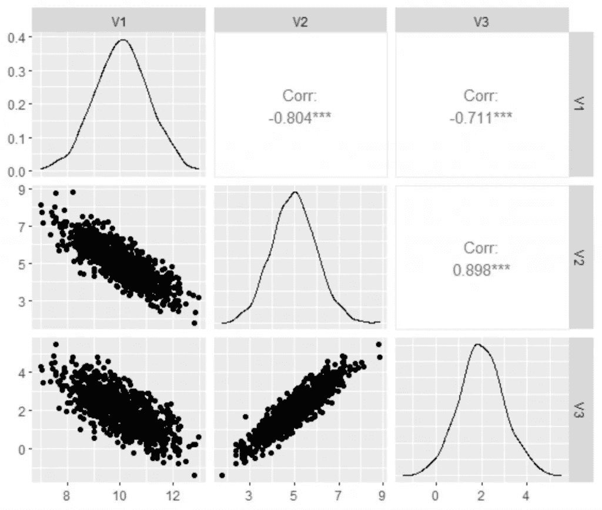

# 如何在 R 中生成相关数据

> 原文：<https://medium.com/geekculture/how-to-generate-correlated-data-in-r-57a675b7fd2f?source=collection_archive---------20----------------------->

## 如何在 R 中生成相关数据的实际例子

 [## 用我的推荐链接加入媒体-乔治皮皮斯

### 阅读乔治·皮皮斯(以及媒体上成千上万的其他作家)的每一个故事。您的会员费直接支持…

jorgepit-14189.medium.com](https://jorgepit-14189.medium.com/membership)