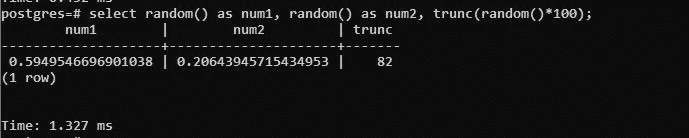
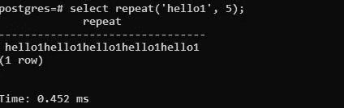
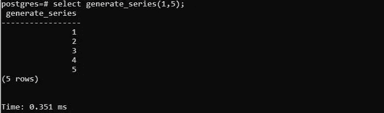
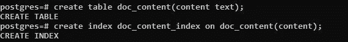
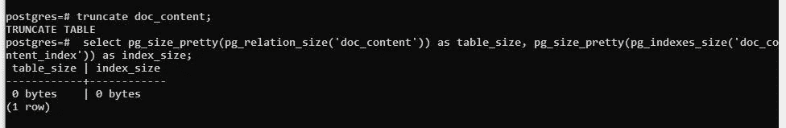
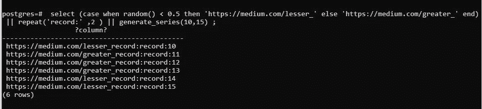
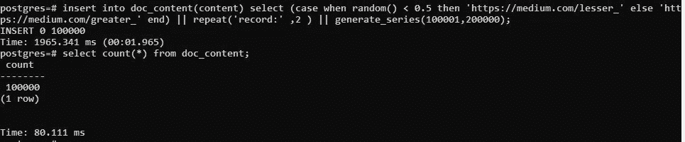

# 如何在 Postgresql 中生成哑数据来评估查询性能？

> 原文：<https://medium.com/geekculture/how-to-generate-dummy-data-in-postgresql-to-evaluate-query-performance-858733c7ab0f?source=collection_archive---------2----------------------->

在本文中，我们将探索 Postgres 的内置函数，这些函数可以帮助我们创建大量的虚拟数据。有时，您需要评估特定任务的查询性能，为此您可能需要大量数据。很有可能您没有很多数据，但是您想评估查询的性能。那么对你来说这是个好消息，Postgres 提供了三个不同的函数，你可以用它们在水平和垂直层面上复制数据。我们将详细了解每个函数，以及如何使用这些函数来创建虚拟数据。


Photo by [Christina @ wocintechchat.com](https://unsplash.com/@wocintechchat?utm_source=unsplash&utm_medium=referral&utm_content=creditCopyText) on [Unsplash](https://unsplash.com/s/photos/technology?utm_source=unsplash&utm_medium=referral&utm_content=creditCopyText)

我们将在这里介绍三个功能:

1.  **random():** `random()`其他任何编程语言中的函数都是用来生成 0 到 1 之间的随机数。这个`random()`函数返回一个浮点，可以使用`trunc()`函数进一步将其截断成一个整数。`random()` 每次都生成不同的数字正如您在下面的查询中看到的，我们已经调用了 random()三次，每次都生成了不同的数字。您可以将`random()`函数包装在`trunc()` 中来生成整数。

```
select random() as num1, random() as num2, trunc(random()*100);
```



**2。repeat():** `repeat()`函数用来在水平层次上重复一个字符串。这个`repeat()`有两个参数:第一个是你想要重复的字符串，第二个是你想要重复这个字符串多少次。

```
**select repeat('hello1', 5);**
```



**3。generate_series():** `generate_series()` 是创建虚拟数据最常用的函数。它返回给定数值范围内的所有数字。这用于在垂直方向复制记录。在下面的查询中，您可以看到它为给定的范围(1，5)生成了 5 行。

```
**select generate_series(1,5);**
```



现在，我们将创建一个具有名为 content 的单个字段的表，看看如何使用上面指定的函数来插入虚拟数据。我们还将在该表上创建一个索引来评估查询性能:

创建表和索引:

```
**create table doc_content(content text);
create index doc_content_index on doc_content(content);**
```



create table doc_content

通过执行以下查询来检查表和索引大小:

```
**select 
        pg_size_pretty(pg_relation_size('doc_content')) as table_size, 
        pg_size_pretty(pg_indexes_size('doc_content_index')) as index_size;**
```



让我们执行下面的查询，使用上面定义的函数创建一些虚拟数据。该查询将生成 6 行，作为 generate_series(10，15)中提供的范围，这将返回序列 10，11，12，13，14 和 15。根据 random()函数返回的数字，case 条件将返回一个字符串，该字符串将与 generate_series()返回的序列连接在一起。

```
**select (case when random() < 0.5 
                    then 'https://medium.com/lesser_'
             else 'https://medium.com/greater_' 
             end) 
       || repeat('record:' ,2 ) 
       || generate_series(10,15) ;**
```



**现在我们将使用上述查询的逻辑插入 10 万条记录:**

```
**insert into doc_content(content) 
          select 
                (case when random() < 0.5 
                           then 'https://medium.com/lesser_' 
                       else 'https://medium.com/greater_' 
                 end) 
                 || repeat('record:' ,2 ) 
                 || generate_series(100001,200000);**
```



现在，您已经成功生成了虚拟数据。您可以很容易地评估查询的性能。

我们研究了生成虚拟或测试数据的三种不同函数。这种方法比手动插入更具伸缩性，但是如果你关心数据的内容并且有外键约束，你将不得不手工编写大量的定制 SQL。

感谢您抽出宝贵的时间阅读这篇文章。如果你喜欢读这篇文章，请给它一个喜欢和掌声。要了解最新的帖子，请在 Medium 上关注我。