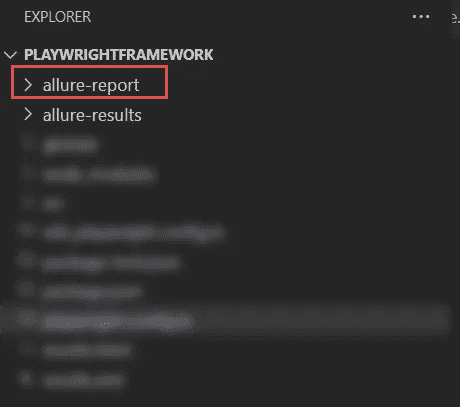
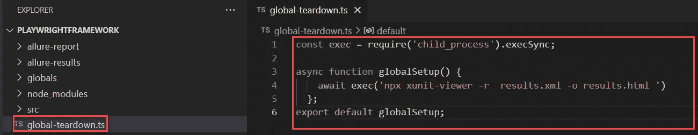
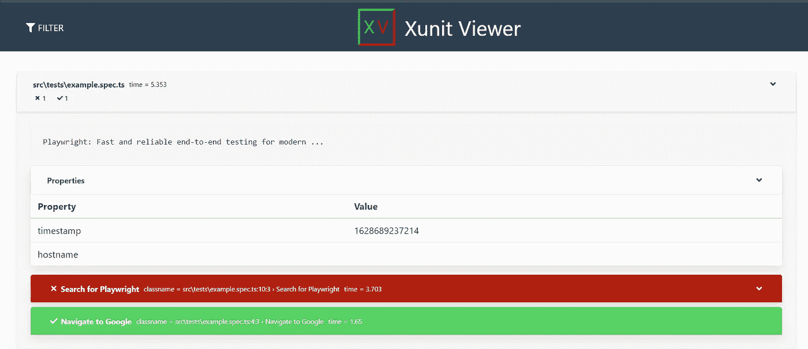

# 如何在剧作家端到端自动化工具中生成 HTML 报告

> 原文：<https://medium.com/geekculture/how-to-generate-html-report-in-playwright-f9ec9b82427a?source=collection_archive---------2----------------------->

作者注意:这篇文章是在没有 PLAYRIGHT 支持的 HTML 报告的地方写的。剧作家的最新版本有自己的 HTML 报告，你不需要遵循变通办法。更多详情查看[官网](https://playwright.dev/docs/test-reporters/#html-reporter)。

剧作家支持各种报告器，默认情况下，剧作家支持点报告器，线报告器，JUnit XML 报告器，JSON 报告器，列表报告器。

随着最近的变化，剧作家也支持倾城报告。

**本教程解释了两种不同的生成 HTML 报告的方法**

1.  **倾城报告**
2.  **HTML 报告**

**方法 1:《倾城》与剧作家的报道**

# 用剧作家整合和生成《诱惑报告》的分步指南

**先决条件:**

1.  我们假设，在你的框架中已经有一些测试

## **第一步:安装 allure 命令行**

要打开 allure 报告，您需要在您的计算机上安装 allure 依赖项。

```
**npm i -D allure-commandline**
```

## **第二步:为剧作家安装诱惑**

```
**npm i -D experimental-allure-playwright**
```

## **步骤 3:配置剧作家全局配置文件**

我们在剧作家配置文件中指定了记者。如果您不想在配置文件中指定报告器类型，也可以在命令行中提到它。我们将在这里展示这两个选项。

Allure 报告的配置，将以下代码复制并粘贴到您的**剧作家.配置. ts 文件**中。该文件应该位于项目根文件夹中

```
// playwright.config.ts
import { PlaywrightTestConfig } from '[@playwright/test](http://twitter.com/playwright/test)';
const config: PlaywrightTestConfig = {
  use: {
    screenshot: 'only-on-failure'
  },
  reporter: 'experimental-allure-playwright',
};
export default config;
```

**注意:**
如果你想在命令行中调用 reporter 只需跳过这一步

## **第四步:运行剧作家测试**

**选项 1:使用全局配置文件执行剧作家测试**

如果您已经按照上面的步骤设置了全局配置文件，只需使用下面的命令执行您的测试

```
**npx playwright test**
```

**选项 2:使用 reporter 选项执行剧作家测试**

***注意:*** *仅当您跳过了第 3 步，即您没有配置剧作家全局配置文件*时，才遵循此选项

使用以下命令执行带有剧作家记者选项的测试

```
**npx playwright test --reporter=line,experimental-allure-playwright**
```

一旦你执行了测试，你应该会看到一个名为 **allure-results** 的文件夹


## **第五步:为剧作家生成诱惑报告**

使用命令行，您可以生成 allure 报告。

使用以下命令在剧作家中生成诱惑报告

```
**npx allure generate ./allure-results --clean**
```

一旦执行上述命令，将会生成另一个名为 **allure-report** 的文件夹



## 步骤 6:使用命令提示符打开剧作家诱惑测试报告

Allure 已经为您生成了一个详细的报告，如果您想查看漂亮的报告，您需要使用下面的命令打开 allure 报告

```
**npx allure open ./allure-report**
```

Allure 报告在浏览器中打开，如下所示


上述步骤完成了 Allure Report 集成。

**方法 2:用 HTML 报告剧作家**

# 在剧作家中生成 HTML 结果的逐步指南

allure 报告的问题是，您不能直接与利益相关者共享 HTML 文件，要做到这一点，您需要创建一个 docker 容器和一些您需要做的配置。

**有一种简单的方法可以用剧作家**生成一个简单的 HTML 文件

简单地说，我们创建一个 JUnit XML 文件，然后在测试执行完成后将它转换成 HTML 文件。

## 步骤 1:安装 XUnit 查看器包

这个包将有助于从 JUnit XML 文件创建 HTML 文件

使用下面的命令安装 XUnit 查看器包

```
**npm install --save-dev xunit-viewer**
```

## 步骤 2:为剧作家创建全局拆卸文件

在你的项目根文件夹**中创建一个名为 **global-teardown.ts** 的新文件**

将下面的代码复制并粘贴到 **global-teardown.ts**

```
//global-teardown.ts
const exec = require('child_process').execSync;async function globalSetup() {
    await exec('npx xunit-viewer -r  results.xml -o results.html ')
  };
export default globalSetup;
```



## 步骤 3:配置你的剧作家全局配置文件

打开应该位于您的项目根文件夹中的配置文件。如果尚未创建，请创建一个。

将下面的代码复制粘贴到**剧作家.配置文件**

```
// playwright.config.ts
import { PlaywrightTestConfig } from '[@playwright/test](http://twitter.com/playwright/test)';
const config: PlaywrightTestConfig = {
  globalTeardown:require.resolve('./global-teardown'),
  use: {
    screenshot: 'only-on-failure'
  },
    reporter: [ ['junit', { outputFile: 'results.xml' }] ],
};
export default config;
```

## 步骤 4:执行剧作家测试以生成 HTML 文件

我们已经完成了生成 HTML 报告所需的所有配置，现在使用下面的命令执行您的测试

```
**npx playwright test**
```

## 步骤 5:查看剧作家生成的 HTML 报告

一旦剧作家测试的执行完成，你就可以在你的项目文件夹中看到 results.html 文件

在浏览器上打开**results.html**。



剧作家生成的**results.html**文件是一个简单的 HTML 文件，具有内嵌的 CSS，因此您可以与利益相关者共享这个 HTML 文件。

***注:*** *1。HTML 文件没有集成截图。
2。通过/失败用红色和绿色标记
3。失败测试显示点击失败测试后的堆栈跟踪*

参考:[https://playwright.dev/](https://playwright.dev/)

☕ [**给我买杯咖啡**](https://www.buymeacoffee.com/ganeshhegde)

**如果您需要任何帮助、支持、指导，请联系我**[**LinkedIn**](https://www.linkedin.com/in/ganeshsirsi/)**|**[**https://www.linkedin.com/in/ganeshsirsi**](https://www.linkedin.com/in/ganeshsirsi/)